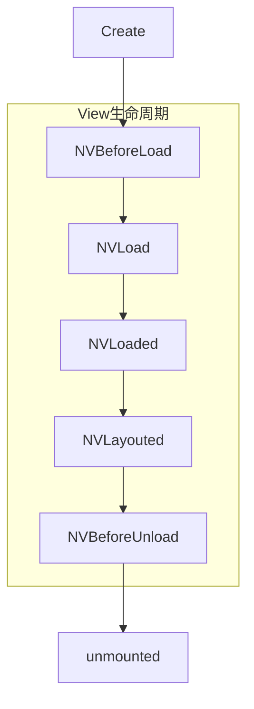

# UTS 组件开发
# UTS component development

> 需HBuilderX 3.6.18 及之后版本

> app平台目前支持nvue/uvue，暂不支持vue

UTS组件，是UTS插件的一个分支。UTS插件提供了原生API的扩展，而UTS组件提供了原生UI组件的开发模式。
UTS component is a branch of UTS plugin. The UTS plug-in provides the extension of the native API, and the UTS component provides the development mode of the native UI component.

组件是一种独立，可复用的UI单元，用于单独封装和承担一定的代码逻辑。
A component is an independent, reusable UI unit that is used to individually encapsulate and undertake certain code logic.

组件与插件的区别在于：前者以标签的形式，对外提供UI封装；后者则只提供API，虽然API可能涉及UI，但仍然是API，无法以标签方式在页面模板中引用。
The difference between components and plug-ins is that the former provides UI encapsulation in the form of tags; the latter only provides APIs. Although APIs may involve UI, they are still APIs and cannot be referenced in page templates in the form of tags.

比如`<video>`是组件；`uni.showModal` 或 `uni.chooseVideo` 虽然有UI，但属于API。
For example, `<video>` is a component; `uni.showModal` or `uni.chooseVideo` has UI, but it belongs to API.

组件一般适用于封装非全屏的场景，即在页面中内嵌一个区域。如果需要你需要封装的UI是全屏界面，那没必要使用组件，通过UTS开发原生页面更简单。 [UTS开发原生页面示例](https://gitcode.net/dcloud/hello-uts/-/tree/master/uni_modules/uts-nativepage)
Components are generally suitable for encapsulating non-full-screen scenarios, that is, embedding an area in the page. If the UI you need to encapsulate is a full-screen interface, then there is no need to use components. It is easier to develop native pages through UTS. [UTS development native page example](https://gitcode.net/dcloud/hello-uts/-/tree/master/uni_modules/uts-nativepage)

当然UTS组件是多端的，一个UTS组件作为一个`uni_modules`，可同时支持app-Android、app-iOS、web、以及各家小程序组件。
Of course, UTS components are multi-terminal. As a `uni_modules`, a UTS component can support app-Android, app-iOS, web, and various MiniApp components at the same time.

本文重点在于讲述如何在app-android和app-ios上，将一个原生UI封装为UTS组件，供使用者在页面template中以组件的方式调用。
This article focuses on how to package a native UI as a UTS component on app-android and app-ios for users to call as components in the page template.

## 前置条件
## Preconditions

继续阅读文档前，开发者需要了解以下前置条件：
Before continuing to read the documentation, developers need to understand the following prerequisites:

- 了解 [uts语法](/uts/) 和 [uts原生插件](uts-plugin.md)
- 了解 [Vue组件](../tutorial/vue3-components.md)
- Learn about [Vue Components](../tutorial/vue3-components.md)


## UTS组件简介
## Introduction to UTS components

#### 为什么使用UTS开发组件
#### Why use UTS to develop components

UTS组件，即：使用UTS语言在uni平台进行组件开发的技术。
UTS components, that is: using UTS language to develop components on the uni platform.

UTS组件的优势在于，它秉承了UTS的跨平台特性，统一的UTS语法，各终端不同的原生产出物。
The advantage of the UTS component is that it inherits the cross-platform characteristics of UTS, the unified UTS syntax, and the different original products of each terminal.

在Android平台会被编译渲染为Android原生View实例，IOS或其他终端平台也是如此。
On the Android platform, it will be compiled and rendered as an Android native View instance, and the same is true for IOS or other terminal platforms.


|				|uts组件					|uni原生组件				|Vue组件				|
| | uts component | uni native component | Vue component |
|:------		|:--------				|:-------- 				|:-------			|
|开发语言		|uts					|java/object-c			|js/ts				|
|Development language | uts | java/object-c | js/ts |
|组件载体		|App平台为系统原生View对象		|系统原生View对象		|WebView内部标签		|
|Component carrier | App platform is the system native View object |System native View object | WebView internal label |


为了统一开发规范、降低使用门槛，UTS原生组件采用了Vue组件的语法，但会根据实际情况略有定制。
In order to unify the development specifications and lower the threshold of use, UTS native components adopt the syntax of Vue components, but will be slightly customized according to the actual situation.

即，您可以像写vue组件一样，使用uts语言来写一个UTS组件。
That is, you can use the uts language to write a UTS component just like writing a Vue component.

## UTS组件结构解析
## UTS component structure analysis


#### UTS组件目录结构
#### UTS component directory structure


<pre v-pre="" data-lang="">
	<code class="lang-" style="padding:0">
┌─common                          // 可跨端公用的uts代码。推荐，不强制
├─static                          // 静态资源
├─utssdk
│	├─app-android                 //Android平台目录
│	│	├─assets                  //Android原生assets资源目录，可选
│	│	├─libs                    //Android原生库目录，可选
│	│	├─res                     //Android原生res资源目录，可选
│	│	├─AndroidManifest.xml     //Android原生应用清单文件，可选
│	│	├─config.json             //Android原生配置文件
│	│	├─index.uts               //Android原生插件能力实现，可选
|	|	└─index.vue               //Android原生组件能力实现，必选
│	├─app-ios                     //iOS平台目录
│	│	├─Frameworks              //iOS原生依赖的第三方 framework 依赖库存放目录，可选
│	│	├─Resources               //iOS原生所依赖的资源文件存放目录，可选
│	│	├─info.plist              //iOS原生所需要添加到主 info.plist 文件中的配置文件，可选
│	│	├─UTS.entitlements        //iOS原生所需要添加到主工程 .entitlements 文件中的配置文件，可选
│	│	├─config.json             //iOS原生配置文件
│	│	├─index.uts               //iOS原生插件能力实现，可选
|	|	└─index.vue               //iOS原生组件能力实现，必选
│	├─web                         //web平台目录
│	│	└─index.uts
│	├─mp-alipay                   // 支付宝小程序平台，可选
│	├─mp-baidu                    // 百度小程序平台，可选
│	├─mp-jd                       // 京东小程序平台（仅限vue2），可选
│	├─mp-kuaishou                 // 快手小程序平台，可选
│	├─mp-lark                     // 飞书小程序平台，可选
│	├─mp-qq                       // QQ小程序平台，可选
│	├─mp-toutiao                  // 抖音小程序平台，可选
│	├─mp-weixin                   // 微信小程序平台，可选
│	├─mp-xhs                      // 小红书小程序平台（仅限vue2），可选
│	└─index.uts                   // 跨平台插件能力实现，可选
└─package.json                    // 插件清单文件
</code>
</pre>


如上所示，UTS组件的目录结构与UTS插件基本相同
As shown above, the directory structure of UTS components is basically the same as that of UTS plugins

唯一的差别在于，UTS组件入口文件有两个:
The only difference is that there are two UTS component entry files:

+ 必选的index.vue 组件入口
+ Mandatory index.vue component entry

+ 可选的index.uts 函数能力入口
+ optional index.uts function capability entry


用户如果在开发组件的同时，存在一些与组件无关的能力需要对外暴露，可以在index.uts中进行实现
If the user has some component-independent capabilities that need to be exposed while developing the component, it can be implemented in index.uts

大多数情况下，我们只需要开发一个index.vue 即可，如果存在多个组件，可以新建多个 xxx.vue文件
In most cases, we only need to develop one index.vue. If there are multiple components, we can create multiple xxx.vue files

关于 index.vue 源码如何编写，我们会在下一个章节介绍
About how to write index.vue source code, we will introduce it in the next chapter


#### index.vue源码结构
#### index.vue source code structure


下面是一个组件源码 index.vue 完整示例：
The following is a complete example of component source code index.vue:

**注意**
**Notice**

- 目前UTS组件仅支持`export default {}`的选项式API，vue3的组合式API暂未支持。
- Currently the UTS component only supports the optional API of `export default {}`, and the combined API of vue3 is not yet supported.

::: preview

> Android

```ts

<template>
	<view >

	</view>
</template>
<script lang="uts">
	import TextUtils from 'android.text.TextUtils'
	import Button from 'android.widget.Button'
	import LinearLayout from 'android.widget.LinearLayout'
	import View from 'android.view.View'

	class ButtonClickListsner extends View.OnClickListener {
		constructor() {
			super()
		}
		override onClick(v ? : View) {
			console.log(v)
		}
	}

	//原生提供以下属性或方法的实现  
	//natively provide the implementation of the following properties or methods
	export default {
		/**
		 * 组件名称，也就是开发者使用的标签
		 */
		name: "uts-hello-view",
		/**
		 * 组件涉及的事件声明，只有声明过的事件，才能被正常发送
		 */
		emits: ['buttonClick'],
		/**
		 * 属性声明，组件的使用者会传递这些属性值到组件
		 */
		props: {
			/**
			 * 字符串类型 属性：buttonText  需要设置默认值
			 */
			"buttonText": {
				type: String,
				default: "点击触发"
			}
		},
		/**
		 * 组件内部变量声明
		 */
		data() {
			return {}
		},
		/**
		 * 属性变化监听器实现
		 */
		watch: {
			"buttonText": {
				/**
				 * 这里监听属性变化，并进行组件内部更新
				 */
				handler(newButtonText: string) {
					if (this.$el != null) {
						let button = this.$el!.findViewWithTag("centerButton") as Button
						if (!TextUtils.isEmpty(newButtonText)) {
							button.setText(newButtonText)
						}
					}
				},
				immediate: false //创建时是否通过此方法更新属性，默认值为false  
			},
		},
		/**
		 * 规则：如果没有配置expose，则methods中的方法均对外暴露，如果配置了expose，则以expose的配置为准向外暴露
		 * ['publicMethod'] 含义为：只有 `publicMethod` 在实例上可用
		 */
		expose: ['doSth'],
		methods: {
			/**
			 * 对外公开的组件方法
			 */
			doSth(paramA: string) {
				// 这是组件的自定义方法
				console.log("paramA",paramA)
			},
			/**
			 * 内部使用的组件方法
			 */
			privateMethod() {

			}
		},

		/**
		 * 组件被创建，组件第一个生命周期，
		 * 在内存中被占用的时候被调用，开发者可以在这里执行一些需要提前执行的初始化逻辑
		 * [可选实现]
		 */
		created() {

		},
		/**
		 * 对应平台的view载体即将被创建，对应前端beforeMount  
		 * [可选实现]
		 */
		NVBeforeLoad() {

		},
		/**
		 * 创建原生View，必须定义返回值类型
		 * 开发者需要重点实现这个函数，声明原生组件被创建出来的过程，以及最终生成的原生组件类型
		 * （Android需要明确知道View类型，需特殊校验） 
		 * todo 补充IOS平台限制
	  * [必须实现]
		 */
		NVLoad(): LinearLayout {
			//必须实现  
			let contentLayout = new LinearLayout(this.$androidContext)
			let button = new Button(this.$androidContext)
			button.setText("点击触发");
			button.setTag("centerButton");
			contentLayout.addView(button, new LinearLayout.LayoutParams(500, 500));
			button.setOnClickListener(new ButtonClickListsner())
			return contentLayout
		},

		/**
		 * 原生View已创建 
		 * [可选实现]
		 */
		NVLoaded() {

		},
		/**
		 * 原生View布局完成  
		 * [可选实现]
		 */
		NVLayouted() {

		},
		/**
		 * 原生View将释放  
		 * [可选实现]
		 */
		NVBeforeUnload() {},
		/**
		 * 原生View已释放，这里可以做释放View之后的操作  
		 * [可选实现]
		 */
		NVUnloaded() {

		},
		/**
		 * 组件销毁  
		 * [可选实现]
		 */
		unmounted() {},
		/**
		 * 自定组件布局尺寸 
		 * [可选实现]
		 */
		NVMeasure(size: UTSSize): UTSSize {
			size.width = 120.0.toFloat()
			size.height = 800.0.toFloat()
			return size
		}
	}
</script>
<style>
	
</style>


```

> iOS

```ts
<template>
	<view class="defaultStyles">
	</view>
</template>
<script lang="uts">
	import {
		UIButton
	} from "UIKit"

	// 定义按钮点击后触发回调的类
	class ButtonClickListsner {
		// 按钮点击回调方法
		@objc buttonClick() {
			console.log("按钮被点击")
		}
	}

	//原生提供以下属性或方法的实现  
	export default {
		/**
		 * 组件名称，也就是开发者使用的标签
		 */
		name: "uts-hello-view",
		/**
		 * 组件涉及的事件声明，只有声明过的事件，才能被正常发送
		 */
		emits: ['buttonClick'],
		/**
		 * 属性声明，组件的使用者会传递这些属性值到组件
		 */
		props: {
			/**
			 * 字符串类型 属性：buttonText  需要设置默认值
			 */
			"buttonText": {
				type: String,
				default: "点击触发"
			}
		},
		/**
		 * 组件内部变量声明
		 */
		data() {
			return {}
		},
		/**
		 * 属性变化监听器实现
		 */
		watch: {
			"buttonText": {
				/**
				 * 这里监听属性变化，并进行组件内部更新
				 */
				handler(newButtonText: string, oldButtonText) {
					this.$el.setTitle(newButtonText, for = UIControl.State.normal)
				},
				immediate: false //创建时是否通过此方法更新属性，默认值为false  
			},
		},
		/**
		 * 规则：如果没有配置expose，则methods中的方法均对外暴露，如果配置了expose，则以expose的配置为准向外暴露
		 * ['publicMethod'] 含义为：只有 `publicMethod` 在实例上可用
		 */
		expose: ['doSth'],
		methods: {
			/**
			 * 对外公开的组件方法
			 */
			doSth(paramA: string) {
				// 这是组件的自定义方法
				console.log("paramA")
			},
			/**
			 * 内部使用的组件方法
			 */
		},


		/**
		 * 组件被创建，组件第一个生命周期，
		 * 在内存中被占用的时候被调用，开发者可以在这里执行一些需要提前执行的初始化逻辑
		 * [可选实现]
		 */
		created() {

		},
		/**
		 * 对应平台的view载体即将被创建，对应前端beforeMount  
		 * [可选实现]
		 */
		NVBeforeLoad() {

		},
		/**
		 * 创建原生View，必须定义返回值类型
		 * 开发者需要重点实现这个函数，声明原生组件被创建出来的过程，以及最终生成的原生组件类型
		 * [必须实现]
		 */
		NVLoad(): UIButton {
			//必须实现  
			let button = new UIButton()
			button.setTitle(this.buttonText, for = UIControl.State.normal)
			const target = new ButtonClickListsner()
			const method = Selector("buttonClick")
			button.addTarget(target, action = method, for = UIControl.Event.touchUpInside)
			return button
		},

		/**
		 * 原生View已创建 
		 * [可选实现]
		 */
		NVLoaded() {

		},
		/**
		 * 原生View布局完成  
		 * [可选实现]
		 */
		NVLayouted() {

		},
		/**
		 * 原生View将释放  
		 * [可选实现]
		 */
		NVBeforeUnload() {},
		/**
		 * 原生View已释放，这里可以做释放View之后的操作  
		 * [可选实现]
		 */
		NVUnloaded() {

		},
		/**
		 * 组件销毁  
		 * [可选实现]
		 */
		unmounted() {}
		/**
		 * 自定组件布局尺寸 
		 * [可选实现]
		 */
		NVMeasure(size: UTSSize): UTSSize {
			return new UTSSize(120, 45);
		}
	}
</script>
```

:::

index.vue 要素可以分为以下几类：
index.vue elements can be divided into the following categories:

+ 配置：
+ configuration:

	name：组件的使用标签，可以省略，若省略则默认为组件名称
	name: the usage label of the component, which can be omitted, if omitted, it will default to the component name
	
	emits：组件允许的消息事件名称，如果没有组件消息，不需要配置
	emits: The name of the message event allowed by the component. If there is no component message, no configuration is required

+ 属性：
+ attributes:
	
	props：需要由组件的使用者提供，比如一个Image组件，会需要一个path属性作为图像路径来源
	props: It needs to be provided by the user of the component. For example, an Image component will need a path attribute as the source of the image path
	
	watch：属性的监听实现，用来监听属性数据更新。
	watch: The monitoring implementation of the attribute, which is used to monitor the update of the attribute data.
	
+ 数据：	
+ data:

	data：组件内部数据定义，用于组件内部逻辑处理，不对外暴露
	data: The internal data definition of the component, which is used for internal logic processing of the component and is not exposed to the outside world

+ 方法：
+ method:

	methods：组件方法定义，可以通过与expose组合使用，区分对内方法和对外方法
	methods: component method definition, which can be used in combination with expose to distinguish internal methods from external methods
	
	expose：与methods 字段配合使用，用以区分组件对内方法和对外方法
	expose: Used in conjunction with the methods field to distinguish between internal and external methods of the component


+ 生命周期：
+ life cycle:

	组件需要重点处理 内存创建/销毁，View载体创建/销毁 过程中的资源管理，具体参考生命周期章节
	Components need to focus on memory creation/destruction, resource management in the process of View carrier creation/destruction, refer to the life cycle chapter for details
	
+ 内置对象：
+ built-in objects:
	
	为了方便组件开发者，UTS组件内置了部分变量与函数，具体参考内置对象与函数章节
	For the convenience of component developers, UTS components have built-in variables and functions, please refer to the built-in objects and functions chapter for details


#### 生命周期 
#### life cycle 

组件开发者需要重点关注组件的生命周期，以便进行资源的初始化和回收
Component developers need to focus on the life cycle of components in order to initialize and recycle resources



|函数名			|描述				|建议行为		|是否可选	|
|function name |description |recommended behavior |optional |
|:----			|:---				|:---			|:---		|
|created		|组件在内存中被创建	|开发者可以在这里执行一些需要最早执行的初始化逻辑|可选|
| created |The component is created in memory |Developers can perform some initialization logic that needs to be executed at the earliest |Optional|
|NVBeforeLoad	|组件对应平台的view载体，即将被创建|开发者可以在这里执行一些需要在View创建前初始化的逻辑|可选|
| NVBeforeLoad |The component corresponds to the view carrier of the platform, which is about to be created|Developers can perform some logic that needs to be initialized before the View is created here|Optional|
|NVLoad			|组件view载体正在被创建实现|开发者需要重点实现这个函数，声明原生组件被创建出来的过程，以及最终生成的原生组件类型|必须实现|
| NVLoad |The component view carrier is being created and implemented|Developers need to focus on implementing this function, declaring the process of creating native components, and the final generated native component type|Must be implemented|
|NVLayouted		|组件对应平台的view载体已布局结束	|需要在view布局结束后执行的逻辑	|可选|
| NVLayouted |The layout of the view carrier of the corresponding platform of the component has been completed |Logic that needs to be executed after the view layout is completed |Optional|
|NVBeforeUnload	|view载体即将被卸载				|View卸载前，需要回收资源的逻辑	|可选|
| NVBeforeUnload | The view carrier is about to be unloaded | Before the View is unloaded, the logic of reclaiming resources is required |Optional|
|NVUnloaded		|view载体已经被卸载				|View卸载后，需要回收资源的逻辑	|可选|
| NVUnloaded | The view carrier has been unloaded | After the View is unloaded, the logic of reclaiming resources is required |Optional|
|unmounted		|组件在内存被销毁				|资源回收逻辑					|可选|
| unmounted | component is destroyed in memory | resource recovery logic | optional |


除上述生命周期外，还存在下列可选周期函数：
In addition to the above life cycles, the following optional cycle functions exist:

+ NVMeasure

NVMeasure 用于告诉排版系统，组件自身需要的宽高，具体的调用时机由排版系统决定。
NVMeasure is used to tell the typesetting system, the width and height required by the component itself, and the specific calling time is determined by the typesetting system.

一般情况下，组件的宽高应该是由终端系统的排版引擎决定，组件开发者不需要实现此函数。
In general, the width and height of a component should be determined by the typesetting engine of the terminal system, and component developers do not need to implement this function.

但是部分场景下，组件开发者需要自己维护宽高，则需要开发者重写此函数

[vue3 生命周期暂不支持](https://uniapp.dcloud.net.cn/tutorial/vue3-api.html#%E9%80%89%E9%A1%B9-%E7%94%9F%E5%91%BD%E5%91%A8%E6%9C%9F%E9%92%A9%E5%AD%90)
[vue3 life cycle is not currently supported](https://uniapp.dcloud.net.cn/tutorial/vue3-api.html#%E9%80%89%E9%A1%B9-%E7%94%9F%E5 %91%BD%E5%91%A8%E6%9C%9F%E9%92%A9%E5%AD%90)


#### 内置对象和函数
#### Built-in Objects and Functions

为了方便组件开发者使用，UTS 组件内部内置了下列对象：
For the convenience of component developers, the following objects are built into the UTS component:

|变量名			|类型		|简介				|平台限制	|方法&属性	|
|Variable Name |Type |Introduction |Platform Restrictions |Methods & Properties |
|:-------		|:--------	|:--------			|:---		|:---			|
|$el			|对象		|当前View实例对象	|全部平台	|开发者在NVLoad返回的对象类型|
|$el |object |current View instance object |all platforms |object type returned by the developer in NVLoad|
|$androidContext|对象		|当前组件上下文		|仅android	|android平台对应Context对象|
|$androidContext|object |Current component context |Android only | Context object corresponding to the android platform|
|$emit("event",Any)|函数		|发送已注册的事件	|全部平台	|$emit(事件名称-必选,事件参数可选)|
|$emit("event",Any)|function |send registered events |all platforms |$emit(event name-required, event parameters are optional)|


#### 通用事件
#### Generic Events

对于UTS组件来说，除了通过 $emit/emits 函数来自定义组件事件外，UTS组件还内置了下列通用事件：
For UTS components, in addition to customizing component events through the $emit/emits function, UTS components also have the following built-in general events:


|事件名称			|简介				
|Event Name |Introduction
|:-------			|:--------			
|click				|组件点击事件响应
| click | Component click event response
|longpress			|组件长按事件响应
| longpress | Component long press event response


通用事件，组件的使用者无需实现，直接使用
General event, the user of the component does not need to implement it, use it directly

```js
<uts-hello-view buttonClick="自定义事件处理函数" click="通用点击事件处理函数" longpress="通用长按事件处理函数"/>
```


## 简单View的示例
## Example of a simple View


本章节以 一个极简的组件开发为例，介绍说明UTS组件开发流程
This chapter takes a minimalist component development as an example to introduce the UTS component development process


#### 创建插件
#### Create plugin

在HBuilder X 中选中Uni-App项目下 uni_modules目录  
Select the uni_modules directory under the Uni-App project in HBuilder X

todo  目前还没有创建界面


这是创建后的目录结构
This is the directory structure after creation


#### 编写逻辑
#### Write the logic

打开index.vue，键入下面的组件源码:
Open index.vue and type the following component source code:

::: preview

> Android

```ts
<template>
	<view>

	</view>
</template>
<script lang="uts">

	import TextUtils from 'android.text.TextUtils'
	import Button from 'android.widget.Button'
	import LinearLayout from 'android.widget.LinearLayout'
	import Color from 'android.graphics.Color'
	import View from 'android.view.View'

	class ButtonClickListsner extends View.OnClickListener {
		constructor() {}
		override onClick(v ? : View) {
			console.log(v)
		}
	}

	//原生提供以下属性或方法的实现  
	//natively provide the implementation of the following properties or methods
	export default {
		name: "uts-hello-view",
		props: {
			"buttonText": {
				type: String,
				default: "点击触发"
			}
		},
		
		watch: {
			"buttonText": {
				
				handler(newButtonText: string) {
					if (this.$el != null) {
						let button = this.$el!.findViewWithTag("centerButton") as Button
						if (!TextUtils.isEmpty(newButtonText)) {
							button.setText(newButtonText)
						}
					}
				}
			},
		},
		
		NVLoad(): LinearLayout {
			//必须实现  
			//Must be implemented
			let contentLayout = new LinearLayout($androidContext)
			let button = new Button($androidContext)
			button.setTag("centerButton");
			contentLayout.addView(button, LinearLayout.LayoutParams(500, 500));
			button.setOnClickListener(new ButtonClickListsner())
			return contentLayout
		},
		
		
	}
</script>
<style>
	
</style>

```

> iOS

```ts
<template>
	<view class="defaultStyles">
	</view>
</template>
<script lang="uts">
	import {
		UIButton,
		UIControl
	} from "UIKit"

	// 定义按钮点击后触发回调的类
	// Define the class that triggers the callback after the button is clicked
	class ButtonClickListsner {
		// 按钮点击回调方法
		// button click callback method
		@objc buttonClick() {
			console.log("按钮被点击")
		}
	}

	//原生提供以下属性或方法的实现  
	//natively provide the implementation of the following properties or methods
	export default {
		name: "uts-hello-view",
		emits: ['buttonClick'],
		props: {
			"buttonText": {
				type: String,
				default: "点击触发"
			}
		},
		watch: {
			"buttonText": {
				/**
				 * 这里监听属性变化，并进行组件内部更新
				 */
				handler(newButtonText: string, oldButtonText) {
					this.$el.setTitle(newButtonText, for = UIControl.State.normal)
				},
				immediate: false //创建时是否通过此方法更新属性，默认值为false  
			},
		},
		data() {
			return {
				buttonClickListsner : new ButtonClickListsner()
			}
		},
		expose: ['doSth'],
		methods: {
			/**
			 * 对外公开的组件方法
			 */
			doSth(paramA: string) {
				// 这是组件的自定义方法
				// This is a custom method for the component
				console.log("paramA")
			}
		},
		/**
		 * 创建原生View，必须定义返回值类型
		 */
		NVLoad(): UIButton {
			//必须实现  
			//Must be implemented
			let button = new UIButton()
			button.setTitle(this.buttonText, for = UIControl.State.normal)
			const method = Selector("buttonClick")
			button.addTarget(this.buttonClickListsner, action = method, for = UIControl.Event.touchUpInside)
			return button
		}
	}
</script>
```

:::

上面的代码，我们自定义了一个  名为 "uts-hello-view" 的UTS 组件，该组件对外提供了一个包含按钮的简单UI实现，并且对外暴露了一个名为 `buttonText`字符串属性，用来构建按钮上的文案
In the above code, we have customized a UTS component named "uts-hello-view", which provides a simple UI implementation containing buttons, and exposes a string property named `buttonText` to the outside world, using to build the copy on the button
 
接下来，我们介绍在uni-app项目中如何使用它
Next, we introduce how to use it in the uni-app project

#### 使用组件
#### Using components

> 注意：UTS组件默认全局注册，无需使用者手动配置
> Note: UTS components are registered globally by default, no need for manual configuration by users

我们在uni-app项目中新建 helloView.nvue 页面，
We create a new helloView.nvue page in the uni-app project,


直接使用`uts-hello-view`标签，并且定义`buttonText`文本内容即可看到效果。
Use the `uts-hello-view` tag directly, and define the text content of `buttonText` to see the effect.

点击按钮，可以在控制台看到组件内部实现的日志输出
Click the button to see the log output implemented inside the component on the console

```js
<template>
	<div>
		<text>UTS view组件</text>
		<uts-hello-view buttonText="点击按钮内容" style="width:375px;height: 375px;background-color: aqua;"></uts-hello-view>
	</div>
</template>

<script>
</script>

<style>
</style>
```


#### 运行和测试
#### Running and testing

在当前示例中，不涉及第三方依赖，使用标准基座直接运行即可
In the current example, no third-party dependencies are involved, and the standard base can be used to run directly


## 包含第三方SDK的示例
## Contains examples of third-party SDKs

本章节以lottie动画组件为例，介绍包含三方SDK的UTS组件开发过程
This chapter takes the lottie animation component as an example to introduce the development process of the UTS component including the third-party SDK

#### 创建插件
#### Create plugin

在HBuilder X 中选中Uni-App项目下 uni_modules目录  
Select the uni_modules directory under the Uni-App project in HBuilder X

todo  目前还没有创建界面

这是创建后的目录结构
This is the directory structure after creation


#### Android 平台引入依赖
#### Android platform introduces dependencies

打开 ~/uni_modules/uts-animation-view/utssdk/app-android/config.json
Open ~/uni_modules/uts-animation-view/utssdk/app-android/config.json

键入如下代码:
Type the following code:

```
"dependencies": [
	"com.airbnb.android:lottie:3.4.0"
]
```

UTS组件建议使用远程依赖的方式集成，如果需要以AAR的形式添加SDK，可以添加到
UTS components are recommended to be integrated using remote dependencies. If you need to add SDK in the form of AAR, you can add it to

~/uni_modules/uts-animation-view/utssdk/app-android/libs目录
~/uni_modules/uts-animation-view/utssdk/app-android/libs directory

依赖的配置原则与UTS插件一致 [UTS插件依赖说明](https://uniapp.dcloud.net.cn/plugin/uts-for-android.html#_3-4-%E5%A2%9E%E5%8A%A0libs%E4%BE%9D%E8%B5%96%E8%B5%84%E6%BA%90)
The configuration principle of dependencies is consistent with that of the UTS plug-in [UTS plug-in dependency description](https://uniapp.dcloud.net.cn/plugin/uts-for-android.html#_3-4-%E5%A2%9E%E5% 8A%A0libs%E4%BE%9D%E8%B5%96%E8%B5%84%E6%BA%90)

#### iOS 平台引入依赖库
#### iOS platform imports dependent libraries

iOS 平台需要将三方依赖库放到 组件目录下 app-ios/Frameworks 中
The iOS platform needs to put the three-party dependency library in app-ios/Frameworks under the component directory

#### 编写逻辑
#### Write the logic


打开index.vue，键入下面的组件源码:
Open index.vue and type the following component source code:

::: preview

> Android

```ts
<template>
    <view>

    </view>
</template>
<script lang="uts">
    import Animator from 'android.animation.Animator'
    import TextUtils from 'android.text.TextUtils'
    import View from 'android.view.View'
    import LottieAnimationView from 'com.airbnb.lottie.LottieAnimationView'
    import LottieDrawable from 'com.airbnb.lottie.LottieDrawable'
	import FileInputStream from 'java.io.FileInputStream'
	import { UTSAndroid } from "io.dcloud.uts";

    class CustomAnimListener extends Animator.AnimatorListener {

        comp: UTSComponent < LottieAnimationView >
            constructor(com: UTSComponent < LottieAnimationView > ) {
                super();
                this.comp = com
            }

        override onAnimationStart(animation: Animator | null) {}

        override onAnimationEnd(animation: Animator | null, isReverse: Boolean) {
            this.comp.$emit("bindended")
        }

        override onAnimationEnd(animation: Animator | null) {}

        override onAnimationCancel(animation: Animator | null) {}

        override onAnimationRepeat(animation: Animator | null) {}
    }

    //原生提供以下属性或方法的实现  
    //natively provide the implementation of the following properties or methods
    export default {
        name: "uts-animation-view",
        /**
         * 当播放到末尾时触发 ended 事件（自然播放结束会触发回调，循环播放结束及手动停止动画不会触发）
         */
        emits: ['bindended'],
        props: {
            /**
             * 动画资源地址，目前只支持绝对路径
             */
            "path": {
                type: String,
                default: ""
            },
            /**
             * 动画是否循环播放
             */
            "autoplay": {
                type: Boolean,
                default: false
            },
            /**
             * 动画是否自动播放
             */
            "loop": {
                type: Boolean,
                default: false
            },
            /**
             * 是否隐藏动画
             */
            "hidden": {
                type: Boolean,
                default: false
            },
            /**
             * 动画操作，可取值 play、pause、stop
             */
            "action": {
                type: String,
                default: "stop"
            }

        },
        data() {
            return {

            }
        },
        watch: {
            "path": {
                handler(newPath: string) {

                    
					if(this.$el != null){
						let lottieAnimationView = this.$el!
						if (!TextUtils.isEmpty(newPath)) {
							
							
						    if (newPath.startsWith("http://") || newPath.startsWith("https://")) {
						        lottieAnimationView.setAnimationFromUrl(newPath)
						    } else {
						        // 默认是static了
						        // The default is static
								var realJsonPath = UTSAndroid.getResourcePath(newPath)
						        lottieAnimationView.setAnimation(new FileInputStream(realJsonPath),newPath)
						    }
						}
						if (this.autoplay) {
						    lottieAnimationView.playAnimation()
						}
					}
                },
                immediate: false //创建时是否通过此方法更新属性，默认值为false  
            },
            "loop": {
                handler(newLoop: Boolean) {
					if(this.$el != null){
						if (newLoop) {
						    this.$el!.repeatCount = Int.MAX_VALUE
						} else {
						    // 不循环则设置成1次
						    // Set it to 1 time if it does not loop
						    this.$el!.repeatCount = 0
						}
						
						if (this.autoplay) {
						    this.$el!.playAnimation()
						}
					}
                    
                },
                immediate: false //创建时是否通过此方法更新属性，默认值为false  
            },

            "autoplay": {
                handler(newValue: boolean) {
					if(this.$el != null){
						if (newValue) {
						    this.$el!.playAnimation()
						}
					}
                    
                },
                immediate: false //创建时是否通过此方法更新属性，默认值为false  
            },

            "action": {
                handler(newAction: string) {

                    if (newAction == "play" || newAction == "pause" || newAction == "stop") {

						if(this.$el != null){
							if (this.action == "play") {
							    this.$el!.playAnimation()
							} else if (this.action == "pause") {
							    this.$el!.pauseAnimation()
							} else if (this.action == "stop") {
							    this.$el!.cancelAnimation()
							    this.$el!.clearAnimation()
							}
						}
                        

                    } else {
                        // 非法入参，不管
                        // Illegal input parameters, no matter
                    }
                },
                immediate: false //创建时是否通过此方法更新属性，默认值为false  
            },

            "hidden": {
                handler(newValue: boolean) {
					if(this.$el != null){
						if (newValue) {
						    this.$el!.visibility = View.GONE
						} else {
						    this.$el!.visibility = View.VISIBLE
						}
					}
                },
                immediate: false //创建时是否通过此方法更新属性，默认值为false  
            },

        },
        methods: {
            setRepeatMode(repeat: string) {
				if(this.$el != null){
					if ("RESTART" == repeat) {
					    this.$el!.repeatMode = LottieDrawable.RESTART
					} else if ("REVERSE" == repeat) {
					    this.$el!.repeatMode = LottieDrawable.RESTART
					}
				}
            },
            privateMethod() { //如何定义不对外暴露的API？ 暂不支持，需在export外写  
            }
        },
        created() { //创建组件，替换created  

        },
        NVBeforeLoad() { //组件将要创建，对应前端beforeMount  
            //可选实现，这里可以提前做一些操作  
            //Optional implementation, here you can do some operations in advance
        },
        NVLoad(): LottieAnimationView { //创建原生View，必须定义返回值类型（Android需要明确知道View类型，需特殊校验）  
            //必须实现  
            //Must be implemented
            let lottieAnimationView = new LottieAnimationView($androidContext)
            return lottieAnimationView
        },
		
        NVLoaded() { //原生View已创建  
			//可选实现，这里可以做后续操作
			//Optional implementation, follow-up operations can be done here
			if(this.$el != null){
				this.$el!.repeatMode = LottieDrawable.RESTART;
				this.$el!.visibility = View.GONE
				this.$el!.repeatCount = 0
				this.$el!.addAnimatorListener(new CustomAnimListener(this))
			}
           
        },
        NVLayouted() { //原生View布局完成  
            //可选实现，这里可以做布局后续操作  
            //Optional implementation, here you can do follow-up operations on layout
        },
        NVBeforeUnload() { //原生View将释放  
            //可选实现，这里可以做释放View之前的操作  
            //Optional implementation, here you can do the operation before releasing the View
        },
        NVUnloaded() { //原生View已释放  
            //可选实现，这里可以做释放View之后的操作  
            //Optional implementation, here you can do the operation after releasing the View
        },
        unmounted() { //组件销毁  
            //可选实现  
            // optional implementation
        }
    }
</script>
<style>
    
</style>

```

> iOS

```ts
<template>
	<view>

	</view>
</template>
<script lang="uts">
	import {
		LottieAnimationView,
		LottieAnimation,
		LottieLoopMode
	} from 'Lottie'
	import {
		URL
	} from 'Foundation'
	import {
		UTSiOS
	} from "DCloudUTSFoundation"


	//原生提供以下属性或方法的实现  
	export default {
		/**
		 * 组件名称，也就是开发者使用的标签
		 */
		name: "uts-animation-view",
		/**
		 * 组件涉及的事件声明，只有声明过的事件，才能被正常发送
		 */
		emits: ['bindended'], // 当播放到末尾时触发 ended 事件（自然播放结束会触发回调，循环播放结束及手动停止动画不会触发）
		/**
		 * 属性声明，组件的使用者会传递这些属性值到组件
		 */
		props: {
			/**
			 * 动画资源地址，支持远程 URL 地址和本地绝对路径
			 */
			"path": {
				type: String,
				default: ""
			},
			/**
			 * 动画是否循环播放
			 */
			"autoplay": {
				type: Boolean,
				default: false
			},
			/**
			 * 动画是否自动播放
			 */
			"loop": {
				type: Boolean,
				default: false
			},
			/**
			 * 是否隐藏动画
			 */
			"hidden": {
				type: Boolean,
				default: false
			},
			/**
			 * 动画操作，可取值 play、pause、stop
			 */
			"action": {
				type: String,
				default: "stop"
			}

		},
		data() {
			return {

			}
		},
		watch: {
			"path": {
				handler(newValue: string, oldValue: string) {
					if (this.autoplay) {
						this.playAnimation()
					}
				},
				immediate: false //创建时是否通过此方法更新属性，默认值为false  
			},
			"loop": {
				handler(newValue: boolean, oldValue: boolean) {
					if (newValue) {
						this.$el.loopMode = LottieLoopMode.loop
					} else {
						this.$el.loopMode = LottieLoopMode.playOnce
					}
				},
				immediate: false //创建时是否通过此方法更新属性，默认值为false  
			},
			"autoplay": {
				handler(newValue: boolean, oldValue: boolean) {
					if (newValue) {
						this.playAnimation()
					}
				},
				immediate: false //创建时是否通过此方法更新属性，默认值为false  
			},
			"action": {
				handler(newValue: string, oldValue: string) {
					const action = newValue
					if (action == "play" || action == "pause" || action == "stop") {
						switch (action) {
							case "play":
								this.playAnimation()
								break;
							case "pause":
								this.$el.pause()
								break;
							case "stop":
								this.$el.stop()
								break;
							default:
								break;
						}
					} else {
						// 非法入参，不管
					}
				},
				immediate: false //创建时是否通过此方法更新属性，默认值为false  
			},

			"hidden": {
				handler(newValue: boolean, oldValue: boolean) {
					this.$el.isHidden = this.hidden
				},
				immediate: false //创建时是否通过此方法更新属性，默认值为false  
			},

		},
		expose: ['setRepeatMode'],
		methods: {
			// 需要对外暴露的方法
			// 设置 RepeatMode 
			setRepeatMode(repeatMode: string) {
				if (repeatMode == "RESTART") {
					if (this.loop) {
						this.$el.loopMode = LottieLoopMode.loop
					} else {
						this.$el.loopMode = LottieLoopMode.playOnce
					}
				} else if (repeatMode == "REVERSE") {
					if (this.loop) {
						this.$el.loopMode = LottieLoopMode.autoReverse
					} else {
						this.$el.loopMode = LottieLoopMode.repeatBackwards(1)
					}
				}
			},
			// 不对外暴露的方法
			// 播放动画 
			playAnimation() {
				// 构建动画资源 url
				var animationUrl: URL | null

				if (this.path.hasPrefix("http")) {
					animationUrl = new URL(string = this.path)
				} else {
					const filePath = UTSiOS.getResourcePath(this.path)
					animationUrl = new URL(fileURLWithPath = filePath)
				}

				if (animationUrl != null) {
					// 加载动画 LottieAnimation
					LottieAnimation.loadedFrom(url = animationUrl!, closure = (animation: LottieAnimation | null):
						void => {
							if (animation != null) {
								// 加载成功开始播放
								this.$el.animation = animation
								this.$el.play(completion = (isFinish: boolean): void => {
									if (isFinish) {
										// 播放完成回调事件
										this.fireEvent("bindended")
									}
								})
							}
						})
				} else {
					console.log("url 构建失败，请检查 path 是否正确")
				}
			}
		},
		created() { //创建组件，替换created  

		},
		NVBeforeLoad() { //组件将要创建，对应前端beforeMount  
			//可选实现，这里可以提前做一些操作  
		},
		NVLoad(): LottieAnimationView { //创建原生View，必须定义返回值类型（Android需要明确知道View类型，需特殊校验）  
			// 初始化 Lottie$el
			const animationView = new LottieAnimationView()
			// 默认只播放一次动画
			animationView.loopMode = LottieLoopMode.playOnce
			return animationView
		},
		NVLoaded() { //原生View已创建  

			/// 更新 props 中定义的属性值

			if (this.loop) {
				this.$el.loopMode = LottieLoopMode.loop
			}

			this.$el.isHidden = this.hidden

			if (this.autoplay) {
				this.playAnimation()
			}
		},

		NVLayouted() { //原生View布局完成  
			//可选实现，这里可以做布局后续操作  
		},

		NVBeforeUnload() { //原生View将释放  
			//可选实现，这里可以做释放View之前的操作  
		},
		NVUnloaded() { //原生View已释放  
			//可选实现，这里可以做释放View之后的操作  
		},
		unmounted() { //组件销毁  
			//可选实现  
		}
	}
</script>
<style>
	
</style>
```

:::

上面的代码我们实现了一个支持lottie动画播放的 UTS组件，标签名称为 `uts-animation-view`
In the above code, we have implemented a UTS component that supports lottie animation playback, and the tag name is `uts-animation-view`

对外提供了下列属性和方法
The following properties and methods are provided externally

|属性		|类型	|默认值	|描述	|
|Attribute |Type |Default Value |Description |
|:---		|:--	|:--	|:---	|
|`path`		|string	||`lottie`资源路径，支持本地地址和`http`协议下的网络地址|
|`path` | string || `lottie` resource path, supports local address and network address under `http` protocol|
|`loop`		|boolean|false	|动画是否循环播放|
|`loop` | boolean| false |Whether the animation is played in a loop|
|`autoplay`	|boolean|true	|动画是否自动播放|
|`autoplay` | boolean| true |Whether the animation is played automatically|
|`action`	|string	|play	|动画操作，可取值 play、pause、stop|
|`action` | string | play |Animation operation, possible values are play, pause, stop|
|`hidden`	|boolean|true	|是否隐藏动画|
|`hidden` | boolean| true |Whether to hide the animation|
|`bindended`|event	|		|当播放到末尾时触发 ended 事件|
|`bindended`| event | |triggers the ended event when playback reaches the end|
|`setRepeatMode`|function|	|设置动画的重复方式，RESTART：重新开始播放，REVERSE，反向播放|
|`setRepeatMode`| function| |Set animation repeat mode, RESTART: restart playback, REVERSE, reverse playback|


#### 使用`uts-animation-vie`组件
#### Using the `uts-animation-vie` component

在uni-app项目中新建 lottie/index.nvue 页面
Create a new lottie/index.nvue page in the uni-app project


引用自定义 uts-animation-view 组件，并编写测试用例
Reference the custom uts-animation-view component and write test cases

```
<template>
    <div>
        <button @tap="changeUrl">播放本地动画资源</button>
		<button @tap="changeServerUrl">播放远程动画资源</button>
		
        <button @tap="changeAutoPlay">测试AutoPlay</button>
        <button @tap="changeLoop">测试Loop</button>
        <button @tap="changeAction(1)">测试action play</button>
        <button @tap="changeAction(2)">测试action pause</button>
        <button @tap="changeAction(3)">测试action stop</button>
        <uts-animation-view ref="animView" :path="animUrl" :autoplay="autoplay" :loop="loop" :action="action"
            :hidden="hidden" @bindended="testAnimEnd" @click="lottieClickTest" @longpress="lottieLongpressTest"
            :style="{width:widthNum+'rpx',height:heightNum+'px',background:yanse}">
        </uts-animation-view>
        
    </div>
</template>

<script>
  
    export default {
        data() {
            return {
                hidden: false,
                autoplay: false,
                action: "play",
                loop: false,
                yanse: "red",
                widthNum: 750,
                heightNum: 200,
                comShow: true,
                animUrl: "/static/anim_a.json"
            }
        },
        
        methods: {

            changeAutoPlay: function() {
                this.autoplay = !this.autoplay
            },
            changeUrl: function() {
                if (this.animUrl == "/static/anim_a.json") {
                    this.animUrl = "/static/anim_b.json"
                } else {
                    this.animUrl = "/static/anim_a.json"
                }
            },

			changeServerUrl: function() {
                this.animUrl = "https://b.bdstatic.com/miniapp/images/lottie_example_one.json"
            },
            changeAction: function(type) {
                if (type == 1) {
                    this.action = "play"
                } else if (type == 2) {
                    this.action = "pause"
                } else if (type == 3) {
                    this.action = "stop"
                }
            },
            changeLoop: function() {
                this.loop = !this.loop
            },
            testAnimEnd: function(res) {
                console.log("testAnimEnd");
            },

            changeRepeat: function(res) {
                let repeatConfig = {
                    count: 3,
                    mode: "restart"
                }
                this.$refs["animView"].updateRepeatConfig(repeatConfig, function(res) {
                    console.log(res);
                });

            },
            lottieClickTest: function(res) {
                console.log("lottieClickTest");
                console.log(res);
            },
            lottieLongpressTest: function(res) {
                console.log("lottieClickTest");
                console.log(res);
            },
        }
    }
</script>

```

以上，我们完成了 `uts-animation-view`组件的集成和使用工作
Above, we have completed the integration and use of the `uts-animation-view` component


#### 运行和测试
#### Running and testing

在当前例子中，因为配置了额外的第三方依赖，需要自定义基座方能使用
In the current example, because additional third-party dependencies are configured, a custom base is required to use


## UTS开发容器组件
## UTS development container components

## 简介

组件一般有两种场景，第一种是： 单标签组件
```html
<uts-view style="xxxx"/>
```

我们上面介绍的 `uts-hello-view`或者`uts-animation-view`都是这种类型
The `uts-hello-view` or `uts-animation-view` we introduced above are all of this type

第二种是 作为容器使用：
The second is used as a container:

```html
<uts-view >
	<text> 文字子组件</text>
	<image src="https://xxx">
<uts-view >
```
## 声明

UTS组件作为容器组件与普通View组件遵循完全相同的规范，
As a container component, UTS components follow exactly the same specifications as ordinary View components.

唯一的区别在于 当组件布局中包含 `<solt>` 标签时，编译器会自动将其转换为容器组件

::: preview

> Android

```ts
<template>
	<view>
		<solt/>
	</view>
</template>
<script lang="uts">

	import LinearLayout from 'android.widget.LinearLayout'

	//原生提供以下属性或方法的实现  
	//natively provide the implementation of the following properties or methods
	export default {
		name: "uts-hello-container",
		
		NVLoad(): LinearLayout {
			let contentLayout = new LinearLayout($androidContext)
			return contentLayout
		}
		
	}
</script>
<style>
	
</style>

```

> iOS

```ts
<template>
	<view>
		<slot></slot>
	</view>
</template>
<script lang="uts">
	import {
		UIView
	} from 'UIKit'
	//原生提供以下属性或方法的实现  
	export default {
		name: "uts-hello-container",
		NVLoad(): UIView {
			let view = new UIView()
			return view
		}

	}
</script>
```

:::

如上，我们即可到了一个最简的UTS容器组件
As above, we can arrive at the simplest UTS container component


## 使用容器组件

UTS容器组件的使用与Vue等常见的前端容器组件一致。唯一要注意的是，目前UTS容器组件还不支持 具名插槽。
The use of UTS container components is consistent with common front-end container components such as Vue. The only thing to note is that currently UTS container components do not yet support named slots.

如下是一个容器组件的使用示例
The following is an example of using a container component


```js
<template>
	<uts-hello-container>
		<text>UTS contianer组件</text>
		<button text="点击按钮内容" style="width:375px;height: 375px;background-color: aqua;"></button>
	</uts-hello-container>
</template>

<script>
</script>

<style>
</style>
```


## 快速体验
## Quick experience


开发者可以使用[Hello UTS](https://gitcode.net/dcloud/hello-uts) 快速体验UTS 组件开发


Lottie动画示例,对应的源码实现：~/uni_modules/uts-animation-view

`uts-animation-view`动画示例,对应的源码实现：~/uni_modules/uts-animation-view


## 常见问题

#### 1 使用者需要指定 组件宽高

```
<uts-hello-view buttonText="点击按钮内容" style="width:375px;height: 375px;background-color: aqua;"></uts-hello-view>
```

如果不通过style 指定组件宽高，会导致组件不显示


#### 2 UTS-Android 插件涉及的像素单位说明： rpx,px,dpx

|单位|说明|使用场景|
|----|---|---|
|逻辑像素 px |逻辑像素 对应到 android中的 dp| 组件使用者 在页面css中使用 举例：`width:480px` |
|物理像素 px |真实的设备像素，与dp 直接的换算关系是 dp * 屏幕密度 = 物理像素 px| android 原生api 传入和返回的单位均为物理像素，比如 设置layoutParam 参数，获取View宽高等 |
|rpx |屏幕宽度固定750单位前提下的逻辑像素| 组件使用者 在页面css中使用 举例：`width:750rpx`,可以使用UTSAndroid.rpx2px() 函数进行rpx 和 逻辑像素 px的转换|


为了让组件使用者的有更好的体验，UTS 插件 应该以 **逻辑像素 px** 作为标准的像素单位：

+ 1 内置的UTS插件/组件，涉及对外交互时会自动进行单位转换，抹平相关差异。比如 `swiper`等组件监听滑动距离等场景

+ 2 建议 插件开发者的插件在设计对外像素单位时也进行单位的转换，以逻辑像素px 作为输出结果


