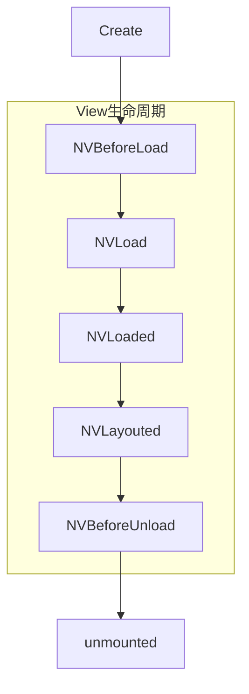

# UTS 组件开发

本文旨在帮助开发者，使用UTS开发Uni-App平台组件功能。


## 前置条件

继续阅读文档前，开发者需要了解以下前置条件：

+ HBuilderX 3.6.15 及之后版本

+ 了解Vue 组件基本概念

+ 目前仅支持nvue

## UTS组件简介

#### 为什么使用组件

组件是一种独立，可复用的UI单元，用于单独封装和承担一定的代码逻辑，组件化可以降低项目的工程复杂度，提升可维护性

组件与插件的区别在于：前者倾向于以标签的形式 对外提供UI封装，后者倾向于以函数/类 的形式 对外提供功能封装。如果你的需求更倾向于封装能力，请移步 [UTS插件开发](https://uniapp.dcloud.net.cn/plugin/uts-plugin.html)

组件一般适用于封装非全屏的场景，如果需要你需要封装的UI始终是全屏，那么可以考虑通过UTS开发原生页面来实现。 [UTS开发原生页面示例](https://gitcode.net/dcloud/hello-uts/-/tree/master/uni_modules/uts-nativepage)


#### 为什么使用UTS开发组件

UTS组件，即：使用UTS语言在uni平台进行组件开发的技术。


UTS组件的优势在于，它秉承了UTS的跨平台特性，统一的UTS语法，各终端不同的本地产出物。

在Android平台会被编译为会被渲染为Android原生View实例，IOS或其他终端平台也是如此。


|				|uts组件					|uni原生组件				|Vue组件				|
|:------		|:--------				|:-------- 				|:-------			|
|开发语言		|uts					|java/object-c			|js/ts				|
|组件载体		|系统原生View对象		|系统原生View对象		|WebView内部标签		|


为了降低前端开发者的开发门槛，UTS组件采用了类Vue组件的语法，[关于Vue组件](https://cn.vuejs.org/guide/essentials/component-basics.html)，但是具体的函数上会有定制，我们会在下一个章节详细介绍


## UTS组件结构解析


#### UTS组件目录结构


<pre v-pre="" data-lang="">
	<code class="lang-" style="padding:0">
┌─common                          // 可跨端公用的uts代码。推荐，不强制
├─static                          // 静态资源
├─utssdk
│	├─app-android                 //Android平台目录
│	│	├─assets                  //Android原生assets资源目录，可选
│	│	├─libs                    //Android原生库目录，可选
│	│	├─res                     //Android原生res资源目录，可选
│	│	├─AndroidManifest.xml     //Android原生应用清单文件，可选
│	│	├─config.json             //Android原生配置文件
│	│	├─index.uts               //Android原生插件能力实现，可选
|	|	└─index.vue               //Android原生组件能力实现，必选
│	├─app-ios                     //iOS平台目录
│	│	├─Frameworks              //iOS原生依赖的第三方 framework 依赖库存放目录，可选
│	│	├─Resources               //iOS原生所依赖的资源文件存放目录，可选
│	│	├─info.plist              //iOS原生所需要添加到主 info.plist 文件中的配置文件，可选
│	│	├─UTS.entitlements        //iOS原生所需要添加到主工程 .entitlements 文件中的配置文件，可选
│	│	├─config.json             //iOS原生配置文件
│	│	├─index.uts               //iOS原生插件能力实现，可选
|	|	└─index.vue               //iOS原生组件能力实现，必选
│	├─web                         //web平台目录
│	│	└─index.uts
│	├─mp-alipay                   // 支付宝小程序平台，可选
│	├─mp-baidu                    // 百度小程序平台，可选
│	├─mp-jd                       // 京东小程序平台（仅限vue2），可选
│	├─mp-kuaishou                 // 快手小程序平台，可选
│	├─mp-lark                     // 飞书小程序平台，可选
│	├─mp-qq                       // QQ小程序平台，可选
│	├─mp-toutiao                  // 字节跳动小程序平台，可选
│	├─mp-weixin                   // 微信小程序平台，可选
│	├─mp-xhs                      // 小红书小程序平台（仅限vue2），可选
│	├─index.d.ts                  // 插件能力声明，可选
│	└─index.uts                   // 跨平台插件能力实现，可选
└─package.json                    // 插件清单文件
</code>
</pre>


如上所示，UTS组件的目录结构与UTS插件基本相同

唯一的差别在于，UTS组件入口文件有两个，一个必选的index.vue 组件入口，和一个可选的index.uts 函数能力入口

用户如果在开发组件的同时，存在一些与组件无关的能力需要对外暴露，可以在index.uts中进行实现

大多数情况下，我们只需要开发一个index.vue 即可，如果存在多个组件，可以新建多个 *.vue文件

关于index.vue 的源码规范会在下一个章节介绍


#### UTS组件源码解析


下面是一个组件源码 index.vue 完整示例：

```ts

<template>
	<view class="defaultStyles">

	</view>
</template>
<script lang="uts">
	import TextUtils from 'android.text.TextUtils'
	import Button from 'android.widget.Button'
	import LinearLayout from 'android.widget.LinearLayout'
	import Color from 'android.graphics.Color'
	import View from 'android.view.View'

	class ButtonClickListsner extends View.OnClickListener {
		constructor() {}
		override onClick(v ? : View) {
			console.log(v)
		}
	}

	//原生提供以下属性或方法的实现  
	export default {
		/**
		 * 组件名称，也就是开发者使用的标签
		 */
		name: "uts-hello-view",
		/**
		 * 组件涉及的事件声明，只有声明过的事件，才能被正常发送
		 */
		emits: ['buttonClick'],
		/**
		 * 属性声明，组件的使用者会传递这些属性值到组件
		 */
		props: {
			/**
			 * 字符串类型 属性：buttonText  需要设置默认值
			 */
			"buttonText": {
				type: String,
				default: "点击触发"
			}
		},
		/**
		 * 组件内部变量声明
		 */
		data() {
			return {}
		},
		/**
		 * 属性变化监听器实现
		 */
		watch: {
			"buttonText": {
				/**
				 * 这里监听属性变化，并进行组件内部更新
				 */
				handler(newButtonText: string) {
					if (this.$el != null) {
						let button = this.$el!.findViewWithTag("centerButton") as Button
						if (!TextUtils.isEmpty(newButtonText)) {
							button.setText(newButtonText)
						}
					}
				},
				immediate: false //创建时是否通过此方法更新属性，默认值为false  
			},
		},
		/**
		 * 规则：如果没有配置expose，则methods中的方法均对外暴露，如果配置了expose，则以expose的配置为准向外暴露
		 * ['publicMethod'] 含义为：只有 `publicMethod` 在实例上可用
		 */
		expose: ['doSth'],
		methods: {
			/**
			 * 对外公开的组件方法
			 */
			doSth(paramA: string) {
				// 这是组件的自定义方法
				console.log("paramA")
			},
			/**
			 * 内部使用的组件方法
			 */
			privateMethod() {

			}
		},

		/**
		 * 组件被创建，组件第一个生命周期，
		 * 在内存中被占用的时候被调用，开发者可以在这里执行一些需要提前执行的初始化逻辑
		 * [可选实现]
		 */
		created() {

		},
		/**
		 * 对应平台的view载体即将被创建，对应前端beforeMount  
		 * [可选实现]
		 */
		NVBeforeLoad() {

		},
		/**
		 * 创建原生View，必须定义返回值类型
		 * 开发者需要重点实现这个函数，声明原生组件被创建出来的过程，以及最终生成的原生组件类型
		 * （Android需要明确知道View类型，需特殊校验） 
		 * todo 补充IOS平台限制
	  * [必须实现]
		 */
		NVLoad(): LinearLayout {
			//必须实现  
			let contentLayout = new LinearLayout($androidContext)
			let button = new Button($androidContext)
			button.setText("点击触发");
			button.setTag("centerButton");
			contentLayout.addView(button, LinearLayout.LayoutParams(500, 500));
			button.setOnClickListener(new ButtonClickListsner())
			return contentLayout
		},

		/**
		 * 原生View已创建 
		 * [可选实现]
		 */
		NVLoaded() {

		},
		/**
		 * 原生View布局完成  
		 * [可选实现]
		 */
		NVLayouted() {

		},
		/**
		 * 原生View将释放  
		 * [可选实现]
		 */
		NVBeforeUnload() {},
		/**
		 * 原生View已释放，这里可以做释放View之后的操作  
		 * [可选实现]
		 */
		NVUnloaded() {

		},
		/**
		 * 组件销毁  
		 * [可选实现]
		 */
		unmounted() {}
		/**
		 * 自定组件布局尺寸 
		 * [可选实现]
		 */
		doMeasure(size: UTSSize): UTSSize {
			size.width = 120.0.toFloat()
			size.height = 800.0.toFloat()
			return size
		}
	}
</script>
<style>
	/* 定义默认样式值, 组件使用者没有配置时使用 */
	.defaultStyles {
		width: 750rpx;
		height: 240rpx;
		background-color: blue;
	}
</style>

```


index.vue可以分为以下几类：

+ 配置：

	name：组件的使用标签，可以省略，若省略则默认为组件名称
	
	emits：组件允许的消息事件名称，如果没有组件消息，不需要配置

+ 属性：
	
	props：需要由组件的使用者提供，比如一个Image组件，会需要一个path属性作为图像路径来源
	
	watch：属性的监听实现，用来监听属性数据更新。
	
+ 数据：	

	data：组件内部数据定义，用于组件内部逻辑处理，不对外暴露

+ 方法：

	methods：组件方法定义，可以通过与expose组合使用，区分对内方法和对外方法
	
	expose：与methods 字段配合使用，用以区分组件对内方法和对外方法


+ 生命周期：

	组件需要重点处理 内存创建/销毁，View载体创建/销毁 过程中的资源管理，具体参考3.4章节
	
+ 内置对象：
	
	为了方便组件开发者，UTS组件内置了部分变量与函数，具体参考3.5章节


#### 生命周期 

组件开发者需要重点关注生命周期



|函数名			|描述				|建议行为		|是否可选	|
|:----			|:---				|:---			|:---		|
|created		|组件在内存中被创建	|开发者可以在这里执行一些需要最早执行的初始化逻辑|可选|
|NVBeforeLoad	|组件对应平台的view载体，即将被创建|开发者可以在这里执行一些需要在View创建前初始化的逻辑|可选|
|NVLoad			|组件view载体正在被创建实现|开发者需要重点实现这个函数，声明原生组件被创建出来的过程，以及最终生成的原生组件类型|必须实现|
|NVLayouted		|组件对应平台的view载体已布局结束	|需要在view布局结束后执行的逻辑	|可选|
|NVBeforeUnload	|view载体即将被卸载				|View卸载前，需要回收资源的逻辑	|可选|
|NVUnloaded		|view载体已经被卸载				|View卸载后，需要回收资源的逻辑	|可选|
|unmounted		|组件在内存被销毁				|资源回收逻辑					|可选|


除上述生命周期外，还存在下列可选周期函数：

+ doMeasure：

doMeasure 用于告诉排版系统，组件自身需要的宽高，具体的调用时机由排版系统决定。

一般情况下，组件的宽高应该是由终端系统的排版引擎决定，组件开发者不需要实现此函数。

但是部分场景下，组件开发者需要自己维护宽高，则需要开发者重写此函数


#### 内置对象和函数

为了方便组件开发者使用，UTS 组件内部内置了下列对象：

|变量名			|类型		|简介				|平台限制	|方法&属性	|
|:-------		|:--------	|:--------			|:---		|:---			|
|$el			|对象		|当前View实例对象	|全部平台	|开发者在NVLoad返回的对象类型|
|$androidContext|对象		|当前组件上下文		|仅android	|android平台对应Context对象|
|emit("event")	|函数		|发送已注册的事件	|全部平台	||


## 简单View的示例

#### 创建插件

在HBuilder X 中选中Uni-App项目下 uni_modules目录  

todo  目前还没有创建界面


这是创建后的目录结构


#### 编写逻辑

打开index.vue，键入下面的组件源码:

```ts
<template>
	<view class="defaultStyles">

	</view>
</template>
<script lang="uts">

	import TextUtils from 'android.text.TextUtils'
	import Button from 'android.widget.Button'
	import LinearLayout from 'android.widget.LinearLayout'
	import Color from 'android.graphics.Color'
	import View from 'android.view.View'

	class ButtonClickListsner extends View.OnClickListener {
		constructor() {}
		override onClick(v ? : View) {
			console.log(v)
		}
	}

	//原生提供以下属性或方法的实现  
	export default {
		/**
		 * 组件名称，也就是开发者使用的标签
		 */
		name: "uts-hello-view",
		/**
		 * 组件涉及的事件声明，只有声明过的事件，才能被正常发送
		 */
		emits: ['buttonClick'],
		/**
		 * 属性声明，组件的使用者会传递这些属性值到组件
		 */
		props: {
			/**
			 * 字符串类型 属性：buttonText  需要设置默认值
			 */
			"buttonText": {
				type: String,
				default: "点击触发"
			}
		},
		
		/**
		 * 属性变化监听器实现
		 */
		watch: {
			"buttonText": {
				/**
				 * 这里监听属性变化，并进行组件内部更新
				 */
				handler(newButtonText: string) {
					if (this.$el != null) {
						let button = this.$el!.findViewWithTag("centerButton") as Button
						if (!TextUtils.isEmpty(newButtonText)) {
							button.setText(newButtonText)
						}
					}
				}
			},
		},
		
		
		NVLoad(): LinearLayout {
			//必须实现  
			let contentLayout = new LinearLayout($androidContext)
			let button = new Button($androidContext)
			button.setText("点击触发");
			button.setTag("centerButton");
			contentLayout.addView(button, LinearLayout.LayoutParams(500, 500));
			button.setOnClickListener(new ButtonClickListsner())
			return contentLayout
		},

		
		
	}
</script>
<style>
	/* 定义默认样式值, 组件使用者没有配置时使用 */
	.defaultStyles {
		width: 750rpx;
		height: 240rpx;
		background-color: blue;
	}
</style>

```

#### 使用组件

打开任意 componet.nvue文件
```js
<uts-hello-view buttonText="点击按钮内容" style="width:375px;height: 375px;background-color: aqua;"></uts-hello-view>
```


## 包含第三方SDK的示例

#### 创建插件

在HBuilder X 中选中Uni-App项目下 uni_modules目录  

todo  目前还没有创建界面

这是创建后的目录结构


#### 引入依赖

打开 ~/uni_modules/uts-animation-view/utssdk/app-android/config.json

键入如下代码:

```
"dependencies": [
	"com.airbnb.android:lottie:3.4.0"
]
```

UTS组件建议使用远程依赖的方式集成，如果需要以AAR的形式添加SDK，可以添加到

~/uni_modules/uts-animation-view/utssdk/app-android/libs目录

#### 编写逻辑


#### 使用组件

#### 使用组件的注意事项

1. 需要自定义基座方能使用

2 不需要引用，直接使用自定义标签

```js
 <xxx-view  :propA="自定义属性值" ref="当前组件标签">
 </xxx-view>
```

#### 使用组件属性


组件的开发者，声明属性
```
props: {
	/**
	 * 属性A：propA  需要声明属性类型和默认值
	 */
	"propA": {
		type: String,
		default: ""
	},
},
```

组件使用者，使用属性
```js
 <xxx-view  :propA="自定义属性值" >
 </xxx-view>
```

#### 使用组件方法


组件的开发者，定义公开方法

```
methods: {
	publicMethod() {
		doSth(paramA: string) {
			// 这是组件的自定义方法
		}
	}
}
```
组件使用者，使用方法

```js
 // 布局代码
 <xxx-view  ref="customTag" >
 </xxx-view>
 // 调用代码
 this.$refs["customTag"].doSth('参数')
```


## 快速体验


开发者可以使用[Hello UTS](https://gitcode.net/dcloud/hello-uts) 快速体验UTS 组件开发

使用HX 3.6.16 版本 - 选择 Hello UTS - 自定义基座包。

查看：三方SDK-Lottie动画示例,对应的源码实现：~/uni_modules/uts-animation-view


## 常见问题
