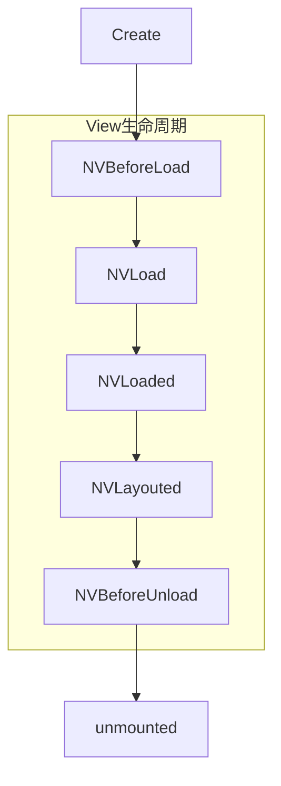

# UTS 组件开发

本文旨在帮助开发者，使用UTS开发Uni-App平台组件功能。


## 前置条件

继续阅读文档前，开发者需要了解以下前置条件：

+ HBuilderX 3.6.15 及之后版本

+ 了解Vue 组件基本概念

+ 目前仅支持nvue

## UTS组件简介

#### 为什么使用组件

组件是一种独立，可复用的UI单元，用于单独封装和承担一定的代码逻辑，组件化可以降低项目的工程复杂度，提升可维护性

组件与插件的区别在于：前者倾向于以标签的形式 对外提供UI封装，后者倾向于以函数/类 的形式 对外提供功能封装。如果你的需求更倾向于封装能力，请移步 [UTS插件开发](https://uniapp.dcloud.net.cn/plugin/uts-plugin.html)

组件一般适用于封装非全屏的场景，如果需要你需要封装的UI始终是全屏，那么可以考虑通过UTS开发原生页面来实现。 [UTS开发原生页面示例](https://gitcode.net/dcloud/hello-uts/-/tree/master/uni_modules/uts-nativepage)


#### 为什么使用UTS开发组件

UTS组件，即：使用UTS语言在uni平台进行组件开发的技术。


UTS组件的优势在于，它秉承了UTS的跨平台特性，统一的UTS语法，各终端不同的本地产出物。

在Android平台会被编译为会被渲染为Android原生View实例，IOS或其他终端平台也是如此。


|				|uts组件					|uni原生组件				|Vue组件				|
|:------		|:--------				|:-------- 				|:-------			|
|开发语言		|uts					|java/object-c			|js/ts				|
|组件载体		|系统原生View对象		|系统原生View对象		|WebView内部标签		|


为了降低前端开发者的开发门槛，UTS组件采用了类Vue组件的语法，[关于Vue组件](https://cn.vuejs.org/guide/essentials/component-basics.html)，但是具体的函数上会有定制，我们会在下一个章节详细介绍


## UTS组件结构解析


#### UTS组件目录结构


<pre v-pre="" data-lang="">
	<code class="lang-" style="padding:0">
┌─common                          // 可跨端公用的uts代码。推荐，不强制
├─static                          // 静态资源
├─utssdk
│	├─app-android                 //Android平台目录
│	│	├─assets                  //Android原生assets资源目录，可选
│	│	├─libs                    //Android原生库目录，可选
│	│	├─res                     //Android原生res资源目录，可选
│	│	├─AndroidManifest.xml     //Android原生应用清单文件，可选
│	│	├─config.json             //Android原生配置文件
│	│	├─index.uts               //Android原生插件能力实现，可选
|	|	└─index.vue               //Android原生组件能力实现，必选
│	├─app-ios                     //iOS平台目录
│	│	├─Frameworks              //iOS原生依赖的第三方 framework 依赖库存放目录，可选
│	│	├─Resources               //iOS原生所依赖的资源文件存放目录，可选
│	│	├─info.plist              //iOS原生所需要添加到主 info.plist 文件中的配置文件，可选
│	│	├─UTS.entitlements        //iOS原生所需要添加到主工程 .entitlements 文件中的配置文件，可选
│	│	├─config.json             //iOS原生配置文件
│	│	├─index.uts               //iOS原生插件能力实现，可选
|	|	└─index.vue               //iOS原生组件能力实现，必选
│	├─web                         //web平台目录
│	│	└─index.uts
│	├─mp-alipay                   // 支付宝小程序平台，可选
│	├─mp-baidu                    // 百度小程序平台，可选
│	├─mp-jd                       // 京东小程序平台（仅限vue2），可选
│	├─mp-kuaishou                 // 快手小程序平台，可选
│	├─mp-lark                     // 飞书小程序平台，可选
│	├─mp-qq                       // QQ小程序平台，可选
│	├─mp-toutiao                  // 字节跳动小程序平台，可选
│	├─mp-weixin                   // 微信小程序平台，可选
│	├─mp-xhs                      // 小红书小程序平台（仅限vue2），可选
│	├─index.d.ts                  // 插件能力声明，可选
│	└─index.uts                   // 跨平台插件能力实现，可选
└─package.json                    // 插件清单文件
</code>
</pre>


如上所示，UTS组件的目录结构与UTS插件基本相同

唯一的差别在于，UTS组件入口文件有两个，一个必选的index.vue 组件入口，和一个可选的index.uts 函数能力入口

用户如果在开发组件的同时，存在一些与组件无关的能力需要对外暴露，可以在index.uts中进行实现

大多数情况下，我们只需要开发一个index.vue 即可，如果存在多个组件，可以新建多个 xxx.vue文件

关于 index.vue 源码如何编写，我们会在下一个章节介绍


#### index.vue源码结构


下面是一个组件源码 index.vue 完整示例：

**注意**

- 目前UTS组件仅支持`export default {}`的选项式API，vue3的组合式API暂未支持。

```ts

<template>
	<view class="defaultStyles">

	</view>
</template>
<script lang="uts">
	import TextUtils from 'android.text.TextUtils'
	import Button from 'android.widget.Button'
	import LinearLayout from 'android.widget.LinearLayout'
	import Color from 'android.graphics.Color'
	import View from 'android.view.View'

	class ButtonClickListsner extends View.OnClickListener {
		constructor() {}
		override onClick(v ? : View) {
			console.log(v)
		}
	}

	//原生提供以下属性或方法的实现  
	export default {
		/**
		 * 组件名称，也就是开发者使用的标签
		 */
		name: "uts-hello-view",
		/**
		 * 组件涉及的事件声明，只有声明过的事件，才能被正常发送
		 */
		emits: ['buttonClick'],
		/**
		 * 属性声明，组件的使用者会传递这些属性值到组件
		 */
		props: {
			/**
			 * 字符串类型 属性：buttonText  需要设置默认值
			 */
			"buttonText": {
				type: String,
				default: "点击触发"
			}
		},
		/**
		 * 组件内部变量声明
		 */
		data() {
			return {}
		},
		/**
		 * 属性变化监听器实现
		 */
		watch: {
			"buttonText": {
				/**
				 * 这里监听属性变化，并进行组件内部更新
				 */
				handler(newButtonText: string) {
					if (this.$el != null) {
						let button = this.$el!.findViewWithTag("centerButton") as Button
						if (!TextUtils.isEmpty(newButtonText)) {
							button.setText(newButtonText)
						}
					}
				},
				immediate: false //创建时是否通过此方法更新属性，默认值为false  
			},
		},
		/**
		 * 规则：如果没有配置expose，则methods中的方法均对外暴露，如果配置了expose，则以expose的配置为准向外暴露
		 * ['publicMethod'] 含义为：只有 `publicMethod` 在实例上可用
		 */
		expose: ['doSth'],
		methods: {
			/**
			 * 对外公开的组件方法
			 */
			doSth(paramA: string) {
				// 这是组件的自定义方法
				console.log("paramA")
			},
			/**
			 * 内部使用的组件方法
			 */
			privateMethod() {

			}
		},

		/**
		 * 组件被创建，组件第一个生命周期，
		 * 在内存中被占用的时候被调用，开发者可以在这里执行一些需要提前执行的初始化逻辑
		 * [可选实现]
		 */
		created() {

		},
		/**
		 * 对应平台的view载体即将被创建，对应前端beforeMount  
		 * [可选实现]
		 */
		NVBeforeLoad() {

		},
		/**
		 * 创建原生View，必须定义返回值类型
		 * 开发者需要重点实现这个函数，声明原生组件被创建出来的过程，以及最终生成的原生组件类型
		 * （Android需要明确知道View类型，需特殊校验） 
		 * todo 补充IOS平台限制
	  * [必须实现]
		 */
		NVLoad(): LinearLayout {
			//必须实现  
			let contentLayout = new LinearLayout($androidContext)
			let button = new Button($androidContext)
			button.setText("点击触发");
			button.setTag("centerButton");
			contentLayout.addView(button, LinearLayout.LayoutParams(500, 500));
			button.setOnClickListener(new ButtonClickListsner())
			return contentLayout
		},

		/**
		 * 原生View已创建 
		 * [可选实现]
		 */
		NVLoaded() {

		},
		/**
		 * 原生View布局完成  
		 * [可选实现]
		 */
		NVLayouted() {

		},
		/**
		 * 原生View将释放  
		 * [可选实现]
		 */
		NVBeforeUnload() {},
		/**
		 * 原生View已释放，这里可以做释放View之后的操作  
		 * [可选实现]
		 */
		NVUnloaded() {

		},
		/**
		 * 组件销毁  
		 * [可选实现]
		 */
		unmounted() {}
		/**
		 * 自定组件布局尺寸 
		 * [可选实现]
		 */
		doMeasure(size: UTSSize): UTSSize {
			size.width = 120.0.toFloat()
			size.height = 800.0.toFloat()
			return size
		}
	}
</script>
<style>
	/* 定义默认样式值, 组件使用者没有配置时使用 */
	.defaultStyles {
		width: 750rpx;
		height: 240rpx;
		background-color: blue;
	}
</style>

```


index.vue 要素可以分为以下几类：

+ 配置：

	name：组件的使用标签，可以省略，若省略则默认为组件名称
	
	emits：组件允许的消息事件名称，如果没有组件消息，不需要配置

+ 属性：
	
	props：需要由组件的使用者提供，比如一个Image组件，会需要一个path属性作为图像路径来源
	
	watch：属性的监听实现，用来监听属性数据更新。
	
+ 数据：	

	data：组件内部数据定义，用于组件内部逻辑处理，不对外暴露

+ 方法：

	methods：组件方法定义，可以通过与expose组合使用，区分对内方法和对外方法
	
	expose：与methods 字段配合使用，用以区分组件对内方法和对外方法


+ 生命周期：

	组件需要重点处理 内存创建/销毁，View载体创建/销毁 过程中的资源管理，具体参考生命周期章节
	
+ 内置对象：
	
	为了方便组件开发者，UTS组件内置了部分变量与函数，具体参考内置对象与函数章节


#### 生命周期 

组件开发者需要重点关注组件的生命周期，以便进行初始化和资源回收



|函数名			|描述				|建议行为		|是否可选	|
|:----			|:---				|:---			|:---		|
|created		|组件在内存中被创建	|开发者可以在这里执行一些需要最早执行的初始化逻辑|可选|
|NVBeforeLoad	|组件对应平台的view载体，即将被创建|开发者可以在这里执行一些需要在View创建前初始化的逻辑|可选|
|NVLoad			|组件view载体正在被创建实现|开发者需要重点实现这个函数，声明原生组件被创建出来的过程，以及最终生成的原生组件类型|必须实现|
|NVLayouted		|组件对应平台的view载体已布局结束	|需要在view布局结束后执行的逻辑	|可选|
|NVBeforeUnload	|view载体即将被卸载				|View卸载前，需要回收资源的逻辑	|可选|
|NVUnloaded		|view载体已经被卸载				|View卸载后，需要回收资源的逻辑	|可选|
|unmounted		|组件在内存被销毁				|资源回收逻辑					|可选|


除上述生命周期外，还存在下列可选周期函数：

+ doMeasure：

doMeasure 用于告诉排版系统，组件自身需要的宽高，具体的调用时机由排版系统决定。

一般情况下，组件的宽高应该是由终端系统的排版引擎决定，组件开发者不需要实现此函数。

但是部分场景下，组件开发者需要自己维护宽高，则需要开发者重写此函数


#### 内置对象和函数

为了方便组件开发者使用，UTS 组件内部内置了下列对象：

|变量名			|类型		|简介				|平台限制	|方法&属性	|
|:-------		|:--------	|:--------			|:---		|:---			|
|$el			|对象		|当前View实例对象	|全部平台	|开发者在NVLoad返回的对象类型|
|$androidContext|对象		|当前组件上下文		|仅android	|android平台对应Context对象|
|emit("event")	|函数		|发送已注册的事件	|全部平台	||


## 简单View的示例


本章节以 一个极简的组件开发为例，介绍说明UTS组件开发流程


#### 创建插件

在HBuilder X 中选中Uni-App项目下 uni_modules目录  

todo  目前还没有创建界面


这是创建后的目录结构


#### 编写逻辑

打开index.vue，键入下面的组件源码:

```ts
<template>
	<view class="defaultStyles">

	</view>
</template>
<script lang="uts">

	import TextUtils from 'android.text.TextUtils'
	import Button from 'android.widget.Button'
	import LinearLayout from 'android.widget.LinearLayout'
	import Color from 'android.graphics.Color'
	import View from 'android.view.View'

	class ButtonClickListsner extends View.OnClickListener {
		constructor() {}
		override onClick(v ? : View) {
			console.log(v)
		}
	}

	//原生提供以下属性或方法的实现  
	export default {
		name: "uts-hello-view",
		props: {
			"buttonText": {
				type: String,
				default: "点击触发"
			}
		},
		
		watch: {
			"buttonText": {
				
				handler(newButtonText: string) {
					if (this.$el != null) {
						let button = this.$el!.findViewWithTag("centerButton") as Button
						if (!TextUtils.isEmpty(newButtonText)) {
							button.setText(newButtonText)
						}
					}
				}
			},
		},
		
		NVLoad(): LinearLayout {
			//必须实现  
			let contentLayout = new LinearLayout($androidContext)
			let button = new Button($androidContext)
			button.setTag("centerButton");
			contentLayout.addView(button, LinearLayout.LayoutParams(500, 500));
			button.setOnClickListener(new ButtonClickListsner())
			return contentLayout
		},
		
		
	}
</script>
<style>
	/* 定义默认样式值, 组件使用者没有配置时使用 */
	.defaultStyles {
		width: 750rpx;
		height: 240rpx;
		background-color: blue;
	}
</style>

```


上面的代码，我们自定义了一个  名为<uts-hello-view/>的UTS 组件，该组件对外提供了一个包含按钮的简单UI实现，并且对外暴露了一个名为 `buttonText`字符串属性，用来构建按钮上的文案
 
接下来，我们在下面章节介绍在uni-app项目中如何使用它

#### 使用组件

>> 需要注意的是，UTS组件默认全局注册，无需使用者手动配置

我们在uni-app项目中新建 componet.nvue 页面，

直接使用`uts-hello-view`标签，并且定义`buttonText`文本内容即可看到效果。

点击按钮，可以在控制台看到组件内部实现的日志输出

```js
<template>
	<div>
		<text>UTS view组件</text>
		<uts-hello-view buttonText="点击按钮内容" style="width:375px;height: 375px;background-color: aqua;"></uts-hello-view>
	</div>
	
</template>

<script>
</script>

<style>
</style>
```


#### 运行和测试

在当前示例中，不涉及第三方依赖，使用标准基座直接运行即可


## 包含第三方SDK的示例

本章节以lottie动画组件为例，介绍包含三方SDK的UTS组件开发过程

#### 创建插件

在HBuilder X 中选中Uni-App项目下 uni_modules目录  

todo  目前还没有创建界面

这是创建后的目录结构


#### 引入依赖

打开 ~/uni_modules/uts-animation-view/utssdk/app-android/config.json

键入如下代码:

```
"dependencies": [
	"com.airbnb.android:lottie:3.4.0"
]
```

UTS组件建议使用远程依赖的方式集成，如果需要以AAR的形式添加SDK，可以添加到

~/uni_modules/uts-animation-view/utssdk/app-android/libs目录

依赖的配置原则与UTS插件一致 [UTS插件依赖说明](https://uniapp.dcloud.net.cn/plugin/uts-for-android.html#_3-4-%E5%A2%9E%E5%8A%A0libs%E4%BE%9D%E8%B5%96%E8%B5%84%E6%BA%90)

#### 编写逻辑


打开index.vue，键入下面的组件源码:

```ts
<template>
    <view class="defaultStyles">

    </view>
</template>
<script lang="uts">
    import Animator from 'android.animation.Animator'
    import TextUtils from 'android.text.TextUtils'
    import View from 'android.view.View'
    import LottieAnimationView from 'com.airbnb.lottie.LottieAnimationView'
    import LottieDrawable from 'com.airbnb.lottie.LottieDrawable'
	import FileInputStream from 'java.io.FileInputStream'
	import { UTSAndroid } from "io.dcloud.uts";

    class CustomAnimListener extends Animator.AnimatorListener {

        comp: UTSComponent < LottieAnimationView >
            constructor(com: UTSComponent < LottieAnimationView > ) {
                super();
                this.comp = com
            }

        override onAnimationStart(animation: Animator | null) {}

        override onAnimationEnd(animation: Animator | null, isReverse: Boolean) {
            this.comp.emit("bindended")
        }

        override onAnimationEnd(animation: Animator | null) {}

        override onAnimationCancel(animation: Animator | null) {}

        override onAnimationRepeat(animation: Animator | null) {}
    }

    //原生提供以下属性或方法的实现  
    export default {
        name: "uts-animation-view",
        /**
         * 当播放到末尾时触发 ended 事件（自然播放结束会触发回调，循环播放结束及手动停止动画不会触发）
         */
        emits: ['bindended'],
        props: {
            /**
             * 动画资源地址，目前只支持绝对路径
             */
            "path": {
                type: String,
                default: ""
            },
            /**
             * 动画是否循环播放
             */
            "autoplay": {
                type: Boolean,
                default: false
            },
            /**
             * 动画是否自动播放
             */
            "loop": {
                type: Boolean,
                default: false
            },
            /**
             * 是否隐藏动画
             */
            "hidden": {
                type: Boolean,
                default: false
            },
            /**
             * 动画操作，可取值 play、pause、stop
             */
            "action": {
                type: String,
                default: "stop"
            }

        },
        data() {
            return {

            }
        },
        watch: {
            "path": {
                handler(newPath: string) {

                    
					if(this.$el != null){
						let lottieAnimationView = this.$el!
						if (!TextUtils.isEmpty(newPath)) {
							
							
						    if (newPath.startsWith("http://") || newPath.startsWith("https://")) {
						        lottieAnimationView.setAnimationFromUrl(newPath)
						    } else {
						        // 默认是static了
								var realJsonPath = UTSAndroid.getResourcePath(newPath)
						        lottieAnimationView.setAnimation(new FileInputStream(realJsonPath),newPath)
						    }
						}
						if (this.autoplay) {
						    lottieAnimationView.playAnimation()
						}
					}
                },
                immediate: false //创建时是否通过此方法更新属性，默认值为false  
            },
            "loop": {
                handler(newLoop: Boolean) {
					if(this.$el != null){
						if (newLoop) {
						    this.$el!.repeatCount = Int.MAX_VALUE
						} else {
						    // 不循环则设置成1次
						    this.$el!.repeatCount = 0
						}
						
						if (this.autoplay) {
						    this.$el!.playAnimation()
						}
					}
                    
                },
                immediate: false //创建时是否通过此方法更新属性，默认值为false  
            },

            "autoplay": {
                handler(newValue: boolean) {
					if(this.$el != null){
						if (newValue) {
						    this.$el!.playAnimation()
						}
					}
                    
                },
                immediate: false //创建时是否通过此方法更新属性，默认值为false  
            },

            "action": {
                handler(newAction: string) {

                    if (newAction == "play" || newAction == "pause" || newAction == "stop") {

						if(this.$el != null){
							if (this.action == "play") {
							    this.$el!.playAnimation()
							} else if (this.action == "pause") {
							    this.$el!.pauseAnimation()
							} else if (this.action == "stop") {
							    this.$el!.cancelAnimation()
							    this.$el!.clearAnimation()
							}
						}
                        

                    } else {
                        // 非法入参，不管
                    }
                },
                immediate: false //创建时是否通过此方法更新属性，默认值为false  
            },

            "hidden": {
                handler(newValue: boolean) {
					if(this.$el != null){
						if (newValue) {
						    this.$el!.visibility = View.GONE
						} else {
						    this.$el!.visibility = View.VISIBLE
						}
					}
                },
                immediate: false //创建时是否通过此方法更新属性，默认值为false  
            },

        },
        methods: {
            setRepeatMode(repeat: string) {
				if(this.$el != null){
					if ("RESTART" == repeat) {
					    this.$el!.repeatMode = LottieDrawable.RESTART
					} else if ("REVERSE" == repeat) {
					    this.$el!.repeatMode = LottieDrawable.RESTART
					}
				}
            },
            privateMethod() { //如何定义不对外暴露的API？ 暂不支持，需在export外写  
            }
        },
        created() { //创建组件，替换created  

        },
        NVBeforeLoad() { //组件将要创建，对应前端beforeMount  
            //可选实现，这里可以提前做一些操作  
        },
        NVLoad(): LottieAnimationView { //创建原生View，必须定义返回值类型（Android需要明确知道View类型，需特殊校验）  
            //必须实现  
            let lottieAnimationView = new LottieAnimationView($androidContext)
            return lottieAnimationView
        },
		
        NVLoaded() { //原生View已创建  
			//可选实现，这里可以做后续操作
			if(this.$el != null){
				this.$el!.repeatMode = LottieDrawable.RESTART;
				this.$el!.visibility = View.GONE
				this.$el!.repeatCount = 0
				this.$el!.addAnimatorListener(new CustomAnimListener(this))
			}
           
        },
        NVLayouted() { //原生View布局完成  
            //可选实现，这里可以做布局后续操作  
        },
        NVBeforeUnload() { //原生View将释放  
            //可选实现，这里可以做释放View之前的操作  
        },
        NVUnloaded() { //原生View已释放  
            //可选实现，这里可以做释放View之后的操作  
        },
        unmounted() { //组件销毁  
            //可选实现  
        }
    }
</script>
<style>
    /* 定义默认样式值, 组件使用者没有配置时使用 */
    .defaultStyles {
        width: 750rpx;
        height: 240rpx;
    }
</style>

```

上面的代码我们实现了一个支持lottie动画播放的 UTS组件，标签名称为 <uts-animation-view />,

对外提供了下列属性和方法

|属性		|类型	|默认值	|描述	|
|:---		|:--	|:--	|:---	|
|`path`		|string	||`lottie`资源路径，支持本地地址和`http`协议下的网络地址|
|`loop`		|boolean|false	|动画是否循环播放|
|`autoplay`	|boolean|true	|动画是否自动播放|
|`action`	|string	|play	|动画操作，可取值 play、pause、stop|
|`hidden`	|boolean|true	|是否隐藏动画|
|`bindended`|event	|		|当播放到末尾时触发 ended 事件|
|`setRepeatMode`|function|		|设置动画的重复方式，RESTART：重新开始播放，REVERSE，反向播放|


#### 使用组件

新建 lottie.nvue 页面，引用自定义 uts-animation-view 组件，并编写测试用例

```
<template>
    <div>
        <button @tap="changeUrl">播放本地动画资源</button>
		<button @tap="changeServerUrl">播放远程动画资源</button>
		
        <button @tap="changeAutoPlay">测试AutoPlay</button>
        <button @tap="changeLoop">测试Loop</button>
        <button @tap="changeAction(1)">测试action play</button>
        <button @tap="changeAction(2)">测试action pause</button>
        <button @tap="changeAction(3)">测试action stop</button>
        <uts-animation-view ref="animView" :path="animUrl" :autoplay="autoplay" :loop="loop" :action="action"
            :hidden="hidden" @bindended="testAnimEnd" @click="lottieClickTest" @longpress="lottieLongpressTest"
            :style="{width:widthNum+'rpx',height:heightNum+'px',background:yanse}">
        </uts-animation-view>
        
    </div>
</template>

<script>
  
    export default {
        data() {
            return {
                hidden: false,
                autoplay: false,
                action: "play",
                loop: false,
                yanse: "red",
                widthNum: 750,
                heightNum: 200,
                comShow: true,
                animUrl: "/static/anim_a.json"
            }
        },
        
        methods: {

            changeAutoPlay: function() {
                this.autoplay = !this.autoplay
            },
            changeUrl: function() {
                if (this.animUrl == "/static/anim_a.json") {
                    this.animUrl = "/static/anim_b.json"
                } else {
                    this.animUrl = "/static/anim_a.json"
                }
            },

			changeServerUrl: function() {
                this.animUrl = "https://b.bdstatic.com/miniapp/images/lottie_example_one.json"
            },
            changeAction: function(type) {
                if (type == 1) {
                    this.action = "play"
                } else if (type == 2) {
                    this.action = "pause"
                } else if (type == 3) {
                    this.action = "stop"
                }
            },
            changeLoop: function() {
                this.loop = !this.loop
            },
            testAnimEnd: function(res) {
                console.log("testAnimEnd");
            },

            changeRepeat: function(res) {
                let repeatConfig = {
                    count: 3,
                    mode: "restart"
                }
                this.$refs["animView"].updateRepeatConfig(repeatConfig, function(res) {
                    console.log(res);
                });

            },
            lottieClickTest: function(res) {
                console.log("lottieClickTest");
                console.log(res);
            },
            lottieLongpressTest: function(res) {
                console.log("lottieClickTest");
                console.log(res);
            },
        }
    }
</script>

```

上面的代码实现了一个名为


#### 运行和测试

在当前例子中，需要下载额外的第三方依赖，需要自定义基座方能使用

点击页面中的测试按钮，即可看到

## 快速体验


开发者可以使用[Hello UTS](https://gitcode.net/dcloud/hello-uts) 快速体验UTS 组件开发

使用HX 3.6.16 版本 - 选择 Hello UTS - 自定义基座包。

查看：三方SDK-Lottie动画示例,对应的源码实现：~/uni_modules/uts-animation-view


## 常见问题
