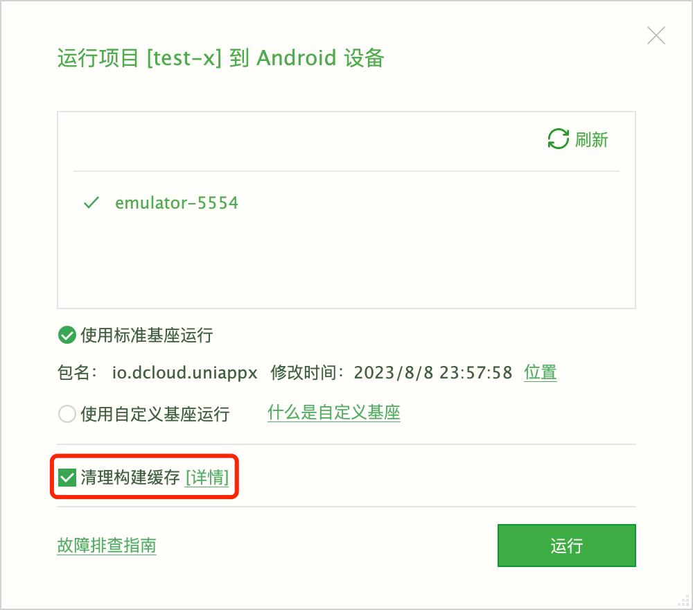

#### 什么是 uni-app x 编译器

`uni-app x`编译器是在Vite基础上进行扩展开发的，集成了uts编译器，从而实现一套uts、uvue代码多端运行。
它的大部分特性（如条件编译）和配置项（如环境变量）与`uni-app`vue3的编译器一致，[详见](https://uniapp.dcloud.net.cn/tutorial/compiler.html)

#### 编译缓存 @cache

`uni-app x`编译器引入了编译缓存机制，以优化开发体验。
在App端，`uni-app x`首先将uts和uvue编译为平台原生语言（如Kotlin），然后经过平台配套的编译器进行打包运行。由于平台原生语言的打包编译过程耗时较长，因此编译器引入了缓存机制来加快开发过程。
在编译时，开发者的uts和uvue代码的编译结果会被持久化为缓存。当下次运行时，如果代码没有发生变动，编译器会优先使用缓存中的编译结果，从而加快编译速度。
如果您不想使用缓存，可以在HBuilderX运行窗口勾选`清理构建缓存`

