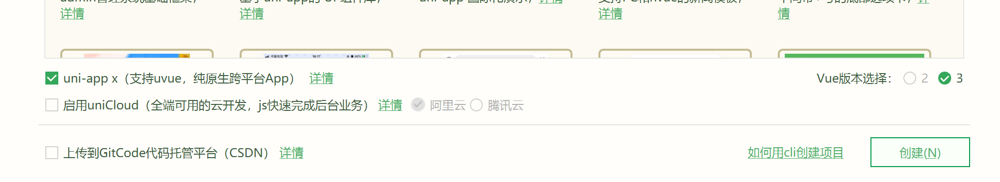
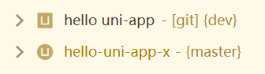
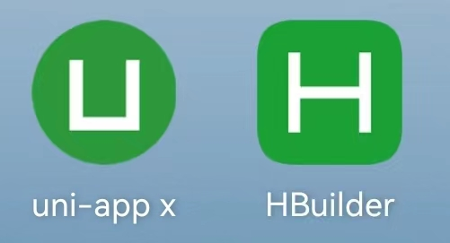

# uni-app x项目

## 新建
在HBuilder3.9起，新建uni-app项目界面的底部有一个checkbox：uni-app x。勾选后会新建为uni-app x项目。



uni-app x的项目，manifest.json中会多一个节点`"uni-app-x" : {}`。这是HBuilder识别项目类型的标记。
```json
{
    "name" : "hello-uniapp x",
    "appid" : "__UNI__4517034",
    "description" : "",
    "versionName" : "1.0.0",
    "versionCode" : "100",
    "uni-app-x" : {
    }
}
```

uni-app x的项目，在左侧项目管理器的图标是圆形的U（之前是方型的U）。



## 项目结构

uni-app x的项目结构与之前基本一致。

主要的差别是没有nativeplugins目录和wxcomponents目录。原因是uni-app x不支持uni-app js引擎版的原生语言插件，不支持微信小程序wxml组件。

基于uts的插件，可以在uni-app x和uni-app上通用。

## 运行

uni-app x的真机运行基座，和uni-app js引擎版不同，是一个绿色圆形的U（之前是方型H），基座名称默认为`uni-app x`（之前叫HBuilder）。


- uni-app x基座，只能运行uni-app x项目，包名是io.dcloud.uniappx
- HBuilder基座，可以运行5+App、wap2app和uni-app js引擎版。包名是io.dcloud.HBuilder

uni-app x运行时，控制台右上角可以选择开启原生日志。

公测版带宽有限，打包自定义基座或正式包时可能更慢。

目前仅支持真机运行，不支持断点debug。

## 发行
uni-app x目前只能打包apk。

暂不支持渠道包。

不支持wgt热更新、不支持安心打包。

下载到项目下的uts插件可打包含入。但内置模块暂不支持拆除，比如video。