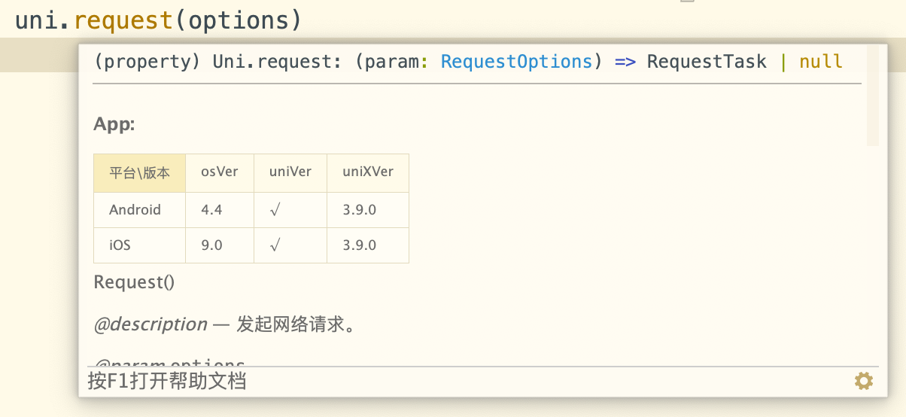
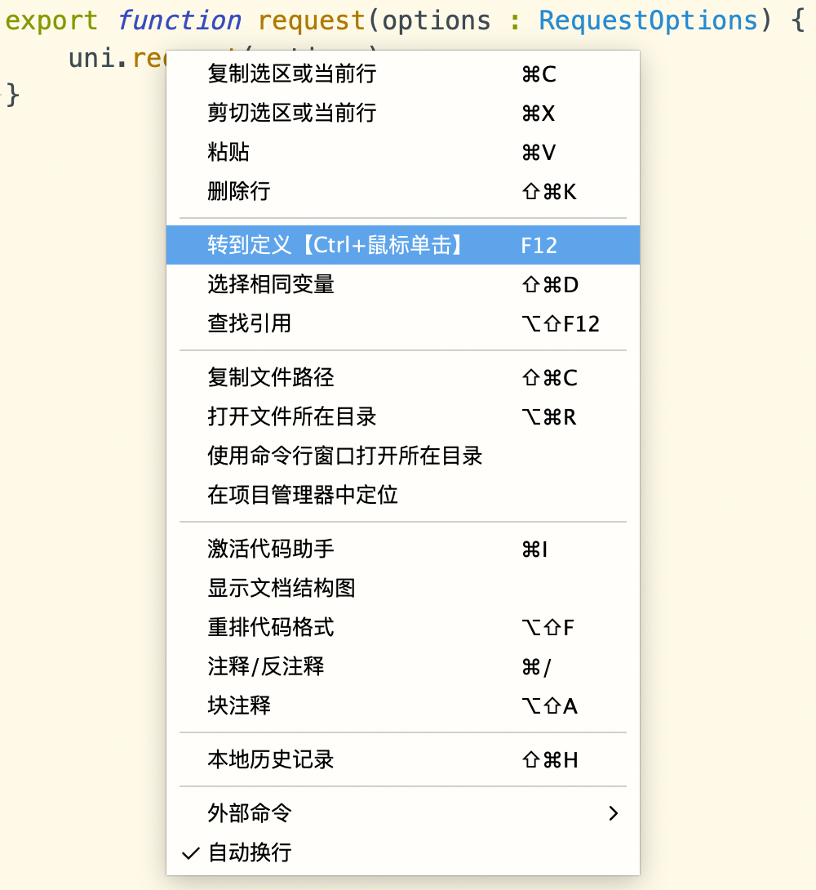

# uni-app x 开发注意

与web开发相比，uni-app x最大的变化有2个：
- 弱类型的js改为了强类型的uts
- 不再使用webview渲染，导致css有变化

重视，并把握好这两点，就可以很快上手。

## 类型系统注意

强类型语言中，变量、方法、参数、返回值、data数据，都必须有类型。

基础类型包括：boolean|string|number|Array|Date|UTSJSONObject|any|null...

开发者需阅读 [uts](https://uniapp.dcloud.net.cn/uts/) 文档，了解类型的定义和使用。

如下代码比较典型的说明了uni-app x中uts类型的要求。

可以看出template和css的代码和以前的uni-app相同，但script区域有变化。

不管是data、自定义变量，甚至是组件事件参数（TouchEvent），都必须有类型。

有的没有通过`:`定义类型，其实是因为编译器具备一定的自动推导能力，可以帮开发者自动补类型。

data里`:`的用途是赋值，无法通过`:`定义类型，所以data的数据有2种处理方式：1、通过字面量自动推导；2、通过`as`声明

```html
<template>
	<view @touchstart="touchstart">
		<text class="red">{{s1}}</text>
	</view>
	<button @click="buttonClick" :disabled="buttonEnable">按钮</button>
</template>
<script lang="uts">
	type User = {
		name:string
	} //定义一个User类型
	export default {
		data() {
			const date = new Date() //自动推导类型为Date
			const v = 1; //自动推导为number
			return {
				buttonEnable: false, //自动推导为boolean
				s1 : "hello", // 根据字面量推导为string
				n1 : 0 as number, // 这里其实可以根据字面量自动推导，as number写不写都行
				n2, // 不合法，必须指定类型。真实运行时请删掉本行
				n3 as number, // 不合法，uts不支持undefined，必须初始化。真实运行时请删掉本行
				n4 : null as number | null // 合法。定义为可为null的数字，初始值是null，但在使用n4前必须为其赋值数字
				year: date.getFullYear() as number, // 在data里，目前无法通过变量类型推导data项的类型，需使用 as 显式声明
				t: ``, // 模板字面量，推导为 string
				o: { id: 1, name:"DCloud" }, // 对象字面量，推导为 UTSJSONObject，注意：访问 data 中定义的UTSJSONObject属性时，需要使用索引访问，如 this.o["id"]
				an: [1, 2], // 数组字面量，如果元素均为纯数字字面量，则推导为 Array<number>
				as: ['1', '2', `3`], // 数组字面量，如果元素均为纯字符串或模板字符串字面量，则推导为 Array<string>
				ab: [true, false], // 数组字面量，如果元素均为boolean字面量，则推导为 Array<boolean>
				ao: [{ id: 1 }, { id: 2 }], // 数组字面量，如果元素均为对象字面量，则推导为 Array<UTSJSONObject>
				am: [[1, 2], [2, 3], [3, 4]], // 数组字面量，支持嵌套推导，推导为 Array<Array<number>>
				aa: [1, '2'], // 数组字面量，如果元素类型不一致，则推导为 Array<any|null>
				u: { name: 'DCloud' } as User, // 类型断言，如果主动指定了类型，则不做自动推导，使用指定的类型，注意：自定义type，需要定义在 export default 外部或通过其他文件导入
				au: [{ name: 'DCloud' }] as User[], // 类型断言，支持数组类型断言
				v: v, // 非字面量类型，目前未指定类型断言，推导为 any | null，建议此情况，均通过as手动指定类型
			}
		}
		methods: {
			touchstart(e : TouchEvent) { // e必须有类型
				let sX:number = e.touches[0].screenX;
				let sY:number = e.touches[0].screenY;
			},
			buttonClick: function () { // 如果不需要 event 参数，可以省略
				this.buttonEnable = true
				this.s1 = "点过按钮了"
			},
		}
	}
</script>
<style>
.red{
	color:red
}
</style>
```

## 函数 event 参数的类型 @function-event-argument-type

上面的例子中，touchstart事件中必须对`e`指定类型，才能使用`e.touches[0].screenX`。下面再举一个例子，加深下记忆：

```vue
<template>
	<switch @change="switchChange" />
</template>
<script lang="uts">
	export default {
		methods: {
			switchChange: function (e : SwitchChangeEvent) { // 这里必须声明e的类型为SwitchChangeEvent
				console.log('switch 发生 change 事件，携带值为', e.detail.value)
			}
		}
	}
</script>
```

那event参数的类型从哪里获取呢？
1. 组件的文档中有介绍，比如[switch的组件](component/switch.md)
2. ide中有提示，比如鼠标移到switch组件的`@change`上，悬浮出现hover，会显示：`(property) 'change': (event: SwitchChangeEvent) => void`

```html
<view @click="(e: any) => foo(e)">event must has type</view>
<view @click="foo($event as MouseEvent)">event must has type</view>
```

## 函数参数类型

如果函数参数为基础数据类型，函数调用时，参数类型可以省略，编译器会自动推导。\
如果函数参数为自定义数据类型，则必须指定类型。

```ts
// 基础数据类型
function foo1(a: string, b: number) {
	console.log(a, b)
}
foo1('hello', 1)

// 自定义数据类型
type Person = {
	name: string
	age: number
}
function foo2(p: Person) {
	console.log(p.name, p.age)
}
foo2({ name: 'name', age: 18 } as Person)
// 或者
const person: Person = { name: 'name', age: 18 }
foo2(person)
```

## JSON的类型

JSON数据在强类型语言中使用时，不能像js那样随意。

js中可以这么写：
```js
var p ={"name": "zhangsan","age": 12}
p.age //12
```

但是在强类型语言中，如果想要使用`p.age`，那么p必须是一个对象，而age则是这个对象的属性。然后必须为p对象、name属性、age属性，都定义类型，比如name是string，age是number。

uts中有2种方式使用json数据：
1. 把json数据转为type，自定义一个类型，声明json数据内容中每个属性的类型。然后就可以使用对象属性的方式来使用json数据。[详见](../uts/data-type.md#type)
2. 使用UTSJSONObject，不为json定义类型，然后通过下标和方法来使用json数据。[详见](../uts/data-type.md#ustjsonobject)

如果是联网获取服务器发下的json数据，那么**务必需要读教程**[request](tutorial/request.md)

## 编译器的类型优化

- 生命周期的参数及参数类型均可省略。以 `onLoad` 为例：
```ts
// 省略参数
onLoad() {
	console.log('onLoad')
}
// 省略参数类型
onLoad(options) {
	console.log('onLoad')
}
```
- 模板函数的 event 参数可以省略，但如果参数存在，则必须有类型。
```html
<template>
	<view @touchstart="onTouchstart" @click="onClick">
		<text>text</text>
	</view>
</template>
<script lang="uts">
	export default {
		methods: {
			onTouchstart() { // event 参数可以省略
				console.log('onTouchstart')
			},
			onClick: function (event: MouseEvent) { // event 参数存在，必须指定类型
				console.log(event)
			}
		}
	}
</script>
```
- uni 及 uniCloud API, {} 字面量参数可以省略类型，success、fail 和 complete 回调函数及其参数类型也可以省略。以 `uni.navigateTo` 为例：
```ts
// 省略 {} 字面量参数类型
uni.navigateTo({
	url: 'test'
	// 省略回调函数
})

uni.navigateTo({
	url: 'test',
	// 省略回调函数参数类型
	success(res){
		console.log(res)
	}
})
```
如需获取 API 的参数类型信息，可通过鼠标悬浮查看，



比如封装 `uni.request` 时，如果参数从函数外部传入，则需要指定参数类型，否则无法获取参数类型信息。
```ts
// 封装
function request(options : RequestOptions) {
	uni.request(options)
}
// 调用
request({url: 'https://www.example.com/request'} as RequestOptions)
```
如果需要查看更详细的参数类型信息，可通过鼠标右键点击转到定义，跳转 d.ts 文件进行查看，如下图所示：



## uts不支持js的一些功能和特性

- 不支持undefined。任何变量被定义后，都需要赋值
- 暂不支持async、await
- 函数声明方式不支持[作为值传递](../uts/function.md#作为值传递)
- 函数表达式方式不支持[默认参数](../uts/function.md#默认参数)

## vue使用注意

[详见](uni-app-x/vue/README.md)

## css使用注意

[详见](uni-app-x/css/README.md)
