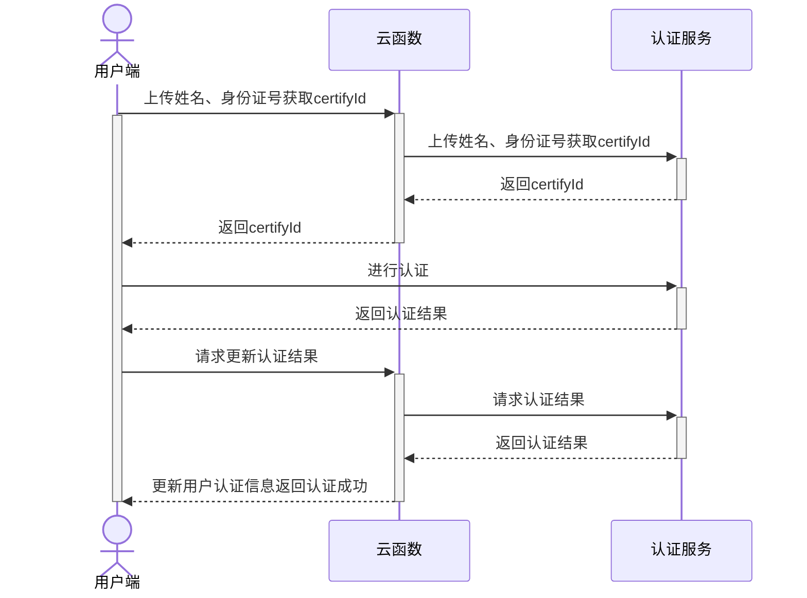

## 业务介绍
## Business introduction

> 实人认证功能自HBuilderX 3.7.1起支持
> Real person authentication is supported since HBuilderX 3.7.1

实人认证源于支付宝的实人认证产品，是一款对用户身份信息真实性进行验证审核的服务套件，提供人脸核身服务。
Real person authentication originated from Alipay's real person authentication product. It is a service suite that verifies and audits the authenticity of user identity information, providing face verification services.

人脸核身服务搭载真人检测和人脸比对等生物识别技术以及权威数据源，可快速对自然人真实身份进行核验。开发者只需要通过简单的配置，即可在客户端内唤起前置摄像头、调用云端接口做活体检测与核身比对等操作。本产品安全稳定，通过率高，为用户提供便捷的数字身份识别解决方案，满足多种场景下身份核验的业务需求。
The face verification service is equipped with biometric technologies such as real person detection and face comparison, as well as authoritative data sources, which can quickly verify the true identity of natural persons. Developers only need to go through simple configuration to activate the front camera in the client, call the cloud interface to perform operations such as liveness detection and body-to-body comparison. This product is safe and stable, with a high pass rate, providing users with a convenient digital identification solution to meet the business needs of identity verification in various scenarios.

### 特色
### feature

人脸核身服务搭载真人检测和人脸比对等生物识别技术以及权威数据源，可快速对自然人真实身份进行核验。开发者只需要通过简单的配置，即可在客户端内唤起前置摄像头、录制视频、调用云端接口做活体检测与核身比对等操作。本产品安全稳定，通过率高，为用户提供便捷的数字身份识别解决方案，满足多种场景下身份核验的业务需求。
The face verification service is equipped with biometric technologies such as real person detection and face comparison, as well as authoritative data sources, which can quickly verify the true identity of natural persons. Developers only need to configure the front-facing camera in the client, record video, and call the cloud interface to perform operations such as liveness detection and body-to-body comparison through simple configuration. This product is safe and stable, with a high pass rate, providing users with a convenient digital identification solution to meet the business needs of identity verification in various scenarios.

人脸核身基本流程如下：
The basic process of face kernel body is as follows:


### 典型场景
### Typical Scenario

#### 政务行业
#### Government Affairs

典型场景：综合数字政务、疫情防疫、公积金提取、工商企业注册等。
Typical scenarios: comprehensive digital government affairs, epidemic prevention, provident fund extraction, industrial and commercial enterprise registration, etc.

响应国家号召，各地政府不断推出线上办理服务，用户可以通过政务 App 客户端，调用人脸认证服务进行身份认证，预约或者直接在线办理各项业务。
In response to the call of the country, local governments continue to launch online processing services. Users can use the government app client to call face authentication services for identity authentication, make appointments or directly handle various businesses online.

#### 互联网行业
#### Internet industry

典型场景：内容发布、权益兑换风控、在线签约等。
Typical scenarios: content publishing, equity exchange risk control, online signing, etc.

- 内容发布场景：国家对互联网内容发布管理办法越来越严格，在一些社区、论坛首次发布内容时，需要有严格的身份核验。通过调用人脸认证服务进行身份实名认证，可以防止恶意灌水、发布不良内容。
- Content release scenario: The state has become more and more strict on the management of Internet content release. When publishing content for the first time in some communities and forums, strict identity verification is required. By calling the face authentication service for identity real-name authentication, malicious flooding and publishing of bad content can be prevented.
- 权益兑换场景：众多互联网权益发放和兑换平台，为防止用户“薅羊毛”，通过调用人脸认证服务，使一个身份证信息只能领取一次（无论注册多少账号），防止用户注册多个账号，绕过风控系统“薅羊毛”。
- Equity exchange scenario: Many Internet equity issuance and exchange platforms, in order to prevent users from "sweeping wool", call the face authentication service so that an ID card information can only be claimed once (regardless of how many accounts are registered), preventing users from registering multiple accounts , Bypassing the risk control system to "sweep the wool".
- 在线签约场景：在线选房、在线签约购房合同、在线签署员工股权协议等场景，都需要用户进行人脸核身。
- Online contract signing scenarios: scenarios such as online house selection, online signing of house purchase contracts, and online signing of employee equity agreements require users to perform face verification.

#### 数字藏品业务
#### Digital collection business

典型场景：实名认证、数字藏品抢购、银行卡绑定。
Typical scenarios: real-name authentication, snap-up of digital collections, bank card binding.

数字藏品业务涉及到在线买卖交易和数字藏品的归属，因此必须要身份核验后才能进行数字藏品收藏购买业务操作。
The digital collection business involves online buying and selling transactions and the attribution of digital collections, so identity verification must be performed before digital collection purchase business operations can be carried out.


#### 保险行业
#### insurance industry

典型场景：手机绑定、投保、续保等。
Typical scenarios: mobile phone binding, insurance application, insurance renewal, etc.

新冠疫情发生以来，传统的面签购买保险模式已发生变化，投保人需通过互联网进行投保和续保，从合规方面需要对投保人进行身份核验，为防止身份伪冒造成的虚假保单，该保险公司需要高安全级别的保单身份核验能力。
Since the outbreak of the new crown epidemic, the traditional face-to-face insurance purchase model has changed. The policyholder needs to apply for and renew the insurance through the Internet. From the aspect of compliance, the identity of the policyholder needs to be verified. In order to prevent false insurance policies caused by identity forgery, the insurance Companies need high-security policy identity verification capabilities.

#### 银行行业
#### Banking

典型场景：转账、视频柜员交易、证件变更、电子合同签约、客户开卡、征信授权、联网核查等。
Typical scenarios: transfers, video teller transactions, certificate changes, electronic contract signing, customer card opening, credit authorization, online verification, etc.

大部分一定规模的银行都已经私有化部署一套实人认证平台，维护成本高，且通过率低。银行接入云端的人脸认证服务后，整体人脸认证通过率提升明显，且风险可控。
Most banks of a certain size have already privatized and deployed a real-person authentication platform, which has high maintenance costs and a low pass rate. After the bank accesses the face authentication service in the cloud, the overall pass rate of face authentication has increased significantly, and the risks are controllable.

#### 交通出行
#### Transportation

典型场景：司机注册入驻、接单、乘客发布行程、机场安检登机、铁路安检购票、长途客运购票、边检口岸通关。
Typical scenarios: driver registration, order acceptance, passenger release itinerary, airport security boarding, railway security check ticket purchase, long-distance passenger transport ticket purchase, border inspection port customs clearance.

- 互联网出行场景：近几年出行安全事件频出，为了防止不法分子代替网约车车主接单进行违法、犯法活动，必须保证入驻的司机信息和真实跑单的是同一人。
- Internet travel scene: In recent years, travel safety incidents have occurred frequently. In order to prevent criminals from taking orders instead of online car-hailing car owners to carry out illegal and illegal activities, it is necessary to ensure that the driver information and the real person running the order are the same person.
- 传统交通出行：智慧停车，核验人车一致；乘客忘记带身份证，可通过调用人脸认证生成临时乘机（车）码。
-Traditional traffic travel: Smart parking, verify that the passenger and the vehicle are consistent; passengers who forget to bring their ID cards can generate a temporary boarding (car) code by calling face authentication.

#### 直播行业
#### Live Streaming Industry

典型场景：用户首次直播前实名、绑定支付、提现。
Typical scenario: user’s real name, binding payment, and cash withdrawal before the first live broadcast.

直播行业因国家强监管需要，需要留存用户身份真实信息。传统做法是要求用户提交手持证件、身份证正反面复印件，通过人工审核证明用户是身份证持有者本人，费时费力。通过调用人脸认证服务，可以大幅提升主播入驻、直播、资金交易等流程效率和体验。
The live broadcast industry needs to retain the real information of user identities due to the need for strong national supervision. The traditional method is to require the user to submit a hand-held certificate, a copy of the front and back of the ID card, and manually verify that the user is the ID card holder himself, which is time-consuming and laborious. By invoking the face authentication service, the process efficiency and experience of anchor registration, live broadcast, and capital transactions can be greatly improved.


#### 招聘行业
#### Recruitment Industry

典型场景：提升信用分、岗位发布、简历投递、面试官身份验证。
Typical scenarios: credit score improvement, job posting, resume delivery, interviewer identity verification.

招聘平台 App，涉及到候选人简历信息的真实性、猎头和面试官的真实性，需要用户身份核验。传统手持身份证校验流程复杂，成功率低。通过接入人脸认证服务，帮助平台更精准的识别用户身份。
The recruitment platform app involves the authenticity of candidates' resume information, the authenticity of headhunters and interviewers, and requires user identity verification. The verification process of traditional handheld ID cards is complicated and the success rate is low. By accessing the face authentication service, it helps the platform to identify users more accurately.

### 优势
### Advantage

#### 金融级指标
#### Financial-grade indicators

该产品基于多年金融行业的实名认证积累，并经大规模场景验证，具有金融级的精准识别准确率，误识率低于 0.01%。
This product is based on the accumulation of real-name authentication in the financial industry for many years, and has been verified by large-scale scenarios. It has a financial-level precise recognition accuracy rate, and the false recognition rate is less than 0.01%.

#### 高安全等级的活体交互
#### Live interaction with high security level

该产品支持单动作活体、多动作活体两种认证方式，这些认证方式无需复杂的交互，即可秒级活体验证，使身份认证过程流畅自然，用户体验良好。
The product supports two authentication methods: single-action living body and multi-action living body. These authentication methods can be verified in seconds without complex interaction, making the identity authentication process smooth and natural, and the user experience is good.

#### 自研检测活体算法
#### Self-developed liveness detection algorithm

人脸认证定位金融级的服务，具有行业领先的生物识别技术和防伪检测技术。技术中应用的活体检测算法与防伪检测算法，均由蚂蚁集团自研，有些并已获得了技术专利，能够有效拦截照片、视频、3D 软件模拟及面具攻击。
Face authentication is positioned as a financial-level service, with industry-leading biometric technology and anti-counterfeiting detection technology. The live detection algorithm and anti-counterfeiting detection algorithm used in the technology are all self-developed by Ant Group, and some have obtained technical patents, which can effectively block photos, videos, 3D software simulations and mask attacks.

#### 国内外认证
#### Domestic and foreign certification

该产品中应用的活体防攻算法获得了 iBeta 国际安全组织最高等级的 Level2 认证，是目前中国国内少数获得此认证的产品之一，是首批获得国家面向金融行业和移动电子政务行业相关认证资质的产品。
The live defense algorithm used in this product has obtained the highest level of Level 2 certification from the iBeta International Security Organization. It is one of the few products in China that have obtained this certification. The product.


### 计费模式
### Billing Mode

#### 计费规则
#### Billing Rules

实人认证产品采用 `差额累进` 的方式进行计费，即按照调用次数划分费率区间，根据不同区间费率分别计算价格，相加之和为最终收费总额。具体计费规则详见下方图表及说明。
Real-person authentication products use the method of "progressive difference" for billing, that is, the rate range is divided according to the number of calls, and the prices are calculated according to the rates of different ranges, and the sum is the final total charge. For specific billing rules, please refer to the chart and description below.

|调用次数	|0 < 调用量 ≤ 10 万|10 万 < 调用量 ≤ 20 万|20 万 < 调用量 ≤ 50 万	|50 万以上				|
|Number of Calls | 0 < Calls ≤ 100,000 | 100,000 < Calls ≤ 200,000 | 200,000 < Calls ≤ 500,000 | More than 500,000 |
|:--------:	|:-----:			|:----:					|:------------------------:	|:-------------------:	|
|区间费率	|0.85 元/次			|0.8 元/次				|0.7 元/次					|0.6 元/次				|
|Interval rate | 0.85 yuan/time | 0.8 yuan/time | 0.7 yuan/time | 0.6 yuan/time |

对比其它主流厂商的同类产品，DCloud 实人认证产品有着明显的价格优势。以阿里云和腾讯云官方的报价为例：
Compared with similar products from other mainstream manufacturers, DCloud real person authentication products have obvious price advantages. Take the official quotations of Alibaba Cloud and Tencent Cloud as an example:

- 阿里云官方报价
- Alibaba Cloud Official Quote


- 腾讯云官方报价
- Tencent Cloud Official Quotation


说明：
illustrate:

- 调用次数：协议期限内成功调用实人认证服务的总次数。协议期限指从开通实人认证服务之日起延后一年，每年重新执行阶梯计费。例如：用户在 2023年01月29日 开通的实人认证，那么在 2023年01月29日 到 2024年01月28日 期间产生的调用次数会持续累加，2024年01月29日 后将会重新计算，以此类推。
- Number of calls: the total number of successful calls to the real person authentication service within the agreement period. The term of the agreement refers to the extension of one year from the date of opening the real person authentication service, and the step billing will be re-executed every year. For example: if the user opened the real-person authentication on January 29, 2023, the number of calls generated during the period from January 29, 2023 to January 28, 2024 will continue to accumulate, and will be recalculated after January 29, 2024 , and so on.

::: warning 注意
::: warning note
- 成功调用指的是请求已经成功进行过人脸核身认证，无论最终核对结果是否匹配都会计费。
- A successful call means that the request has been successfully authenticated by face verification, and it will be billed no matter whether the final verification result matches or not.
:::

#### 结算方式
#### Settlement method

实人认证产品采用先冻结余额再解冻清算的结算方式，产生的费用均从实人认证产品的`账户余额`中扣除。
The real person authentication product adopts the settlement method of freezing the balance first and then unfreezing the liquidation, and the expenses incurred are all deducted from the "account balance" of the real person authentication product.

请求实人认证服务后，系统将根据当时的调用次数来冻结相应的余额，并于请求认证成功后再根据此时的调用次数来解冻结算。若请求认证失败或未认证，则需要等待本次请求产生的认证凭证过期失效后，再解冻并返还本次请求所冻结的金额，至实人认证产品的账户余额中。
After requesting the real person authentication service, the system will freeze the corresponding balance according to the number of calls at that time, and unfreeze the calculation according to the number of calls at this time after the request for authentication is successful. If the requested authentication fails or is not authenticated, you need to wait until the authentication certificate generated by this request expires, and then unfreeze and return the amount frozen in this request to the account balance of the real person authentication product.

::: warning 注意
::: warning note
- 认证凭证有效期为`23小时`
- Authentication credentials are valid for `23 hours`
:::


#### 费用计算示例
#### Fee Calculation Example

在协议期限内，开发者将用户的身份信息发给实人认证服务，无论发送多少次，收费都按实际成功调用次数扣取。
During the term of the agreement, the developer sends the user's identity information to the real person authentication service. No matter how many times it is sent, the fee will be deducted according to the actual number of successful calls.

- 如果调用成功 100000 次，则费用金额 = 100000 次 x 0.85 元/次 = 85000 元
- If 100,000 successful calls are made, the fee amount = 100,000 times x 0.85 yuan/time = 85,000 yuan
- 如果调用成功 110000 次，则费用金额 = 100000 次 x 0.85 元/次+10000 次 x 0.8 元/次 = 93000 元
- If 110,000 successful calls are made, the fee amount = 100,000 times x 0.85 yuan/time + 10,000 times x 0.8 yuan/time = 93,000 yuan
- 如果调用成功 550000 次，则费用金额 = 100000 次 x 0.85 元/次+100000 次 x 0.8 元/次+300000 次 x 0.7 元/次 + 50000 次 x 0.6 元/次=405000 元
- If 550,000 successful calls are made, the fee amount = 100,000 times x 0.85 yuan/time + 100,000 times x 0.8 yuan/time + 300,000 times x 0.7 yuan/time + 50,000 times x 0.6 yuan/time = 405,000 yuan


## 业务开通
## Business activation

### 开通流程
### Activation process
使用开发者账号登录[uniCloud控制台](#https://unicloud.dcloud.net.cn/) ，选择`实人认证`栏目。在使用此功能前需要完成实名认证，可前往[开发者中心](#https://dev.dcloud.net.cn/)完成实名认证。
Log in to the [uniCloud console](#https://unicloud.dcloud.net.cn/) with the developer account, and select the `Personal Authentication` column. Real-name authentication needs to be completed before using this function. You can go to [Developer Center](#https://dev.dcloud.net.cn/) to complete real-name authentication.


完成实名认证后，阅读uni实名认证服务协议并点击协议下方的“同意协议并开通”按钮，便可开通实人认证服务。
After completing the real-name authentication, read the uni real-name authentication service agreement and click the "Agree Agreement and Activate" button at the bottom of the agreement to activate the real-person authentication service.


### 充值
### Recharge
实人认证为预付费业务，使用实人认证服务之前，需要先进行充值。点击页面上的“充值”按钮，并输入充值金额进行充值，充值金额最小为1元。
Real person authentication is a prepaid service, and before using the real person authentication service, you need to recharge first. Click the "Recharge" button on the page and enter the recharge amount to recharge. The minimum recharge amount is 1 yuan.


### 安全配置
### Security configuration

系统提供了 uniCloud 服务空间白名单安全配置，可以提高接口调用安全性，防止被他人盗用。可点击“添加服务空间”按钮，选择相应的服务空间完成添加服务空间白名单，服务空间添加成功后，只有列表中的服务空间才可以调用当前账号下的实人认证接口。此列表为空时，不校验调用方的服务空间。
The system provides uniCloud service space whitelist security configuration, which can improve the security of interface calls and prevent them from being stolen by others. You can click the "Add Service Space" button and select the corresponding service space to complete adding the service space white list. After the service space is successfully added, only the service space in the list can call the real-person authentication interface under the current account. When this list is empty, the caller's service space is not verified.


### 调用记录
### call record

系统可查看实人认证实时的调用记录列表，但此业务数据量较大，为了维持服务的稳定性，只能查看30天内的某1天的全部调用记录，默认选择当天。
The system can view the real-time call record list of real-person authentication, but this business has a large amount of data. In order to maintain the stability of the service, it can only view all call records of a certain day within 30 days, and the current day is selected by default.


### 调用统计
### Call Statistics

系统可查看实人认证每日调用汇总数据，包括每日请求次数、每日请求成功次数、每日计费金额等汇总数据。
The system can view the summary data of the daily calls of real person authentication, including the daily number of requests, the number of successful daily requests, and the daily billing amount.


## 开发指南
## Development Guide

实人认证服务端接口仅能通过uniCloud云函数进行调用，完整调用流程如下：
The real person authentication server interface can only be called through uniCloud cloud functions. The complete calling process is as follows:



上述流程中涉及如下接口：
The above process involves the following interfaces:

- 云函数获取实人认证实例：[uniCloud.getFacialRecognitionVerifyManager()](#get-frv-manager)
- The cloud function obtains a real person authentication instance: [uniCloud.getFacialRecognitionVerifyManager()](#get-frv-manager)
- 云函数上传姓名、身份证号获取certifyId：[frvManager.getCertifyId()](#get-certify-id)
- The cloud function uploads the name and ID number to get the certifyId: [frvManager.getCertifyId()](#get-certify-id)
- 云函数使用certifyId获取认证结果：[frvManager.getAuthResult()](#get-auth-result)
- The cloud function uses certifyId to obtain the authentication result: [frvManager.getAuthResult()](#get-auth-result)
- 客户端调起sdk刷脸认证：[uni.startFacialRecognitionVerify()](#start-frv)
- The client invokes the sdk face authentication: [uni.startFacialRecognitionVerify()](#start-frv)

### 云函数接口
### Cloud function interface

实人认证相关接口由uni-cloud-verify扩展库提供，如何使用扩展库请参考：[云函数内使用扩展库](cf-functions.md#extension)
The interface related to real person authentication is provided by the uni-cloud-verify extension library. For how to use the extension library, please refer to: [Using the extension library in cloud functions](cf-functions.md#extension)

#### 获取实人认证实例@get-frv-manager
#### Get real person authentication instance @get-frv-manager

**接口形式**
**Interface form**

```js
uniCloud.getFacialRecognitionVerifyManager(Object GetFacialRecognitionVerifyManagerParam)
```

**参数说明**
**Parameter Description**

|参数名		|类型		|必填	|默认值	|说明																																		|
|Parameter name |Type |Required |Default value |Description |
|:-:			|:-:		|:-:	|:-:		|:-:																																		|
|requestId|String	|是		|-			|本次云函数请求的requestId，用于接口内部获取当前应用appId及客户端ip信息	|
| requestId| String |Yes |- |The requestId of this cloud function request is used to obtain the current application appId and client ip information inside the interface |

**返回值**
**return value**

此接口返回实人认证实例
This interface returns the real person authentication instance

**示例代码**
**Example Code**

云函数
cloud function

```js
exports.main = async (event, context) => {
  const frvManager = uniCloud.getFacialRecognitionVerifyManager({
    requestId: context.requestId
  })
};
```

云对象
cloud object

```js
'use strict';
module.exports = {
  _before() {
    this.frvManager = uniCloud.getFacialRecognitionVerifyManager({
      requestId: this.getUniCloudRequestId()
    })
  }
}
```

#### 获取certifyId@get-certify-id
#### Get-certifyId@get-certify-id

**接口形式**
**Interface form**

```js
frvManager.getCertifyId(Object GetCertifyIdParam)
```

**参数说明**
**Parameter Description**

|参数名		|类型		|必填	|默认值	|说明					|
|Parameter name |Type |Required |Default value |Description |
|:-:			|:-:		|:-:	|:-:		|:-:					|
|realName	|String	|是		|-			|用户真实姓名	|
| realName | String | Yes |- | User real name |
|idCard		|String	|是		|-			|用户身份证号	|
| idCard | String | Yes |- |User ID number |

**返回值**
**return value**

|字段名		|类型		|必备	|说明																								|
|Field Name |Type |Required |Description |
|:-:			|:-:		|:-:	|:-:																								|
|certifyId|String	|是		|认证id，用于客户端调用认证接口及云函数获取认证结果	|
| certifyId| String |Yes |Certification id, used by the client to call the authentication interface and cloud function to obtain the authentication result |

**示例代码**
**Example Code**

云函数
cloud function

```js
exports.main = async (event, context) => {
  const frvManager = uniCloud.getFacialRecognitionVerifyManager({
    requestId: context.requestId
  })
  const result = await frvManager.getCertifyId({
    realName: '张三',
    idCard: 'xxxxxx'
  })
  return result
};
```

云对象
cloud object

```js
module.exports = {
  _before() {
    this.frvManager = uniCloud.getFacialRecognitionVerifyManager({
      requestId: this.getUniCloudRequestId()
    })
  },
  async getCertifyId() {
    const result = await this.frvManager.getCertifyId({
      realName: '张三',
      idCard: 'xxxxxx'
    })
    return result
  }
}
```

#### 获取认证结果@get-auth-result
#### Get the authentication result @get-auth-result

**接口形式**
**Interface form**

```js
frvManager.getAuthResult(Object GetAuthResultParam)
```

**参数说明**
**Parameter Description**

|参数名					|类型		|必填	|默认值	|说明																																			|
|Parameter name |Type |Required |Default value |Description |
|:-:						|:-:		|:-:	|:-:		|:-:																																			|
|certifyId			|String	|是		|-			|认证id																																		|
| certifyId | String | yes | - | certify id |
|needAlivePhoto	|String	|否		|N			|是否获取认证照片，Y_O （原始图片）、Y_M（虚化，背景马赛克）、N（不返图）	|
| needAlivePhoto | String | No | N | Whether to obtain an authentication photo, Y_O (original image), Y_M (blurred, background mosaic), N (no image returned) |

**返回值**
**return value**

|字段名			|类型		|必备											|说明																																|
|Field Name |Type |Required |Description |
|:-:				|:-:		|:-:											|:-:																																|
|authState	|String	|是												|人脸检测状态。PROCESSING：初始化；SUCCESS：检测成功；FAIL：检测失败|
| authState | String | Yes | Face detection state. PROCESSING: Initialization; SUCCESS: Detection succeeded; FAIL: Detection failed|
|score			|Number	|authState为SUCCESS时必备	|活体检测结果分数																										|
| score | Number | Required when authState is SUCCESS | Liveness detection result score |
|quality		|Number	|authState为SUCCESS时必备	|人脸图片质量分																											|
| quality | Number | Required when authState is SUCCESS |Face image quality score |
|base64Photo|String	|authState为SUCCESS时必备	|认证图片的base64内容																								|
| base64Photo| String | Mandatory when authState is SUCCESS | base64 content of authentication image |

**示例代码**
**Example Code**

云函数
cloud function

```js
exports.main = async (event, context) => {
  const frvManager = uniCloud.getFacialRecognitionVerifyManager({
    requestId: context.requestId
  })
  const result = await frvManager.getAuthResult({
    certifyId: 'xxxxxx'
  })
  return result
};
```

云对象
cloud object

```js
module.exports = {
  _before() {
    this.frvManager = uniCloud.getFacialRecognitionVerifyManager({
      requestId: this.getUniCloudRequestId()
    })
  },
  async getAuthResult() {
    const result = await this.frvManager.getAuthResult({
      certifyId: 'xxxxxx'
    })
    return result
  }
}
```

#### 错误处理
#### Error Handling

可以通过try catch捕获接口抛出的错误，接口抛出的错误为标准的[uni错误对象](../tutorial/err-spec.md)
The error thrown by the interface can be caught by try catch, and the error thrown by the interface is the standard [uni error object](../tutorial/err-spec.md)

具体错误码规范见：[错误码](#err-code)
For specific error code specifications, see: [Error Code](#err-code)

**示例**
**example**

```js
module.exports = {
  _before() {
    this.frvManager = uniCloud.getFacialRecognitionVerifyManager({
      requestId: this.getUniCloudRequestId()
    })
  },
  async getAuthResult() {
    try {
      const result = await this.frvManager.getAuthResult({
        certifyId: 'xxxxxx'
      })
      return result
    } catch (e) {
      if(e.errCode === 50001 || e.errCode === 50002) {
        throw new Error('缺少参数或参数不正确')
      }
      throw e
    }
  }
}
```

### 客户端接口
### Client interface

#### 调起实人认证界面@start-frv
#### Call up the real person authentication interface @start-frv

```js
uni.startFacialRecognitionVerify({
    certifyId:"",
    progressBarColor: "#CC0000", //刷脸圈的颜色
    progressBarBackgroundColor: "#00CC00", //刷脸圈的背景颜色
    quitAlertTitle:"刷脸页退出对话框的标题",
    quitAlertMessage: "刷脸页退出对话框的内容",
    timeoutAlertTitle: "刷脸页超时对话框的标题",
    timeoutAlertMessage: "刷脸页超时对话框的内容",
    failAlertTitle: "刷脸页错误提示对话框的标题",
    failAlertMessage: "刷脸页错误提示对话框的内容",
    title: "刷脸框顶部文案",
    customBundleName: "iOS自定义UI资源文件名称(英文)",
    success:(e)=>{
        console.log(JSON.stringify(e))
    },
    fail:(e)=>{
        console.log(JSON.stringify(e))
    },
    complete:(e)=>{
        console.log(JSON.stringify(e))
    }
})
```

**参数说明**
**Parameter Description**

| 参数											| 类型	| 是否必传| 支持平台	|描述																														|
| Parameter | Type | Required | Supported Platforms |Description |
|---												|---		|---			|---				|---																														|
| certifyId									| String| 是			| 安卓、iOS	|认证流水号，由服务端根据接入的业务模式调用对应的初始化接口获取	|
| certifyId | String| Yes | Android, iOS | The certification serial number is obtained by the server calling the corresponding initialization interface according to the connected business model |
| progressBarColor					| String| 否			| 安卓、iOS	| 刷脸圈的颜色																									|
| progressBarColor | String| No | Android, iOS | The color of the face circle |
| activityIndicatorColor		| String| 否			| iOS				| 网络等待菊花颜色																							|
| activityIndicatorColor | String| No | iOS | Color of network waiting chrysanthemum |
| progressBarBackgroundColor| String| 否			| 安卓			| 刷脸圈的背景颜色																							|
| progressBarBackgroundColor| String| No | Android | The background color of the face bar |
| quitAlertTitle						| String| 否			| 安卓			| 刷脸页退出对话框的标题																				|
| quitAlertTitle | String| No | Android | The title of the exit dialog box on the swiping face page |
| quitAlertMessage					| String| 否			| 安卓			| 刷脸页退出对话框的内容																				|
| quitAlertMessage | String| No | Android | The content of the exit dialog box by swiping the face page |
| timeoutAlertTitle					| String| 否			| 安卓			| 刷脸页超时对话框的标题																				|
| timeoutAlertTitle | String| No | Android | The title of the timeout dialog box for face swiping pages |
| timeoutAlertMessage				| String| 否			| 安卓			| 刷脸页超时对话框的内容																				|
| timeoutAlertMessage | String| No | Android | The content of the timeout dialog box of the facial recognition page |
| failAlertTitle						| String| 否			| 安卓			| 刷脸页错误提示对话框的标题																		|
| failAlertTitle | String| No | Android | The title of the error prompt dialog box on the facial recognition page |
| failAlertMessage					| String| 否			| 安卓			| 刷脸页错误提示对话框的内容																		|
| failAlertMessage | String| No | Android | The content of the error prompt dialog box on the facial recognition page |
| title											| String| 否			| 安卓			| 刷脸圈的颜色																									|
| title | String| No | Android | The color of the face circle |
| success										| String| 否			| 安卓、iOS	| 成功回调																											|
| success | String| No | Android, iOS | Success callback |
| fail											| String| 否			| 安卓、iOS	| 失败回调																											|
| fail | String| No | Android, iOS | Failure callback |
| complete									| String| 否			| 安卓、iOS	| 完成回调																											|
| complete | String| No | Android, iOS | Complete callback |


注: 颜色值为六位十六进制字符串("#FF0000")
Note: Color values are six-digit hexadecimal strings ("#FF0000")

**返回值**
**return value**

|参数				|类型		|必备	|描述																		|
|Parameter |Type |Required |Description |
|---				|---		|---	|---																		|
|errSubject	|String	|是		| 模块名称(uni-facialRecognitionVerify)	|
| errSubject | String | Yes | Module name (uni-facialRecognitionVerify) |
|errCode		|Number	|是		|错误码，详情见：[错误码](#err-code)		|
| errCode | Number | Yes | Error code, for details, see: [Error Code](#err-code) |
|errMsg			|String	|否		|错误信息，详情见：[错误码](#err-code)	|
| errMsg | String | No | Error message, see: [error code](#err-code) |
|cause			|Object	|否		|SDK返回的原始数据											|
| cause | Object |No | Original data returned by the SDK |

cause

|参数		|描述					|
|Parameters |Description |
|---		|---					|
|code		|原始错误码		|
| code |Original error code |
|message|原始错误信息	|
| message|Original error message |

### 错误码@err-code
### Error code @err-code

**云端错误码**
**Cloud error code**

|错误码	|说明																										|
|Error code |Description |
|:-:		|:-:																										|
|0			|请求成功																								|
| 0 | Request succeeded |
|50001	|缺少参数																								|
| 50001 | Missing parameter |
|50002	|参数类型、取值不正确																		|
| 50002 | The parameter type and value are incorrect |
|54003	|appId不存在																						|
| 54003 | appId does not exist |
|54004	|服务空间不在白名单中																		|
| 54004 | The service space is not in the white list |
|54020	|请求记录不存在，certifyId无效													|
| 54020 | Request record does not exist, certifyId is invalid |
|54021	|云函数内缺少接口调用凭证，请联系DCloud处理							|
| 54021 | There is no interface call certificate in the cloud function, please contact DCloud for processing |
|54022	|服务空间不存在																					|
| 54022 | Service space does not exist |
|55000	|服务器错误，请联系DCloud处理														|
| 55000 | Server error, please contact DCloud |
|55001	|Api调用失败，实人认证服务商服务不可用，请联系DCloud处理|
| 55001 | Api call failed, the real person authentication service provider service is unavailable, please contact DCloud for processing|
|60000	|服务不可用，请联系DCloud处理														|
| 60000 | The service is unavailable, please contact DCloud for processing |

**客户端错误码**
**Client error code**

|错误码	|错误信息					|描述																					|
|Error code |Error message |Description |
|---		|---							|---																					|
|0			|刷脸完成					|实际结果需要通过服务端查询接口								|
| 0 |Face swiping completed |Actual results need to query the interface through the server |
|10001	|certifyId不能为空|参数certifyId为空														|
| 10001 | certifyId cannot be empty | The parameter certifyId is empty |
|10010	|刷脸异常					|刷脸异常,具体原因详见cause										|
| 10010 | Abnormal facial recognition | Abnormal facial recognition, see cause for details |
|10011	|验证中断					|如用户主动退出、验证超时等,具体原因详见cause	|
| 10011 | Verification Interrupted | For example, the user voluntarily logs out, verification timeout, etc., see cause for details |
|10012	|网络异常					|网络异常																			|
| 10012 | Network exception | Network exception |
|10013	|刷脸验证失败			|实际结果需要通过服务端查询结果								|
| 10013 | Facial verification failed | The actual result needs to be checked by the server |
|10020	|设备设置时间异常	|设备设置时间异常，仅iOS返回									|
| 10020 | The device setting time is abnormal | The device setting time is abnormal, only returned by iOS |