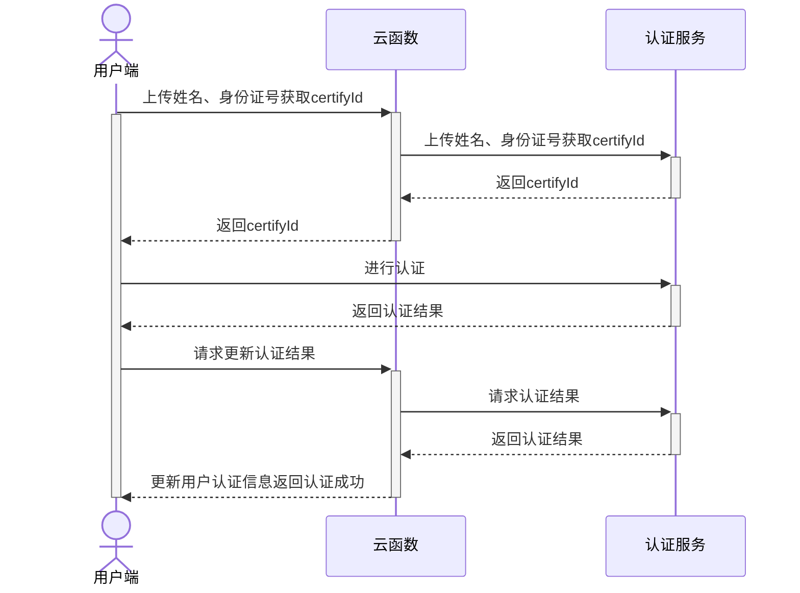

## 业务介绍

> 实人认证功能自HBuilderX 3.7.1起支持

实人认证源于支付宝的实人认证产品，是一款对用户身份信息真实性进行验证审核的服务套件，提供人脸核身服务。

人脸核身服务搭载真人检测和人脸比对等生物识别技术以及权威数据源，可快速对自然人真实身份进行核验。开发者只需要通过简单的配置，即可在客户端内唤起前置摄像头、调用云端接口做活体检测与核身比对等操作。本产品安全稳定，通过率高，为用户提供便捷的数字身份识别解决方案，满足多种场景下身份核验的业务需求。

### 特色

人脸核身服务搭载真人检测和人脸比对等生物识别技术以及权威数据源，可快速对自然人真实身份进行核验。开发者只需要通过简单的配置，即可在客户端内唤起前置摄像头、录制视频、调用云端接口做活体检测与核身比对等操作。本产品安全稳定，通过率高，为用户提供便捷的数字身份识别解决方案，满足多种场景下身份核验的业务需求。

人脸核身基本流程如下：


### 典型场景

#### 政务行业

典型场景：综合数字政务、疫情防疫、公积金提取、工商企业注册等。

响应国家号召，各地政府不断推出线上办理服务，用户可以通过政务 App 客户端，调用人脸认证服务进行身份认证，预约或者直接在线办理各项业务。

#### 互联网行业

典型场景：内容发布、权益兑换风控、在线签约等。

- 内容发布场景：国家对互联网内容发布管理办法越来越严格，在一些社区、论坛首次发布内容时，需要有严格的身份核验。通过调用人脸认证服务进行身份实名认证，可以防止恶意灌水、发布不良内容。
- 权益兑换场景：众多互联网权益发放和兑换平台，为防止用户“薅羊毛”，通过调用人脸认证服务，使一个身份证信息只能领取一次（无论注册多少账号），防止用户注册多个账号，绕过风控系统“薅羊毛”。
- 在线签约场景：在线选房、在线签约购房合同、在线签署员工股权协议等场景，都需要用户进行人脸核身。

#### 数字藏品业务

典型场景：实名认证、数字藏品抢购、银行卡绑定。

数字藏品业务涉及到在线买卖交易和数字藏品的归属，因此必须要身份核验后才能进行数字藏品收藏购买业务操作。


#### 保险行业

典型场景：手机绑定、投保、续保等。

新冠疫情发生以来，传统的面签购买保险模式已发生变化，投保人需通过互联网进行投保和续保，从合规方面需要对投保人进行身份核验，为防止身份伪冒造成的虚假保单，该保险公司需要高安全级别的保单身份核验能力。

#### 银行行业

典型场景：转账、视频柜员交易、证件变更、电子合同签约、客户开卡、征信授权、联网核查等。

大部分一定规模的银行都已经私有化部署一套实人认证平台，维护成本高，且通过率低。银行接入云端的人脸认证服务后，整体人脸认证通过率提升明显，且风险可控。

#### 交通出行

典型场景：司机注册入驻、接单、乘客发布行程、机场安检登机、铁路安检购票、长途客运购票、边检口岸通关。

- 互联网出行场景：近几年出行安全事件频出，为了防止不法分子代替网约车车主接单进行违法、犯法活动，必须保证入驻的司机信息和真实跑单的是同一人。
- 传统交通出行：智慧停车，核验人车一致；乘客忘记带身份证，可通过调用人脸认证生成临时乘机（车）码。

#### 直播行业

典型场景：用户首次直播前实名、绑定支付、提现。

直播行业因国家强监管需要，需要留存用户身份真实信息。传统做法是要求用户提交手持证件、身份证正反面复印件，通过人工审核证明用户是身份证持有者本人，费时费力。通过调用人脸认证服务，可以大幅提升主播入驻、直播、资金交易等流程效率和体验。


#### 招聘行业

典型场景：提升信用分、岗位发布、简历投递、面试官身份验证。

招聘平台 App，涉及到候选人简历信息的真实性、猎头和面试官的真实性，需要用户身份核验。传统手持身份证校验流程复杂，成功率低。通过接入人脸认证服务，帮助平台更精准的识别用户身份。

### 优势

#### 金融级指标

该产品基于多年金融行业的实名认证积累，并经大规模场景验证，具有金融级的精准识别准确率，误识率低于 0.01%。

#### 高安全等级的活体交互

该产品支持单动作活体、多动作活体两种认证方式，这些认证方式无需复杂的交互，即可秒级活体验证，使身份认证过程流畅自然，用户体验良好。

#### 自研检测活体算法

人脸认证定位金融级的服务，具有行业领先的生物识别技术和防伪检测技术。技术中应用的活体检测算法与防伪检测算法，均由蚂蚁集团自研，有些并已获得了技术专利，能够有效拦截照片、视频、3D 软件模拟及面具攻击。

#### 国内外认证

该产品中应用的活体防攻算法获得了 iBeta 国际安全组织最高等级的 Level2 认证，是目前中国国内少数获得此认证的产品之一，是首批获得国家面向金融行业和移动电子政务行业相关认证资质的产品。


### 计费模式

#### 计费规则

实人认证产品采用 `差额累进` 的方式进行计费，即按照调用次数划分费率区间，根据不同区间费率分别计算价格，相加之和为最终收费总额。具体计费规则详见下方图表及说明。

|调用次数	|0 < 调用量 ≤ 10 万|10 万 < 调用量 ≤ 20 万|20 万 < 调用量 ≤ 50 万	|50 万以上				|
|:--------:	|:-----:			|:----:					|:------------------------:	|:-------------------:	|
|区间费率	|0.85 元/次			|0.8 元/次				|0.7 元/次					|0.6 元/次				|

对比其它主流厂商的同类产品，DCloud 实人认证产品有着明显的价格优势。

以阿里云和腾讯云官方的报价为例：

- 阿里云官方报价


- 腾讯云官方报价


说明：

- 调用次数：协议期限内成功调用实人认证服务的总次数。协议期限指从开通实人认证服务之日起延后一年，每年重新执行阶梯计费。例如：用户在 2023年01月29日 开通的实人认证，那么在 2023年01月29日 到 2024年01月28日 期间产生的调用次数会持续累加，2024年01月29日 后将会重新计算，以此类推。

::: warning 注意
- 成功调用指的是该次请求已经进行过认证，无论最终核对结果是否匹配都会计费。
:::

#### 结算方式

实人认证产品采用先冻结余额再解冻清算的结算方式，产生的费用均从实人认证产品的`账户余额`中扣除。

请求实人认证服务后，系统将根据当时的调用次数来冻结相应的余额，并于请求认证成功后再根据此时的调用次数来解冻结算。若请求认证失败或未认证，则需要等待本次请求产生的认证凭证过期失效后，再解冻并返还本次请求所冻结的金额，至实人认证产品的账户余额中。

::: warning 注意
- 认证凭证有效期为`23小时`
:::


#### 费用计算示例

在协议期限内，开发者将用户的身份信息发给实人认证服务，无论发送多少次，收费都按实际成功验证次数扣取。

- 如果验证成功 100000 次，则费用金额 = 100000 次 x 0.85 元/次 = 85000 元
- 如果验证成功 110000 次，则费用金额 = 100000 次 x 0.85 元/次+10000 次 x 0.8 元/次 = 93000 元
- 如果验证成功 550000 次，则费用金额 = 100000 次 x 0.85 元/次+100000 次 x 0.8 元/次+300000 次 x 0.7 元/次 + 50000 次 x 0.6 元/次=405000 元


## 业务开通

### 开通流程
使用开发者账号登录[uniCloud控制台](#https://unicloud.dcloud.net.cn/) ，选择`实人认证`栏目。在使用此功能前需要完成实名认证，可前往[开发者中心](#https://dev.dcloud.net.cn/)完成实名认证。


完成实名认证后，阅读uni实名认证服务协议并点击协议下方的“同意协议并开通”按钮，便可开通实人认证服务。


### 充值
实人认证为预付费业务，使用实人认证服务之前，需要先进行充值。点击页面上的“充值”按钮，并输入充值金额进行充值，充值金额最小为1元。


### 安全配置

系统提供了 uniCloud 服务空间白名单安全配置，可以提高接口调用安全性，防止被他人盗用。可点击“添加服务空间”按钮，选择相应的服务空间完成添加服务空间白名单，服务空间添加成功后，只有列表中的服务空间才可以调用当前账号下的实人认证接口。此列表为空时，不校验调用方的服务空间。


### 调用记录

系统可查看实人认证实时的调用记录列表，但此业务数据量较大，为了维持服务的稳定性，只能查看30天内的某1天的全部调用记录，默认选择当天。


### 调用统计

系统可查看实人认证每日调用汇总数据，包括每日请求次数、每日请求成功次数、每日计费金额等汇总数据。


## 开发指南

实人认证服务端接口仅能通过uniCloud云函数进行调用，完整调用流程如下：



上述流程中涉及如下接口：

- 云函数获取实人认证实例：[uniCloud.getFacialRecognitionVerifyManager()](#get-frv-manager)
- 云函数上传姓名、身份证号获取certifyId：[frvManager.getCertifyId()](#get-certify-id)
- 云函数使用certifyId获取认证结果：[frvManager.getAuthResult()](#get-auth-result)
- 客户端调起sdk刷脸认证：[uni.startFacialRecognitionVerify()](#start-frv)

### 云函数接口

实人认证相关接口由uni-cloud-verify扩展库提供，如何使用扩展库请参考：[云函数内使用扩展库](cf-functions.md#extension)

#### 获取实人认证实例@get-frv-manager

**接口形式**

```js
uniCloud.getFacialRecognitionVerifyManager(Object GetFacialRecognitionVerifyManagerParam)
```

**参数说明**

|参数名		|类型		|必填	|默认值	|说明																																		|
|:-:			|:-:		|:-:	|:-:		|:-:																																		|
|requestId|String	|是		|-			|本次云函数请求的requestId，用于接口内部获取当前应用appId及客户端ip信息	|

**返回值**

此接口返回实人认证实例

**示例代码**

云函数

```js
exports.main = async (event, context) => {
  const frvManager = uniCloud.getFacialRecognitionVerifyManager({
    requestId: context.requestId
  })
};
```

云对象

```js
'use strict';
module.exports = {
  _before() {
    this.frvManager = uniCloud.getFacialRecognitionVerifyManager({
      requestId: this.getUniCloudRequestId()
    })
  }
}
```

#### 获取certifyId@get-certify-id

**接口形式**

```js
frvManager.getCertifyId(Object GetCertifyIdParam)
```

**参数说明**

|参数名		|类型		|必填	|默认值	|说明					|
|:-:			|:-:		|:-:	|:-:		|:-:					|
|realName	|String	|是		|-			|用户真实姓名	|
|idCard		|String	|是		|-			|用户身份证号	|

**返回值**

|字段名		|类型		|必备	|说明																								|
|:-:			|:-:		|:-:	|:-:																								|
|certifyId|String	|是		|认证id，用于客户端调用认证接口及云函数获取认证结果	|

**示例代码**

云函数

```js
exports.main = async (event, context) => {
  const frvManager = uniCloud.getFacialRecognitionVerifyManager({
    requestId: context.requestId
  })
  const result = await frvManager.getCertifyId({
    realName: '张三',
    idCard: 'xxxxxx'
  })
  return result
};
```

云对象

```js
module.exports = {
  _before() {
    this.frvManager = uniCloud.getFacialRecognitionVerifyManager({
      requestId: this.getUniCloudRequestId()
    })
  },
  async getCertifyId() {
    const result = await this.frvManager.getCertifyId({
      realName: '张三',
      idCard: 'xxxxxx'
    })
    return result
  }
}
```

#### 获取认证结果@get-auth-result

**接口形式**

```js
frvManager.getAuthResult(Object GetAuthResultParam)
```

**参数说明**

|参数名					|类型		|必填	|默认值	|说明																																			|
|:-:						|:-:		|:-:	|:-:		|:-:																																			|
|certifyId			|String	|是		|-			|认证id																																		|
|needAlivePhoto	|String	|否		|N			|是否获取认证照片，Y_O （原始图片）、Y_M（虚化，背景马赛克）、N（不返图）	|

**返回值**

|字段名			|类型		|必备											|说明																																|
|:-:				|:-:		|:-:											|:-:																																|
|authState	|String	|是												|人脸检测状态。PROCESSING：初始化；SUCCESS：检测成功；FAIL：检测失败|
|score			|Number	|authState为SUCCESS时必备	|活体检测结果分数																										|
|quality		|Number	|authState为SUCCESS时必备	|人脸图片质量分																											|
|base64Photo|String	|authState为SUCCESS时必备	|认证图片的base64内容																								|

**示例代码**

云函数

```js
exports.main = async (event, context) => {
  const frvManager = uniCloud.getFacialRecognitionVerifyManager({
    requestId: context.requestId
  })
  const result = await frvManager.getAuthResult({
    certifyId: 'xxxxxx'
  })
  return result
};
```

云对象

```js
module.exports = {
  _before() {
    this.frvManager = uniCloud.getFacialRecognitionVerifyManager({
      requestId: this.getUniCloudRequestId()
    })
  },
  async getAuthResult() {
    const result = await this.frvManager.getAuthResult({
      certifyId: 'xxxxxx'
    })
    return result
  }
}
```

#### 错误处理

可以通过try catch捕获接口抛出的错误，接口抛出的错误为标准的[uni错误对象](../tutorial/err-spec.md)

具体错误码规范见：[错误码](#err-code)

**示例**

```js
module.exports = {
  _before() {
    this.frvManager = uniCloud.getFacialRecognitionVerifyManager({
      requestId: this.getUniCloudRequestId()
    })
  },
  async getAuthResult() {
    try {
      const result = await this.frvManager.getAuthResult({
        certifyId: 'xxxxxx'
      })
      return result
    } catch (e) {
      if(e.errCode === 50001 || e.errCode === 50002) {
        throw new Error('缺少参数或参数不正确')
      }
      throw e
    }
  }
}
```

### 客户端接口

#### 调起实人认证界面@start-frv


### 错误码@err-code

**云端错误码**

|错误码	|说明																										|
|:-:		|:-:																										|
|0			|请求成功																								|
|50001	|缺少参数																								|
|50002	|参数类型、取值不正确																		|
|54003	|appId不存在																						|
|54004	|服务空间不在白名单中																		|
|54020	|请求记录不存在，certifyId无效													|
|54021	|云函数内缺少接口调用凭证，请联系DCloud处理							|
|54022	|服务空间不存在																					|
|55000	|服务器错误，请联系DCloud处理														|
|55001	|Api调用失败，实人认证服务商服务不可用，请联系DCloud处理|
|60000	|服务不可用，请联系DCloud处理														|

**客户端错误码**

|错误码	|错误信息					|描述																					|
|---		|---							|---																					|
|0			|刷脸完成					|实际结果需要通过服务端查询接口								|
|10001	|certifyId不能为空|参数certifyId为空														|
|10010	|刷脸异常					|刷脸异常,具体原因详见cause										|
|10011	|验证中断					|如用户主动退出、验证超时等,具体原因详见cause	|
|10012	|网络异常					|网络异常																			|
|10013	|刷脸验证失败			|实际结果需要通过服务端查询结果								|
|10020	|设备设置时间异常	|设备设置时间异常，仅iOS返回									|