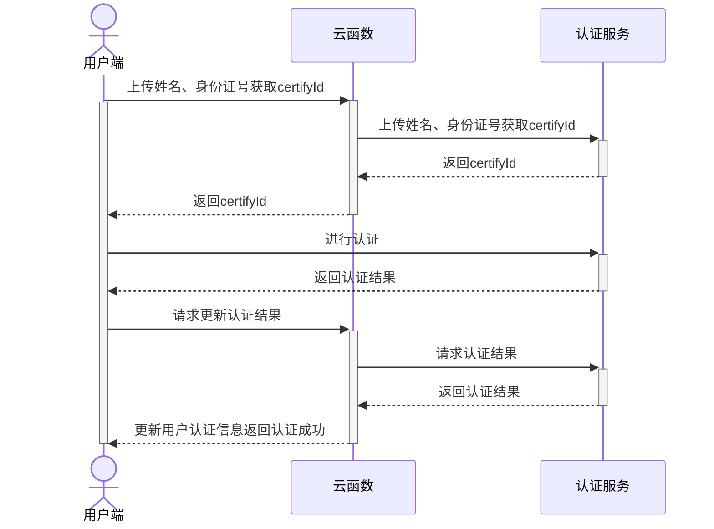

## 开发指南

uni实人认证服务，分前端api和云端api，云端为uniCloud API。如开发者的业务不在uniCloud上，需参考[云函数url化](../http.md)文档编写云函数提供http接口供外部访问，由uniCloud获取到认证结果后转交给开发者的非uniCloud服务器上。

完整认证流程如下：



上述流程中涉及如下接口：

- 云函数获取实人认证实例：[uniCloud.getFacialRecognitionVerifyManager()](#get-frv-manager)
- 云函数上传姓名、身份证号获取certifyId：[frvManager.getCertifyId()](#get-certify-id)
- 云函数使用certifyId获取认证结果：[frvManager.getAuthResult()](#get-auth-result)
- 客户端调起sdk刷脸认证：[uni.startFacialRecognitionVerify()](#start-frv)

### 云函数接口

实人认证相关接口由uni-cloud-verify扩展库提供，如何使用扩展库请参考：[云函数内使用扩展库](cf-functions.md#extension)

#### 获取实人认证实例@get-frv-manager

**接口形式**

```js
uniCloud.getFacialRecognitionVerifyManager(Object GetFacialRecognitionVerifyManagerParam)
```

**参数说明**

|参数名		|类型		|必填	|默认值	|说明																																		|
|:-:			|:-:		|:-:	|:-:		|:-:																																		|
|requestId|String	|是		|-			|本次云函数请求的requestId，用于接口内部获取当前应用appId及客户端ip信息	|

**返回值**

此接口返回实人认证实例

**示例代码**

云函数

```js
exports.main = async (event, context) => {
  const frvManager = uniCloud.getFacialRecognitionVerifyManager({
    requestId: context.requestId
  })
};
```

云对象

```js
'use strict';
module.exports = {
  _before() {
    this.frvManager = uniCloud.getFacialRecognitionVerifyManager({
      requestId: this.getUniCloudRequestId()
    })
  }
}
```

#### 获取certifyId@get-certify-id

**接口形式**

```js
frvManager.getCertifyId(Object GetCertifyIdParam)
```

**参数说明**

|参数名		|类型		|必填	|默认值	|说明					|
|:-:			|:-:		|:-:	|:-:		|:-:					|
|realName	|String	|是		|-			|用户真实姓名	|
|idCard		|String	|是		|-			|用户身份证号	|

**返回值**

|字段名		|类型		|必备	|说明																								|
|:-:			|:-:		|:-:	|:-:																								|
|certifyId|String	|是		|认证id，用于客户端调用认证接口及云函数获取认证结果	|

**示例代码**

云函数

```js
exports.main = async (event, context) => {
  const frvManager = uniCloud.getFacialRecognitionVerifyManager({
    requestId: context.requestId
  })
  const result = await frvManager.getCertifyId({
    realName: '张三',
    idCard: 'xxxxxx'
  })
  return result
};
```

云对象

```js
module.exports = {
  _before() {
    this.frvManager = uniCloud.getFacialRecognitionVerifyManager({
      requestId: this.getUniCloudRequestId()
    })
  },
  async getCertifyId() {
    const result = await this.frvManager.getCertifyId({
      realName: '张三',
      idCard: 'xxxxxx'
    })
    return result
  }
}
```

#### 获取认证结果@get-auth-result

**接口形式**

```js
frvManager.getAuthResult(Object GetAuthResultParam)
```

**参数说明**

|参数名					|类型		|必填	|默认值	|说明																																			|
|:-:						|:-:		|:-:	|:-:		|:-:																																			|
|certifyId			|String	|是		|-			|认证id																																		|
|needAlivePhoto	|String	|否		|N			|是否获取认证照片，Y_O （原始图片）、Y_M（虚化，背景马赛克）、N（不返图）	|

**返回值**

|字段名			|类型		|必备											|说明																																|
|:-:				|:-:		|:-:											|:-:																																|
|authState	|String	|是												|人脸检测状态。PROCESSING：初始化；SUCCESS：检测成功；FAIL：检测失败|
|score			|Number	|authState为SUCCESS时必备	|活体检测结果分数																										|
|quality		|Number	|authState为SUCCESS时必备	|人脸图片质量分																											|
|base64Photo|String	|authState为SUCCESS时必备	|认证图片的base64内容																								|

**示例代码**

云函数

```js
exports.main = async (event, context) => {
  const frvManager = uniCloud.getFacialRecognitionVerifyManager({
    requestId: context.requestId
  })
  const result = await frvManager.getAuthResult({
    certifyId: 'xxxxxx'
  })
  return result
};
```

云对象

```js
module.exports = {
  _before() {
    this.frvManager = uniCloud.getFacialRecognitionVerifyManager({
      requestId: this.getUniCloudRequestId()
    })
  },
  async getAuthResult() {
    const result = await this.frvManager.getAuthResult({
      certifyId: 'xxxxxx'
    })
    return result
  }
}
```

#### 错误处理

可以通过try catch捕获接口抛出的错误，接口抛出的错误为标准的[uni错误对象](../tutorial/err-spec.md)

具体错误码规范见：[错误码](#err-code)

**示例**

```js
module.exports = {
  _before() {
    this.frvManager = uniCloud.getFacialRecognitionVerifyManager({
      requestId: this.getUniCloudRequestId()
    })
  },
  async getAuthResult() {
    try {
      const result = await this.frvManager.getAuthResult({
        certifyId: 'xxxxxx'
      })
      return result
    } catch (e) {
      if(e.errCode === 50001 || e.errCode === 50002) {
        throw new Error('缺少参数或参数不正确')
      }
      throw e
    }
  }
}
```

### 客户端接口

#### 调起实人认证界面@start-frv

```js
uni.startFacialRecognitionVerify({
    certifyId:"",
    progressBarColor: "#CC0000", //刷脸圈的颜色
    progressBarBackgroundColor: "#00CC00", //刷脸圈的背景颜色
    quitAlertTitle:"刷脸页退出对话框的标题",
    quitAlertMessage: "刷脸页退出对话框的内容",
    timeoutAlertTitle: "刷脸页超时对话框的标题",
    timeoutAlertMessage: "刷脸页超时对话框的内容",
    failAlertTitle: "刷脸页错误提示对话框的标题",
    failAlertMessage: "刷脸页错误提示对话框的内容",
    title: "刷脸框顶部文案",
    customBundleName: "iOS自定义UI资源文件名称(英文)",
    success:(e)=>{
        console.log(JSON.stringify(e))
    },
    fail:(e)=>{
        console.log(JSON.stringify(e))
    },
    complete:(e)=>{
        console.log(JSON.stringify(e))
    }
})
```

**参数说明**

| 参数											| 类型	| 是否必传| 支持平台	|描述																														|
|---												|---		|---			|---				|---																														|
| certifyId									| String| 是			| 安卓、iOS	|认证流水号，由服务端根据接入的业务模式调用对应的初始化接口获取	|
| progressBarColor					| String| 否			| 安卓、iOS	| 刷脸圈的颜色																									|
| activityIndicatorColor		| String| 否			| iOS				| 网络等待菊花颜色																							|
| progressBarBackgroundColor| String| 否			| 安卓			| 刷脸圈的背景颜色																							|
| quitAlertTitle						| String| 否			| 安卓			| 刷脸页退出对话框的标题																				|
| quitAlertMessage					| String| 否			| 安卓			| 刷脸页退出对话框的内容																				|
| timeoutAlertTitle					| String| 否			| 安卓			| 刷脸页超时对话框的标题																				|
| timeoutAlertMessage				| String| 否			| 安卓			| 刷脸页超时对话框的内容																				|
| failAlertTitle						| String| 否			| 安卓			| 刷脸页错误提示对话框的标题																		|
| failAlertMessage					| String| 否			| 安卓			| 刷脸页错误提示对话框的内容																		|
| title											| String| 否			| 安卓			| 刷脸圈的颜色																									|
| success										| String| 否			| 安卓、iOS	| 成功回调																											|
| fail											| String| 否			| 安卓、iOS	| 失败回调																											|
| complete									| String| 否			| 安卓、iOS	| 完成回调																											|


注: 颜色值为六位十六进制字符串("#FF0000")

**返回值**

|参数				|类型		|必备	|描述																		|
|---				|---		|---	|---																		|
|errSubject	|String	|是		| 模块名称(uni-facialRecognitionVerify)	|
|errCode		|Number	|是		|错误码，详情见：[错误码](#err-code)		|
|errMsg			|String	|否		|错误信息，详情见：[错误码](#err-code)	|
|cause			|Object	|否		|SDK返回的原始数据											|

cause

|参数		|描述					|
|---		|---					|
|code		|原始错误码		|
|message|原始错误信息	|

### 错误码@err-code

**云端错误码**

|错误码	|说明																										|
|:-:		|:-:																										|
|0			|请求成功																								|
|50001	|缺少参数																								|
|50002	|参数类型、取值不正确																		|
|54003	|appId不存在																						|
|54004	|服务空间不在白名单中																		|
|54020	|请求记录不存在，certifyId无效													|
|54021	|云函数内缺少接口调用凭证，请联系DCloud处理							|
|54022	|服务空间不存在																					|
|55000	|服务器错误，请联系DCloud处理														|
|55001	|Api调用失败，实人认证服务商服务不可用，请联系DCloud处理|
|60000	|服务不可用，请联系DCloud处理														|

**客户端错误码**

|错误码	|错误信息					|描述																					|
|---		|---							|---																					|
|0			|刷脸完成					|实际结果需要通过服务端查询接口								|
|10001	|certifyId不能为空|参数certifyId为空														|
|10010	|刷脸异常					|刷脸异常,具体原因详见cause										|
|10011	|验证中断					|如用户主动退出、验证超时等,具体原因详见cause	|
|10012	|网络异常					|网络异常																			|
|10013	|刷脸验证失败			|实际结果需要通过服务端查询结果								|
|10020	|设备设置时间异常	|设备设置时间异常，仅iOS返回									|