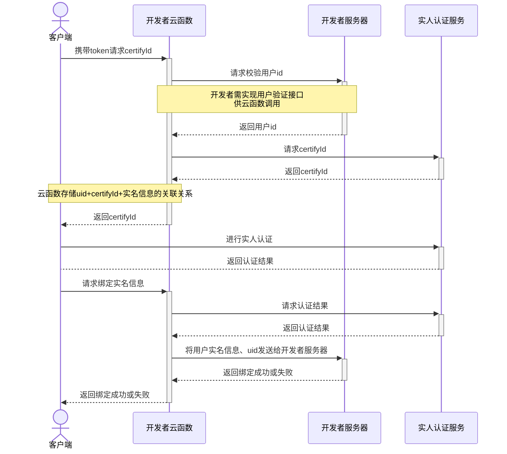

## 开发指南
## Development Guide

uni实人认证服务，分前端api和云端api，云端为uniCloud API。
uni real person authentication service is divided into front-end api and cloud api, and the cloud is uniCloud API.

如开发者的业务不在uniCloud上，需参考[云函数url化](../http.md)文档编写云函数提供http接口供外部访问，由uniCloud获取到认证结果后转交给开发者的非uniCloud服务器上。
If the developer's business is not on uniCloud, you need to refer to [Cloud function urlization](../http.md) document to write cloud functions to provide http interface for external access, and uniCloud will transfer the authentication results to the developer's non-uniCloud after obtaining the authentication results on the server.

首先在uniCloud服务空间新建一个云函数/云对象，用于处理实人认证业务。新建时在[云函数的扩展库](../cf-functions.md#extension)中配置uni-cloud-verify扩展库。

在uni-app客户端和uniCloud云函数中调用如下api，实现下图流程：
Call the following api in the uni-app client and uniCloud cloud function to realize the following process:

- 客户端获取metaInfo：[uni.getFacialRecognitionMetaInfo](#get-meta-info)
- 客户端调起sdk刷脸认证：[uni.startFacialRecognitionVerify()](#start-frv)
- 云函数获取实人认证实例：[uniCloud.getFacialRecognitionVerifyManager()](#get-frv-manager)
- The cloud function obtains a real person authentication instance: [uniCloud.getFacialRecognitionVerifyManager()](#get-frv-manager)
- 云函数提交姓名、身份证号以获取认证服务的certifyId：[frvManager.getCertifyId()](#get-certify-id)
- The cloud function submits the name and ID number to obtain the certifyId of the certification service: [frvManager.getCertifyId()](#get-certify-id)
- 云函数使用certifyId获取认证结果：[frvManager.getAuthResult()](#get-auth-result)

完整认证流程如下：
The complete certification process is as follows:


- 如果您使用uni-id，那么uni-id-pages已经帮您内置好相关功能，前端页面和云端逻辑均已写好，安全、无需开发、拿来就用。[详见](/uniCloud/uni-id-summary.md#frv)
- 如果您的业务系统不在uniCloud上，那么需要在上述流程图中加一个原业务服务器，由云函数和原业务服务器进行token校验、传递认证结果。
- If your business system is not on uniCloud, you need to add an original business server to the above flowchart, and the cloud function and the original business server will perform token verification and transfer the authentication result.

### 接口防刷

由于实人认证涉及费用，为避免其他人盗刷您的余额，您应当谨慎编码，防止漏洞。一般可以通过一个用户每天限制实名次数来实现防刷，未登录用户禁止调用认证接口。如果有更高的安全需求可以使用uni安全网络，可以有效防止伪造客户端请求，[详见](../secure-network.md)

### 客户端接口

#### 获取实人认证设备信息@get-meta-info
调用刷脸前通过客户端先获取设备信息，调用[uni.getFacialRecognitionMetaInfo](https://uniapp.dcloud.net.cn/api/plugins/facialRecognitionVerify.html)  

`const metaInfo = uni.getFacialRecognitionMetaInfo();`

**返回值**

|字段名		|类型		| 描述		|
|:-:			|:-:		|:-:		|
|metaInfo|String	|云函数获取认证服务的certifyId时，在入参metaInfo中传入该值	|

#### 调起实人认证界面@start-frv

通过云函数获取certifyId后，在客户端调用[uni.startFacialRecognitionVerify](https://uniapp.dcloud.net.cn/api/plugins/facialRecognitionVerify.html)打开认证界面，通过刷脸操作获取认证结果。

`uni.startFacialRecognitionVerify(OBJECT)`


**参数说明**  

| 参数						| 类型		| 是否必传	| 支持平台		| 描述															|
| ---						| ---		| ---		| ---			| ---															|
| certifyId					| String	| 是		| App			| 认证流水号，由服务端根据接入的业务模式调用对应的初始化接口获取		|
| progressBarColor			| String	| 否		| App			| 刷脸圈的颜色													|
| screenOrientation      | String  | 否    | App-Android  | 认证界面UI朝向。port 为竖屏，land 为横屏，默认为 port|
| success					| Function	| 否		| App			| 成功回调														|
| fail						| Function	| 否		| App			| 失败回调														|
| complete					| Function	| 否		| App			| 完成回调														|

注: 颜色字符串格式为“#RRGGBB”，RRGGBB为十六进制字符串，如红色("#FF0000")  

**返回值**

| 字段名		|  类型  | 描述				|
| ---			| --- | ---					|
| errSubject| String	| 模块名称(uni-facialRecognitionVerify)|
| errCode	|	Number| 错误码，详情见：[错误码](#err-code)|
| errMsg		| String | 错误信息，详情见：[错误码](#err-code)|
| cause		|	Object| SDK返回的原始数据 (certifyId不为空时返回)|

**cause**  

| 字段名	|  类型 | 描述				|
| ---		| ---		| ---		|
| code	|	Number| SDK原始错误码		|
| message	| String | SDK原始错误信息		|

**示例代码**

```js
uni.startFacialRecognitionVerify({
    certifyId:"",
    progressBarColor: "#CC0000", //刷脸圈的颜色
    screenOrientation: "port", //认证界面UI朝向
    success:(e)=>{
        console.log(JSON.stringify(e))
    },
    fail:(e)=>{
        console.log(JSON.stringify(e))
    },
    complete:(e)=>{
        console.log(JSON.stringify(e))
    }
})
```

#### iOS平台自定义UI  
iOS平台不支持通过参数的方式修改刷脸页的提示文案，但可以通过自定义bundle文件的方式修改提示内容以及国际化信息

[APBToygerFacade.bundle文件下载](https://native-res.dcloud.net.cn/uni-app/file/APBToygerFacade.zip)

首先需要下载APBToygerFacade.bundle文件，可通过修改APBToygerFacade.bundle中的内容自定义多语言文案，如 zh-Hans.strings 代表中文文案，en.strings 代表英文文案，内容格式为 "APBToygerFacade:xxxA"="xxxB"，xxxA 为目标修改文案，xxxB 为修改后的文案，示例内容如下：
```
"APBToygerFacade:xxxA"="xxxB";
"APBToygerFacade:当前设备不支持刷脸"="当前设备不支持刷脸";
"APBToygerFacade:拿起手机眨眨眼"="拿起手机，眨眨眼";
"APBToygerFacade:再试一次"="再试一次";
"APBToygerFacade:无法启动相机"="无法打开相机";
"APBToygerFacade:网络不给力"="网络异常";
```

此处文案修改后需要完整测试回归 UI 以及文案变化影响，以免影响用户体验。修改后的bundle文件配到项目根目录的 nativeResources -> ios -> Resources 路径下后打包即可，详情参照[iOS原生应用配置文件和资源](https://uniapp.dcloud.net.cn/tutorial/app-nativeresource-ios.html) 

### 云函数接口
### Cloud function interface

实人认证相关接口由uni-cloud-verify扩展库提供，调用`uniCloud.getFacialRecognitionVerifyManager()`需云函数/云对象中加载对应的扩展库。[参考](../cf-functions.md#extension)


#### 获取实人认证实例@get-frv-manager
#### Get real person authentication instance @get-frv-manager

**接口形式**
**Interface form**

```js
uniCloud.getFacialRecognitionVerifyManager(Object GetFacialRecognitionVerifyManagerParam)
```

**参数说明**
**Parameter Description**

**Object GetFacialRecognitionVerifyManagerParam**

|属性			|类型		|必填	|默认值	|说明																										|
|:-:			|:-:		|:-:	|:-:		|:-:																										|
|requestId|String	|是		|-			|本次云函数请求的requestId															|
|appId		|String	|否		|-			|用于在url化等无法获取客户端信息的场景下传入客户端appId	|

**返回值**
**return value**

此接口返回实人认证实例对象
This interface returns the real person authentication instance object

**示例代码**
**Example Code**

- 云函数
- cloud function

```js
exports.main = async (event, context) => {
  const frvManager = uniCloud.getFacialRecognitionVerifyManager({
    requestId: context.requestId
  })
};
```

- 云对象
- cloud object

```js
'use strict';
module.exports = {
  _before() {
    // 本示例写在_before中，可以按需调整到某个方法中
    // This example is written in _before and can be adjusted to a method as needed
    this.frvManager = uniCloud.getFacialRecognitionVerifyManager({
      requestId: this.getUniCloudRequestId()
    })
  }
}
```

#### 获取certifyId@get-certify-id
#### Get-certifyId@get-certify-id

**接口形式**
**Interface form**

```js
frvManager.getCertifyId(Object GetCertifyIdParam)
```

**参数说明**
**Parameter Description**

**Object GetCertifyIdParam**

|属性				|类型		|必填	|默认值	|说明													|
|:-:				|:-:		|:-:	|:-:		|:-:													|
|realName		|String	|是		|-			|用户真实姓名									|
|idCard			|String	|是		|-			|用户身份证号									|
|metaInfo		|String	|是		|-			|客户端获取设备信息返回的metaInfo	|
|needPicture|Boolean|否		|false	|是否需要采集用户照片					|

**返回值**
**return value**

|字段名		|类型		|必备	|说明																								|
|Field Name |Type |Required |Description |
|:-:			|:-:		|:-:	|:-:																								|
|certifyId|String	|是		|认证id，用于客户端调用认证接口及云函数获取认证结果	|
| certifyId| String |Yes |Certification id, used by the client to call the authentication interface and cloud function to obtain the authentication result |

**示例代码**
**Example Code**

云函数
cloud function

```js
exports.main = async (event, context) => {
  const frvManager = uniCloud.getFacialRecognitionVerifyManager({
    requestId: context.requestId
  })
  const result = await frvManager.getCertifyId({
    realName: '张三',
    idCard: 'xxxxxx',
    metaInfo: '{"xx": "xx"}'
  })
  return result
};
```

云对象
cloud object

```js
module.exports = {
  _before() { // _before是云对象中每个方法运行前都会执行的方法
    this.frvManager = uniCloud.getFacialRecognitionVerifyManager({
      requestId: this.getUniCloudRequestId()
    })
  },
  async getCertifyId() {
    const result = await this.frvManager.getCertifyId({
      realName: '张三',
      idCard: 'xxxxxx',
      metaInfo: '{"xx": "xx"}'
    })
    return result
  }
}
```

#### 获取认证结果@get-auth-result
#### Get the authentication result @get-auth-result

**接口形式**
**Interface form**

```js
frvManager.getAuthResult(Object GetAuthResultParam)
```

**参数说明**
**Parameter Description**

**Object GetAuthResultParam**

|属性			|类型	|必填	|默认值	|说明																		|
|:-:			|:-:	|:-:	|:-:	|:-:																		|
|certifyId		|String	|是		|-		|认证id																		|

**返回值**
**return value**

|字段名			|类型		|必备											|说明																																								|
|:-:				|:-:		|:-:											|:-:																																								|
|authState	|String	|是												|人脸检测状态。SUCCESS：检测成功；FAIL：检测失败								|
|score			|Number	|authState为SUCCESS时必备	|活体检测结果分数																																		|
|quality		|Number	|authState为SUCCESS时必备	|人脸图片质量分																																			|
|pictureUrl	|String	|authState为SUCCESS时必备	|实人认证采集的图片链接，此链接为临时链接请勿直接保存到数据库，应下载后自行保存文件	|

**示例代码**
**Example Code**

云函数
cloud function

```js
exports.main = async (event, context) => {
  const frvManager = uniCloud.getFacialRecognitionVerifyManager({
    requestId: context.requestId
  })
  const result = await frvManager.getAuthResult({
    certifyId: 'xxxxxx'
  })
  return result
};
```

云对象
cloud object

```js
module.exports = {
  _before() {
    this.frvManager = uniCloud.getFacialRecognitionVerifyManager({
      requestId: this.getUniCloudRequestId()
    })
  },
  async getAuthResult() {
    const result = await this.frvManager.getAuthResult({
      certifyId: 'xxxxxx'
    })
    return result
  }
}
```

#### 错误处理
#### Error Handling

可以通过try catch捕获接口抛出的错误，接口抛出的错误为标准的[uni错误对象](../../tutorial/err-spec.md)

具体错误码规范见：[错误码](#err-code)
For specific error code specifications, see: [Error Code](#err-code)

**示例**
**example**

```js
module.exports = {
  _before() {
    this.frvManager = uniCloud.getFacialRecognitionVerifyManager({
      requestId: this.getUniCloudRequestId()
    })
  },
  async getAuthResult() {
    try {
      const result = await this.frvManager.getAuthResult({
        certifyId: 'xxxxxx'
      })
      return result
    } catch (e) {
      if(e.errCode === 50001 || e.errCode === 50002) {
        throw new Error('缺少参数或参数不正确')
      }
      throw e
    }
  }
}
```

### 错误码@err-code
### Error code @err-code

**云端错误码**
**Cloud error code**

|错误码	|说明													|
|Error code |Description |
|:-:	|:-:													|
|0		|请求成功												|
| 0 | Request succeeded |
|50001	|缺少参数												|
| 50001 | Missing parameter |
|50002	|参数类型、取值不正确									|
| 50002 | The parameter type and value are incorrect |
|54003	|appId不存在											|
| 54003 | appId does not exist |
|54004	|服务空间不在白名单中									|
| 54004 | The service space is not in the white list |
|54020	|请求记录不存在，certifyId无效							|
| 54020 | Request record does not exist, certifyId is invalid |
|54021	|云函数内缺少接口调用凭证，请联系DCloud处理				|
| 54021 | There is no interface call certificate in the cloud function, please contact DCloud for processing |
|54022	|服务空间不存在											|
|54100	|实人认证账号余额不足						|
|54101	|费用获取失败，请联系DCloud处理							|
|54102	|金额冻结失败，请联系DCloud处理											|
|55000	|服务器错误，请联系DCloud处理							|
| 55000 | Server error, please contact DCloud |
|55001	|Api调用失败，实人认证服务商服务不可用，请联系DCloud处理|
|55023	|尚未开通实人认证										|
|60000	|服务不可用，请联系DCloud处理							|
| 60000 | The service is unavailable, please contact DCloud for processing |

**客户端错误码**
**Client error code**

|错误码	|错误信息			|描述											|
|Error code |Error message |Description |
|---	|---				|---											|
|0		|刷脸完成			|实际结果需要通过服务端查询接口					|
| 0 |Face swiping completed |Actual results need to query the interface through the server |
|10001	|certifyId不能为空	|参数certifyId为空								|
| 10001 | certifyId cannot be empty |The parameter certifyId is empty |
|10010	|刷脸异常			|刷脸异常,具体原因详见cause						|
| 10010 | Abnormal facial recognition | Abnormal facial recognition, see cause for details |
|10011	|验证中断			|如用户主动退出、验证超时等,具体原因详见cause	|
| 10011 | Verification Interrupted | For example, the user voluntarily logs out, verification timeout, etc., see cause for details |
|10012	|网络异常			|网络异常										|
| 10012 | Network exception | Network exception |
|10013	|刷脸验证失败		|实际结果需要通过服务端查询结果					|
| 10013 | Facial verification failed | The actual result needs to be checked by the server |
|10020	|设备设置时间异常	|设备设置时间异常，仅iOS返回					|
| 10020 | The device setting time is abnormal | The device setting time is abnormal, only returned by iOS |


### 注意事项 

- 为对抗攻击，实人认证SDK返回的错误原因比较模糊。  
- HBuilderX3.7.4+新增支持，标准基座可直接真机运行，打包或自定义基座需在“App模块配置”中勾选“FacialRecognitionVerify(实人认证)”（注意不是faceId）参考[详情](https://uniapp.dcloud.net.cn/tutorial/app-facialRecognitionVerify.html)
- App-Android平台要求**Android5**（API Leavel 21）及以上系统，App-iOS平台要求**iOS9**及以上系统
- App端使用实人认证SDK，需在隐私政策的三方SDK中添加实人认证功能描述，参考[详情](https://ask.dcloud.net.cn/article/39484#FacialRecognitionVerify)


### 非 uniCloud 业务使用 <Badge text="uni-frv-pages 待发布" />

如果您的业务没有部署在 uniCloud 上，可以通过 uni-frv-pages 来实现实人认证功能。
uni-frv-pages 集成了实名认证前端页面和云端云对象，适用于没有使用uniCloud或没有使用uni-id账号体系的项目。

插件下载地址：[https://ext.dcloud.net.cn/plugin?name=uni-frv-pages](https://ext.dcloud.net.cn/plugin?name=uni-frv-pages)


#### 业务流程



#### 项目文件说明
```text
├── uni_modules                                     存放[uni_module](/uni_modules)规范的插件。
│    ├── uni-frv-pages                              
│    │   ├── changelog.md
│    │   ├── common                                     页面公共逻辑
│    │   │   ├── check-id-card.js                       校验身份证号合法性
│    │   │   └── common.scss
│    │   ├── components                                 公共组件
│    │   │   └── uni-frv-pages-realname                 实名认证组件
│    │   │       ├── face-verify-icon.svg               实名认证错误提示Icon
│    │   │       └── uni-frv-pages-realname.vue     
│    │   ├── package.json                               包管理文件
│    │   ├── pages                                  
│    │   │   └── common
│    │   │       └── webview                            用于实现应用内浏览或打开《用户协议和隐私协议》URL链接页面
│    │   │           └── webview.vue
│    │   ├── pages_init.json                            页面初始化文件
│    │   ├── readme.md
│    │   └── uniCloud
│    │       ├── cloudfunctions
│    │       │   └── uni-frv-co                         实名认证云对象
│    │       │       ├── config.js                      加载uni-config-center/uni-frv-co.json配置文件
│    │       │       ├── functions                      云对象方法目录
│    │       │       │   ├── _after.js                  云对象加载后方法
│    │       │       │   ├── _before.js                 云对象执行前方法
│    │       │       │   ├── getAuthResult.js           获取实人认证结果
│    │       │       │   ├── getCertifyId.js            获取实人认证认证ID
│    │       │       │   └── index.js                   导出云对象方法文件
│    │       │       ├── index.obj.js                   云对象入口
│    │       │       ├── lang                           国际化目录
│    │       │       │   ├── en.js
│    │       │       │   ├── index.js
│    │       │       │   └── zh-hans.js
│    │       │       ├── lib                            云对象公共类库
│    │       │       │   ├── constants.js               变量定义声明文件
│    │       │       │   ├── error.js                   错误码
│    │       │       │   ├── request-webhook.js         处理业务服务器回调文件
│    │       │       │   ├── sensitive-aes-cipher.js    敏感信息加解密
│    │       │       │   ├── sign.js                    用于给业务服务器回调数据签名
│    │       │       │   ├── utils.js                   工具类方法
│    │       │       │   └── validator.js               请求参数校验
│    │       │       └── package.json                   包管理文件
│    │       └── database                               数据库目录
│    │           └── opendb-frv-logs.schema.json        实人认证记录表
```
#### 配置（uni-frv-co）

实人认证配置文件路径：`uniCloud/cloudfunctions/common/uni-config-center/uni-frv-pages/config.json`

```json
// 如果拷贝此内容切记去除注释
{
	"callback": { // 配置业务服务器回调
		"userAuth": "", // 用户校验
		"verifyResult": "" // 认证完成后结果回调
	},
	"requestTimeout": 5000, // 请求业务服务器超时时间
	"realNameCertifyLimit": 5, // 限制每个用户每天实人认证次数
	"sensitiveInfoEncryptSecret": "", // 敏感信息加密密钥(长度需要大于32位)，敏感信息如：姓名、身份证号、认证照片
	"needAlivePhoto": true, // 是否需要返回用户人脸照片
	"requestAuthSecret": "" // 请求业务服务器时计算签名密钥
}
```

#### 前端使用

将`uni-frv-pages`插件导入至项目中，由于`uni-frv-pages`提供的实名认证入口是组件形式，需要自行准备实名认证页面，将`uni-frv-pages-realname`引入至页面中。

**组件用法**

```vue
<uni-frv-pages-realname :agreement="{url: '', title: ''}" token="user token" @result="resultCallback"></uni-frv-pages-realname>
```

**组件Props**

| 属性名       | 类型     | 默认值 | 说明                |
|-----------|--------|-----|-------------------|
| agreement | Object | -   | 隐私协议展示名称与地址，默认不展示 |
| token     | String | -   | 业务系统的用户id         |

**组件Event**

| 事件名称   | 事件说明   | 返回参数        |
|--------|--------|-------------|
| result | 认证成功事件 | 见下方Result说明 |

Result说明

| 参数       | 类型     | 说明                              |
|----------|--------|---------------------------------|
| status   | number | 认证状态：0 未认证 1 等待认证 2 认证通过 3 认证失败 |
| idCard   | string | 用户身份证号码                         |
| realName | string | 用户真实姓名                          |

**实名认证页面示例**

```vue
<template>
	<view class="content">
		<template v-if="isCertified">
			<uni-list>
			<uni-list-item class="item" title="姓名" :rightText="realName"></uni-list-item>
			<uni-list-item class="item" title="身份证号码" :rightText="idCard"></uni-list-item>
		  </uni-list>
		</template>
		<template v-else>
			<uni-frv-pages-realname :agreement="agreement" :token="token" @result="resultCallback"></uni-frv-pages-realname>
		</template>
	</view>
</template>

<script>
	export default {
		data() {
			return {
                token: '',
				agreement: {
						title: "实名认证协议",
						url: "https://www.xxx.com"
				},
				isCertified: false,
				realName: '',
				idCard: '',
			}
		},
		methods: {
			resultCallback (result) {
				if (result.status === 2) {
					this.isCertified = true
					this.realName = result.realName
					this.idCard = result.idCard
				}
			}
		}
	}
</script>
```

#### 业务回调接口规范

完成整个实名认证流程，需要业务服务器配合提供两个回调接口，用于用户校验与认证结果通知。
为保证请求在网络上传输安全，在请求回调地址时，`uni-frv-co`会对请求参数进行签名，开发者在服务器需要验证签名是否正确，不正确的签名可以将请求拒绝。
验证签名操作为开发者主动行为，需要开发者评估是否需要签名验证，不作为强制要求。但强烈建议验证签名以保证安全性。

**概述**

| 请求相关项  | 说明                                                            |
|--------|---------------------------------------------------------------|
| 请求协议	  | HTTP/HTTPS，为保证数据安全，建议使用 HTTPS                                 |
| 请求方式	  | POST                                                          |
| 请求类型	  | application/json; charset=utf-8                               |
| 校验方式   | uni-frv-co 请求到业务服务器时，开发者应从请求头中获取签名字段进行安全校验，防止数据篡改；签名见下方请求签名说明 |
| 请求超时时间 | 默认超时5秒钟，可在配置文件中配置                                             |

**请求签名说明**

请在`uni-frv-co`配置文件中配置`requestAuthSecret`请求鉴权密钥，确保业务服务器与配置文件中的请求鉴权密钥一致。

发起请求时，将使用请求鉴权密钥计算签名，会在 HTTP 请求头中携带以下信息：

| Header            | 描述                                                              |
|-------------------|-----------------------------------------------------------------|
| uni-frv-nonce     | 随机字符串                                                           |
| uni-frv-timestamp | 当前时间戳; 单位毫秒                                                     |
| uni-frv-signature | 请求鉴权签名; 了解签名算法[详见](/uniCloud/uni-id-pages.md#http-reqeust-auth) |

**用户校验**

以下示例的请求地址均为示例，在实际使用中将更换为业务服务器的回调地址。

HTTP 示例
```javascript
POST /callback/userAuth HTTP/1.1
Host: xxx.com
uni-frv-nonce: x9K3829
uni-frv-timestamp: 1676882808550
uni-frv-signature: 1C965267A4A02C6978949C7135215B0A75AEA22B2B84ED491E792365C8269EFA
Content-Type: application/json
Cache-Control: no-cache

{"token": "test token"}
```

Request Body 说明

| 名称    | 类型     | 必须  | 说明            |
|-------|--------|-----|---------------|
| token | string | 是   | 业务系统中的用户token |

Response Body 说明

| 名称      | 类型     | 必须  | 说明                  |
|---------|--------|-----|---------------------|
| errCode | string | 是   | 错误码；成功返回0，其他错误返回错误码 |
| errMsg  | string | 否   | 错误信息；成功可以为空         |
| uid     | string | 是   | 业务系统中的用户id          |

**注意**

- 开发者需要严格按照 ResponseBody 格式返回。

**认证结果通知**


以下示例的请求地址均为示例，在实际使用中将更换为业务服务器的回调地址。

HTTP 示例
```javascript
POST /callback/verifyResult HTTP/1.1
Host: xxx.com
uni-frv-nonce: x9K3829
uni-frv-timestamp: 1676882808550
uni-frv-signature: 1C965267A4A02C6978949C7135215B0A75AEA22B2B84ED491E792365C8269EFA
Content-Type: application/json
Cache-Control: no-cache

{"uid": "test uid", "realName": "张三", "idCard": '10xxxxxxxxxx', "photo": "...", "status": 2}
```

Request Body 说明

| 名称       | 类型     | 必须  | 说明                              |
|----------|--------|-----|---------------------------------|
| uid      | string | 是   | 业务系统中的用户id                      |
| realName | string | 是   | 真实姓名                            |
| idCard   | string | 是   | 身份证号码                           |
| photo    | string | 是   | 用户认证照片；needAlivePhoto为true时返回   |
| status   | string | 是   | 认证状态：0 未认证 1 等待认证 2 认证通过 3 认证失败 |

Response Body 说明

| 名称       | 类型     | 必须  | 说明                  |
|----------|--------|-----|---------------------|
| errCode  | string | 是   | 错误码；成功返回0，其他错误返回错误码 |
| errMsg   | string | 否   | 错误信息；成功可以为空         |
| realName | string | 否   | 真实姓名                |
| idCard   | string | 否   | 身份证号                |

**注意**

- 开发者需要严格按照 `ResponseBody` 格式返回。
- 如果有敏感数据脱敏需求，可以在响应中返回脱敏后的真实姓名和身份证号。

#### 回调接口签名验证

**nodejs示例**

```javascript
function verify (body, signature, timestamp, nonce) {
  const timeout = 30 * 1000 // 请求超过30秒不能再请求，防止重放攻击
  const bodyStr = Object.keys(body)
    .sort()
    .filter(item => typeof body[item] !== 'object')
    .map(item => `${item}=${body[item]}`)
    .join('&')

  if (isNaN(Number(timestamp)) || (Number(timestamp) + timeout) < Date.now()) {
    throw {
      errCode: "ILLEGAL_REQUEST"
    }
  }

  const reSignature = crypto.createHmac('sha256', `${requestAuthSecret + nonce}`).update(`${timestamp}${bodyStr}`).digest('hex')

  if (signature !== reSignature.toUpperCase()) {
    throw {
      errCode: "ILLEGAL_REQUEST"
    }
  }

  return true
}
```

其他语言参考[签名算法](/uniCloud/uni-id-pages.md#http-reqeust-auth)自行实现签名验证逻辑

