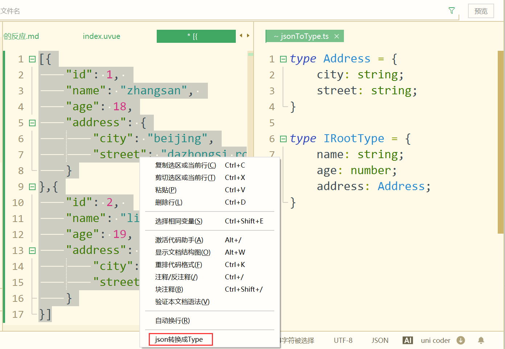

# 类型@data-type

强类型语言的特点，是数据类型要求严格。它带来2个好处：
1. 高性能：明确的类型有更大的优化空间，在iOS和Android等OS上可以节省内存、提高运算速度；web端由于仍编译为js，不具有类型性能优化。
2. 安全的代码：强类型代码编写虽然没有弱类型自由，但类型检查、非空检查...等各种检查可以提高代码的健壮性。

如果您是js开发者，那么需要一定的学习过程来掌握 UTS 的类型系统。总体原则是你将牺牲一些代码的灵活性，来换取代码的健壮性和高性能。

所谓 类型，即 type，用于对有相同特征的变量或值进行归类。

比如 `"abc"`和`"你好"`，都属于字符串string，所有string类型有相同的方法、属性，比如`.length`属性获取字符串长度。

UTS 的类型有：
- 基础类型：boolean、number、string、any、null，都是小写。前3个typeof返回类型名称，null的typeof是object，any的typeof是运行时值的类型。
- 对象类型：Date、Array、Map、Set、UTSJSONObject，首字母大写。typeof返回"object"，判断准确类型需使用 instanceof 
- 使用 type 来自定义类型
- 特殊类型：function、class、error。
- 平台专有类型：Int、Float、Double、NSString、kotlin.Array...

除了特殊类型，其他类型都可以在变量后面通过`:`加类型名称来给这个变量声明类型。

## 布尔值（boolean）

布尔是简单的基础类型，只有2个值：`true` 和 `false`。

```ts
let a:boolean = true // 定义类型并赋值字面量
let b = false // 未显式声明类型，但根据字面量可自动推导为布尔类型
let c:boolean // 定义类型但定义时未赋值
c = true // 后续为变量赋值字面量
```

**注意：**
- 在js里，true == 1、 false == 0。但在其他强类型语言里，`1`和`0`是数字类型，无法和布尔类型相比较。
- 注意 boolean 不要简写成 bool

## 数字（number）

在 ts 中，数字不区分整型和浮点，就是一个 number。但在 kotlin 和 swift 中，数字需要是一个确定类型，比如 Int、Float、Double，没有泛数字。

UTS 在iOS和Android平台上新增了 number 类型，拉齐了web端的实现，方便开发者写全端兼容代码，也降低web开发者使用 uts 的门槛。

number 是一个泛数字类型，包括整数或浮点数，包括正数负数。例如： 正整数 `42` 或者 浮点数 `3.14159` 或者 负数 `-1` 。

```ts
let a:number = 42       //a为number类型
let b:number = 3.14159  //b为number类型
let c = 42              //注意：目前版本推导c为Int类型，新版本将调整c为number类型
let d = 3.14159         //注意：目前版本推导d为float类型，新版本将调整d为number类型
```

- 编译到kotlin平台时，number 利用 kotlin的 `Number`抽象类实现
- 编译到swift平台时，number 利用 `NSNumber` 实现

### 平台专有数字类型

除了 number 类型，UTS 在 Android 和 iOS 设备上，也可以使用 kotlin 和 swift 的专有数字类型。

日常开发使用 number 类型就可以。但是也有需要平台专有数字类型的场景：

1. 在 kotlin 和 swift 中，调用系统API或三方SDK的入参或返回值的类型，强制约定了平台专有数字类型。比如入参要求传入 Int，那么传入 number 会报错。比如方法返回了一个 Int，使用 number 类型的变量去接收，也会报错。
2. number 作为泛数字，性能还是弱于Int。在普通计算中无法体现出差异，但在千万次运算后，累计会产生毫秒级速度差异。

请注意：
number本身的使用很简单，但混入了平台专有数字类型后，会引出很多细节需要学习。
- 如果您不调用原生API，初学uts时建议跳过本节，直接往下看string类型。
- 如果您是插件作者，那请务必仔细阅读本章节。

#### Kotlin 专有数字类型 @Kotlin

|类型名称|长度  |最小值       |最大值          |描述|
|:--     |:---  |:---         |:---           |:-- |
|Byte    |8bit  |-128         |127            |整型|
|UByte   |8bit  |0            |255            |整型|
|Short   |16bit |-32768       |32767          |整型|
|UShort  |16bit |0            |65535          |整型|
|Int     |32bit |-2147483648  |2147483647     |整型|
|UInt    |32bit |0            |4294967295     |整型|
|Long    |64bit |-9223372036854775808 |9223372036854775807     |整型|
|ULong   |64bit |0            |9223372036854775807 * 2 + 1     |整型|
|Float   |32bit |1.4E-45F     |3.4028235E38                    |[浮点型](https://kotlinlang.org/docs/numbers.html#floating-point-types)|
|Double  |64bit |4.9E-324     |1.7976931348623157E308         |[浮点型](https://kotlinlang.org/docs/numbers.html#floating-point-types)|

基本数据类型会有jvm编译魔法加持，kotlin 会把 Int / Double 等非空类型编译为 基本数据类型，Int? / Double? 等可为空的类型编译为 Integer等包装类型，享受不到编译优化加持。

如果涉及大量运算，建议开发者不要使用 number、Int? ，要明确使用 Int等类型 [详情](https://kotlinlang.org/docs/numbers.html#numbers-representation-on-the-jvm)

#### Swift 专有的数字类型 @Swift

|类型名称    |长度   |最小值        				|最大值          					|描述|
|:--     	|:---  |:---         				|:---           					|:-- |
|Int8    	|8bit  |-128         				|127            					|整型|
|UInt8   	|8bit  |0            				|255            					|整型|
|Int16   	|16bit |-32768       				|32767          					|整型|
|UInt16  	|16bit |0            				|65535          					|整型|
|Int32      |32bit |-2147483648  				|2147483647     					|整型|
|UInt32     |32bit |0            				|4294967295     					|整型|
|Int64      |64bit |-9223372036854775808 		|9223372036854775807     			|整型|
|UInt64   	|64bit |0                    		|9223372036854775807 * 2 + 1     	|整型|
|Int  		|64bit |-9223372036854775808 		|9223372036854775807     			|整型(64位平台下)|
|UInt   	|64bit |0                 	 		|9223372036854775807 * 2 + 1     	|整型(64位平台下)|
|Int  		|32bit |-2147483648      	 		|2147483647     				  	|整型(32位平台下)|
|UInt   	|32bit |0            	  	 		|4294967295     				  	|整型(32位平台下)|
|Float   	|32bit |1.1754944E-38     	 		|3.4028235E38                    	|单精度浮点型|
|Float16   	|16bit |6.104e-05         	 		|65504.0                    		|半精度浮点型(仅iOS14.0及以上系统支持)|
|Float32   	|32bit |1.1754944E-38     	 		|3.4028235E38                    	|单精度浮点型，等同Float|
|Float64   	|64bit |2.2250738585072014E-308     |1.7976931348623157E308             |双精度浮点型，等同Double|
|Double  	|64bit |2.2250738585072014E-308     |1.7976931348623157E308         	|双精度浮点型|


**注意：**
- Swift 中 Int 类型是根据平台动态的，在 32 位设备下等同于 Int32, 在64位设备下等同于 Int64。因此建议整型使用 Int, 除非必要，且在保证不会溢出的场景下才使用 Int32、Int64。
- 同样，Swift 中的 UInt 类型也是根据平台动态的，在 32 位设备下等同于 UInt32, 在64位设备下等同于 UInt64。建议使用 UInt，非必要不使用 UInt32、UInt64。
- Float16 在 iOS14.0 及以上系统上才能使用，使用时注意做系统版本号判断。[参考](../plugin/uts-uni-api.md#设备)
- Float32 是 Float 的类型别名, 两者等价。
- Float64 是 Double 的类型别名, 两者等价。

#### 专有数字类型的定义方式

使用下面的方法，虽然可能会被编辑器报语法错误（后续HBuilderX会修复这类误报），但编译到 kotlin 和 swift 运行是正常的。

- 声明特定的平台数字类型
 > 平台专有数字类型，均为首字母大写，注意与 number 首字母小写是不同的

```ts
let a:Int = 3 //注意 Int 是首字母大写
let b:Int = 4
let c:Double  = a * 1.0 / b
```

* 注意专有数字类型不能在web端和小程序端使用，如工程需兼容非App端，要把这些代码放入条件编译中；
* iOS和Android都有的类型，比如Int，编译后可跨2个平台；但如果使用了某平台专有的数字类型，比如swift的Int8，则此代码不能编译到Android，工程如需支持Android，则把这些代码写在条件编译中。

```ts
// #ifdef APP-IOS
let d:Int8 = 1 // Int8是swift平台专有类型
// #endif
```

这些专有类型定义后，可以使用kotlin和swift为其提供的各种方法，具体参考kotlin和swift的文档。

### 字面量类型自动推导@autotypefornumber

具体值，比如`42`、`"abc"`，称之为[字面量](literal.md)

字面量可以直接用于赋值、传参，比如 `let a = 42`，就是把`42`这个数字字面量赋值给了a。

不管是 ts 、kotlin 还是 swift，都具备字面量自动推导类型的能力，为 a 自动推导合适的类型。

**在HBuilderX 3.9版之前，在未显式声明类型的情况下使用数字字面量赋值、传参，由平台语言自动推导为相应的类型**

但不同平台，推导结果不一样。

- ts 中，a 被推导为 number
- kotlin 中，a 被推导为 Int
- swift 中，a 被推导为 Int

上述只是一个简单的示例，再看一个复杂的例子，`let a = 1/10`。

a 会被自动推导成什么类型？是Int、double、还是number？值是0还是0.1？在不同平台的差异更大。

在web端，a 的类型是 number，值是0.1，但在 kotlin 中，类型是 Int，值是0。

**HBuilderX 3.9起 uts 提供了2条新的字面量类型推导规则：**

- 规则1. 在定义变量时，若没有显式声明变量类型，通过数字字面量以及数字字面量组成的运算表达式来给变量赋值，此时变量类型默认推导为 number类型

举例说明：
* HBuilderX3.9前，运行到App，由kotlin和swift编译器推导
```ts
let a = 1  // 类型为Int
let b = 1/10 // 类型为Int，值为0
```

* HBuilderX3.9起，运行到App，未显式声明类型的变量，需根据数字字面量推导变量类型，此时由 uts 编译器推导，变量类型默认为 number
```ts
let a = 1  // 类型为number
let b = 1/10 // 类型为number，值为0.1
```

如您已经显式声明变量类型，无需自动推导，则不受上述规则变化影响。不管HBuilderX 3.9之前还是之后，以下代码都是一样的
```ts
let a:Int = 1  // 类型为Int
```

`let a = 1`，a从Int变成number，这是一个**无法向下兼容的更新**，请开发者注意调整。

但`let b:Int = 1/10` 会在 HBuilderX 3.9+起报错，原因见下面第二条规则。

再澄清下规则1：
  * 如果定义变量时已经显式声明了类型，和规则1无关
  * 如果不是定义变量，和规则1无关

也就是如下代码中，`60`这个字面量的处理，和规则1无关，不会把这个`60`改为number类型

```ts
function test(score: Int): boolean {
	return (score>=60) 
}
test(60) // 这个60可以正常传入，无论HBuilderX 3.9之前还是之后
```

- 规则2. 纯数字字面量的除法，其结果会变成number

在HBuilderX 3.9以前，字面量除法也由kotlin和swift自动推导，kotlin下存在一个问题，看如下代码：
```ts
function test(score: number): boolean {
	return (score>=60) 
}
test(1/10) // 报错，类型不匹配。需要number而传入Int
```

这个问题看着有点诡异，其实是由于kotlin推导字面量时，把1/10推导成了Int，且值为0。然后把Int类型的数字传给需要number入参的函数test时，就会报类型不匹配。

为了解决这个问题，从HBuilderX 3.9起引入了一条字面量除法规则：**纯数字字面量的除法，结果一定是number**。

引入这个规则后，上述代码就可以正常运行了。

这里的`纯数字字面量的除法`，指除法表达式中除了数字和运算符，不包括任何其他东西：
- 比如变量：`let a:Int=1;let b:Int= a/1`
- 比如使用 as 断言：`(1 as Int)/10`
以上除法表达式，都不是“纯数字字面量的除法”，都不会被推导为number。

但是这条规则，也会导致一个**向下兼容问题**。

下面的代码在HBuilderX 3.9之前是可以正常运行的，但在3.9起会报错，因为1.0/10被转为了number类型，传入需要Double的函数时就会类型不匹配。
```ts
function test(score: Double): boolean {
	return (score>=60.0) 
}
test(1.0/10)
```

在HBuilderX 3.9后，为了正确传入Double，要注意跳过规则2。避免纯数字字面量除法，所以正确的写法是：
```ts
function test(score: Double): boolean {
	return (score>=60.0) 
}
test((1.0 as Double)/10) //表达式中任意一个数字as一下，都不会走规则2
```

也就是，在纯字面量除法时，原生和js冲突了。uts选择了遵守js开发者的习惯，而原生开发者使用平台专有类型时则需注意使用`as`来规避。

### 各种数字类型之间的转换

对number类型的数字，使用to方法转换为平台专有类型。

而Number.from()方法传入一个平台专有类型的数字，则可以转换为number。

#### kotlin

所有的 number 都支持下列方法进行转换（部分类库API使用java编写，其要求的java类型与下列kotlin类型完全一致，可以直接使用

  * toByte(): Byte
  * toShort(): Short
  * toInt(): Int
  * toLong(): Long
  * toFloat(): Float
  * toDouble(): Double

另外 number 还具备下列函数进行整型的无符号转换，这部分API 在jvm上没有对应的原始数据类型，主要的使用场景是 色值处理等专业计算场景的`多平台拉齐`

  * toUByte(): UByte
  * toUShort(): UShort
  * toUInt(): UInt
  * toULong(): ULong

```ts
let a:number = 3
a.toInt() // 转换为 Int 类型
a.toFloat() // 转换为 Float 类型，后续也将支持 new Float(a) 方式转换
a.toDouble() // 转换为 Double 类型，后续也将支持 new Double(a) 方式转换

//平台专有类型之间，也可以使用to方法转换
let i:Int = 1
i.toDouble() // 转换为 Double 类型
```

把 kotlin 专有数字类型，转换为number，使用Number.from()方法
```ts
let a: Int = 1
let a1 = Number.from(a) // Int转number

let b: Float = 3.14
let b1 = Number.from(b)

let c: Double = 3.1414926
let c1 = Number.from(c)

let e: Long = 2147483649
let e1 = Number.from(e)
```

#### swift

swift与kotlin类似。使用to方法和Number.from方法互相转换。

```ts
// number转成平台特有类型
let a:number = 3
a.toInt() // 转换为 Int 类型
a.toFloat() // 转换为 float 类型
a.toInt64() // 转换为 Int64 类型

// 平台特有类型转成number
let f: Float = 5.0
let n = Number(f)
let i = Number.from(3.14)
let j = Number.from(f)

let d: Int64 = 12306    
let d1 = Number.from(d)

// 特定类型转成其他的特定类型
let a:Int = 3
let b = new Double(a) // 将整型变量 a 转换为 Double 类型
```

### number的边界说明

- 在不同平台上，数值的范围限制不同，超出限制会导致相应的错误或异常
  * 编译至 JavaScript 平台时，数值范围为 ±1.7976931348623157e+308，超出范围会返回 `Infinity` 或 `-Infinity`。
  * 编译至 Kotlin 平台时，整型的数值范围为 -9223372036854775808 到 9223372036854775807，超出范围会报错：`The value is out of range‌`。浮点型的数值范围为 ±1.7976931348623157e+308，超出范围会返回 `Infinity` 或 `-Infinity`。平台专有数字类型范围 [详见](#Kotlin)。
  * 编译至 Swift 平台时，整型的数值范围为 -9223372036854775808 到 9223372036854775807，浮点型的数值范围为 ±1.7976931348623157e+308，超出范围会报错：`integer literal overflows when stored into 'NSNumber'`。平台专有数字类型范围 [详见](#Swift)

### 运算和比较

既然数字类型有很多，就涉及跨类型的数字之间的运算和比较的问题。

跨类型数字的运算，比如加减乘除取余，是什么样的？Int+number可以吗？详见 [算数运算符](operator.md#arithmeticdifftype)

跨类型数字的比较，大于小于等于不等于的规则是什么样的？详见 [比较运算符](operator.md#comparisondifftype)

### 更多API

Number内置对象还有很多API，[详见](buildin-object-api/number.md)

## 字符串（string） @string

字符串是一串表示文本值的字符序列，例如：`"hello world"`。

string在多平台均可良好兼容。

```ts
let s1:string = "abc"  //显式声明string类型并赋值
let s2 = "abc" // 根据字符串字面量"abc"，自动推导为string类型
let s3:string
s3 = "abc"
```

### 平台专有字符串类型

- iOS 的 NSString

app-ios平台上原生有 NSString ，某些系统API或者三方库API可能使用NSString类型的字符串参数或者返回值。

定义NSString
```ts
let nstr = NSString(string="123") // 类型为NSString
```

可按照下面的方法在 string 和 NSString 之间转换：

- string 转 NSString
```ts
let str = "abcd" // 类型为string
// 方式一：
let nstr1 = NSString(string=str)  // 类型为NSString
// 方式二：
let nstr2 = str as NSString  // 类型为NSString
```

- NSString 转 string
```ts
let nstr3 = NSString(string="123") // 类型为NSString
// 方式一：
let str4 = String(nstr3)  // 类型为string
// 方式二：
let str5 = nstr3 as string  // 类型为string
```

边界情况说明：

- 在不同平台上，字符串的长度限制不同，超出限制会导致相应的错误或异常
  * 编译至 JavaScript 平台时，最大长度取决于 JavaScript 引擎，例如在 V8 中，最大长度为 2^30 - 25，超出限制会报错：`Invalid string length`；在 JSCore 中，最大长度为 2^31 - 1，超出限制会报错：`Out of memory __ERROR`。
  * 编译至 Kotlin 平台时，最大长度受系统内存的限制，超出限制会报错：`java.lang.OutOfMemoryError: char[] of length xxx would overflow`。
  * 编译至 Swift 平台时，最大长度也受系统内存的限制，超出限制目前没有返回信息。


## any类型 @any

有时会遇到在编程阶段还不清楚类型的变量。这些值可能来自于动态的内容，比如来自用户输入或第三方代码库。

这种情况下，我们不希望类型检查器对这些值进行检查而是直接让它们通过编译阶段的检查。那么我们可以使用 `any` 类型来标记这些变量：

```ts
let notSure: any = 4;
notSure = "maybe a string instead";
notSure = false; // okay, definitely a boolean
```

当你只知道一部分数据的类型时，any类型也是有用的。 比如，你有一个数组，它包含了不同的类型的数据：

```ts
let list: any[] = [1, true, "free"];
list[1] = 100;
```

- 注意：在 TS 中可以将 null 赋值给 any 类型的变量，但是在 Swift 和 Kottlin 中，any 类型属于非空类型，也就是不能将 null 赋值给 any 类型的变量。因此 在 UTS 中 也不能将 null 赋值给 any 类型，以免编译失败。

## null类型 @null

一个表明 null 值的特殊关键字。

uts 的类型系统可以消除来自代码空引用的危险。

许多编程语言中最常见的陷阱之一，就是访问空引用的成员会导致空引用异常。在 Java 中，这等同于 NullPointerException 或简称 NPE。

在 uts 中，类型系统能够区分一个引用可以容纳 null （可空引用）还是不能容纳（非空引用）。 例如，string 类型的常规变量不能容纳 null：

```ts
let a: string = "abc" // 默认情况下，常规初始化意味着非空
a = null // 编译错误
```

如果要允许为空，可以声明一个变量为可空字符串（写作 string | null）

```ts
let b: string | null = "abc" // 可以设置为空
b = null // ok
```

但这不代表 uts 在App端支持广泛的联合类型，实际上仅有可为空才能这么写。即 `let b : string | number` 仅能在编译为js时使用，因为kotlin和swift都不支持联合类型。

现在，如果你调用 a 的方法或者访问它的属性，它保证不会导致 NPE，这样你就可以放心地使用：

```ts
const l = a.length //返回3
```

但是如果你想访问 b 的同一个属性，那是不安全的，并且编译器会报告一个错误：

```ts
const l = b.length // 错误：变量“b”可能为空
```

我们要庆幸编译器的报错，因为如果编译器放过后，在线上运行时万一真的为空，那会导致崩溃。

如何正确访问可能为null的对象的属性和方法？有几种方式可以做到。

### 代码中判空后再使用

如果你的代码已经判空，则编译器不会再告警。你可以显式检测 b 是否为 null，在不为 null 的情况下调用 b 的属性和方法。

```ts
if (b != null) {
  console.log(b.length) //返回3
}
```

编译器会跟踪所执行检测的信息，并允许你在 if 内部调用 length。

### 不判空，使用`?.`进行安全调用

访问可空变量的属性的第二种选择是使用安全调用操作符 `?.`

```ts
const a = "uts"
const b: string | null = null
console.log(a.length) // a是明确的string类型，它的属性可以直接调用，无需安全调用
console.log(b?.length) // b可能为null，null没有length属性，在没有判空时，.操作符前面必须加?标记
```

如果 b 非空，就返回 b.length，否则返回 null，`b?.length`这个表达式的类型是 number | null。

安全调用在链式调用中很有用。例如，一个员工 Bob 可能会（或者不会）分配给一个部门。 可能有另外一个员工是该部门的负责人。获取 Bob 所在部门负责人（如果有的话）的名字，写作：

```ts
bob?.department?.head?.name
```

如果任意一个属性（环节）为 null，这个链式调用就会返回 null。

### 空值合并

空值合并运算符（??）是一个逻辑运算符，当左侧的操作数为 null 时，返回其右侧操作数，否则返回左侧操作数。

```ts
const foo = null ?? 'default string';
console.log(foo);
// Expected output: "default string"

const baz = 0 ?? 42;
console.log(baz);
// Expected output: 0
```

### 非空断言

非空断言运算符（!）将任何值转换为非空类型。可以写 b! ，这会返回一个非空的 b 值（例如：在我们示例中的 string）或者如果 b 为 null，就会抛出一个异常。

```ts
const l = b!.length
```
<!-- 
### vue data中null的用法

很多时候，data的数据需要通过script获取，而 uts 不支持 undefined，初始化时就只能赋null。

```html
<script lang=uts>
	type PersonType = {
		id: number,
	    name: string,
		age: number
	}
	export default {
		data() {
			return {
				person: null as PersonType | null,
			}
		},
		onLoad() {
			this.person = JSON.parse(`{
				id: 1, 
				name: "zhangsan", 
				age: 18,
				address: {city: "beijing",street: "dazhongsi road"}
			}`) as PersonType
			console.log(this.person?.address?.city);
		}
	}
</script>
```
 -->
## 日期（Date）@date

日期对象表示日期，包括年月日时分秒等各种日期。

它的类型名称是首字母大写`:Date`。但通过new Date()赋值时，可以省略`:Date`。

```ts
const myDate = new Date() // 通过new Date赋值时，可以省略:Date
const myDate1:Date = new Date() 
console.log(myDate instanceof Date) // Date用typeof会返回object，需使用instanceof判断
const year:number = myDate.getFullYear()
```

在js中，Date其实是内置对象，typeof一个日期，返回的是`object`。

Date对象还有很多方法属性，[详见](buildin-object-api/date.md)


## 数组（Array）@array

Array，即数组，支持在单个变量名下存储多个元素，并具有执行常见数组操作的成员。

`js`和`swift`的Array，是可变长的泛型Array。

而在`kotlin`中，其自带的Array是不可变长的，即数组的length是固定的。只有ArrayList是可变长的。

为了拉齐实现，UTS补充了新的Array，替代kotlin的Array。它继承自kotlin的ArrayList，所以可以变长。

如果开发者需要使用原始的kotlin的不可变长的Array，需使用 `kotlin.Array`。

需要使用平台专有数组类型的场景，也是如下2种情况：
1. 某些系统API或三方原生SDK的入参或返回值强制指定了kotlin的原生数组类型。
2. uts新增的可动态变长的Array，在性能上不如固定length、不可变长的原始kotlin.Array。但也只有在巨大量的运算中才能体现出毫秒级的差异。

### 定义数组

`UTS` 中 Array 有多种创建方式，这些方式是等价的：

1. 字面量创建

```ts
let a1 = [1,2,3];//支持
let a2 = [1,'2',3];//支持

// 需要注意的是，字面量创建的数组，不支持出现空的缺省元素
let a3 = [1,,2,3];//不支持
```

如果想定义一个空数组，则不能依赖编译器的自动推导，需显式声明空数组的类型。见下

2. 使用:Array<>定义数组项的类型

```ts
const a1:Array<string> = ["uni-app", "uniCloud", "HBuilder"] //表示数组内容都是string。如不能确定可以写Array<any>
let a2:Array<number> = []; //定义一个数字类型的空数组
```

3. 使用[]定义数组项的类型
```ts
const a1: string[] = ['a', 'b', 'c']; //表示数组内容都是string
```

4. 创建数组对象
```ts
let a1 = new Array(1,2,3);//支持
let a2 = new Array(1,'2',3);//安卓平台支持, iOS 平台不支持，在 iOS 中创建 Any[] 数组请直接使用数组字面量，如 let a2 = [1. '2', 3]
let a3 = Array(1,2,3);//支持
let a4 = Array(1,'2','3');//安卓平台支持, iOS 平台不支持，在 iOS 中创建 Any[] 数组请直接使用数组字面量，如 let a4 = [1,'2','3']
```

5. uvue的data定义数组
```ts
export default {
	data() {
		return {
			listdata: [] as Array<UTSJSONObject>,
		}
	}
}
```

字面量创建的数组，在uts的老版本上，kotlin自动推导数组类型时，可能会推导成intArray，而不是uts的array。建议显式声明类型。

typeof 一个 array 得到的是 object。需使用 Array.isArray 或 instanceof 来判断数组类型。

```ts
let a1 = [1,2,3]
console.log(Array.isArray(a1)) // 返回true
console.log(a1 instanceof Array) // 返回true
```

- 注意：uts 不支持以 Array(arrayLength) 指定数组长度的方式创建一个数组。

```ts

// 下面的写法中，a1 将是一个当前 length 为1, 元素是 100 的整型数组。而不是 length 为 100 ，由 100 个空槽组成的数组。
const a1: Array(100); // [100], 当前数组长度为1

```

### 遍历数组对象

使用foreach来实现数组的遍历

```ts
const array1: string[] = ['a', 'b', 'c'];
array1.forEach((element:string, index:number) => {
	console.log(element)
    console.log(array1[index]) //与上一行代码等价
});
// 打印结果是 a a b b c c
```

### 平台专有数组类型

#### kotlin专有数组类型

- 专有数组类型清单
	* kotlin.collections.List
	* kotlin.Array
	* ...

- 专有数组类型定义方式

```ts
// kotlin.collections.List
let kotlinList= mutableListOf("hello","world")
// kotlin.Array
let kotlinArray = arrayOf("hello","world")
```

- 专有数组类型 转 Array


```ts
// kotlin.collections.List 转换 Array
let kotlinList= mutableListOf("hello","world")
let utsArr = Array.fromNative(kotlinList) 
```

```ts
// kotlin.Array 转换 Array
let kotlinArray = arrayOf("hello","world")
let utsArr = Array.fromNative(kotlinArray)
```

举个例子。如下代码向系统查询了有多少应用可以响应 `launcher`行为 ，返回的 resolveInfo 是一个 `List<ResolveInfo>`。

```ts
let packageManager = UTSAndroid.getUniActivity()!.getPackageManager();
let intent = new Intent(Intent.ACTION_MAIN);
intent.addCategory(Intent.CATEGORY_LAUNCHER);
// 查询当前设备上安装了几个launcher
let resolveInfo = packageManager.queryIntentActivities(intent,0);
```

可以将其先转换为UTS的Array对象再进行其他处理和操作

```ts
let launcherList = Array.fromNative(resolveInfo) 
console.log(clothing.length);
```

- Array 转 专有数组类型

```ts
let utsArr= ["hello","world"] //类型为Array

// Array 转换 kotlin.collections.List
let kotlinList = utsArr.toKotlinList()

// Array 转换 kotlin.Array
let kotlinArray = utsArr.toTypedArray()

```

#### iOS 平台专有数组类型

>UTS 中的 Array 对应到 Swift 中就是 Array, 方法是通用的，无需转换。一般情况下，使用 Array 即可。
>
>但是，某些系统或者三方库 API 可能会要求 OC 的 NSArray、NSMutableArray 类型的数组，这个时候就需要进行转换。

- 专有数组类型清单
	* NSArray
	* NSMutableArray

- 专有数组类型定义方式

1. 创建 NSArray

	> NSArray 是 OC 中的不可变数组，顾名思义，数组创建完成之后就不可以再添加或者删除元素。因此，创建 NSArray 对象时就应该完成数组的初始化。可以通过以下方式创建 NSArray:

	```ts
		// 方式一： 创建一个空数组，注意数组创建后就不可改变，不能再添加或者删除元素，应避免使用该方式。
		let a: NSArray = NSArray()  
		
		// 方式二： 用一个数组创建一个 NSArray, 推荐使用。同样，创建完成后数组不可变。
		let b: NSArray = NSArray(array=[1, 2, 3, 4]) // 等价于 any[]，注意：不是等价于 number[]
		
		// 方式三: 用一个元素定义 NSArray, 不推荐使用
		let c: NSArray = NSArray(object=1)
		
		// 方式四：用不定长元素定义 NSArray, 可以使用
		let d: NSArray = NSArray(objects=1, "2", false, "ok")

	```

2. 创建 NSMutableArray

   - NSMutableArray 是 OC 中的可变数组，其是 NSArray 的子类，可变数组创建后可以增加或者删除元素。NSArray 的所有创建方式也都适用于 NSMutableArray
      
   		```ts
   		// 方式一： 创建一个空数组，其类型等价于 any[]
   		let a: NSMutableArray = NSMutableArray()  
   		a.add(1) 	//添加一个元素
   		a.add("22") //添加一个元素
   		a.add(false) //添加一个元素
   		a.remove(1) //移除一个元素
   		a.removeObject(at=2) //移除一个指定下标的元素
   		a.removeAllObjects() //移除全部元素
   		a.removeLastObject() //移除最后一个元素

   		// 方式二： 用一个数组创建一个 NSMutableArray, 推荐使用。
   		let b: NSMutableArray = NSMutableArray(array=[1, 2, 3, 4]) // 等价于 any[]，注意：不是等价于 number[]

   		// 方式三: 用一个元素定义 NSMutableArray
   		let c: NSMutableArray = NSMutableArray(object=1)

   		// 方式四：用不定长元素定义 NSMutableArray
   		let d: NSMutableArray = NSMutableArray(objects=1, "2", false, "ok")

   		```
	

- 专有数组类型 转 Array

```ts

// 将 NSArray 转成 Array
let a: NSArray = NSArray(array=[1, 2, 3, 4]) // 等价于 any[]，注意：不是等价于 number[]
let a1 = Array(a)

// 将 NSMutableArray 转成 Array
let b: NSMutableArray = NSMutableArray(array=[1, 2, 3, 4]) // 等价于 any[]，注意：不是等价于 number[]
let b1 = Array(b)

```

- Array 转 专有数组类型

```ts
// 定义一个 Array
let a = [1, 2, 3] //类型为number[]

// Array 转换成 NSArray
// 方式一：
let a1: NSArray = NSArray(array= a)

// 方式二：
let a2 = a as NSArray

// Array 转换成 NSMutableArray
let a3: NSMutableArray = NSMutableArray(array= a)

```

**注意：** 
  + 无论是 NSArray 还是 NSMutableArray 对象创建后都等价于 any[] 类型的数组，此时 Swift 不再有类型推导，可以往可变数组中添加任意类型的非空元素。
  + NSArray 和 NSMutableArray 类型的数组不接受空值 null, 任何情况下不要往这两种类型中注入 null。 否则，在运行时可能会引起应用闪退。
  + Array 类型不能通过 as 方式转换成 NSMutableArray 类型。 但是可以通过 as 方式 转换成 NSArray 类型。
  + Swift 中的 Array 是值类型，其和 TS 中 Array 的一点区别是 可以通 == 判断两个数组是否相等，只要两个数组的类型和元素一样，判等的结果就是 true。


### 更多API

Array作为内置对象，还有更多API，[详见](buildin-object-api/array.md)

## Map

Map 是一种 key value 形式的数据类型。

与二维数组相比，Map的key不能重复，并且读写的方式是get()、set()。与UTSJSONObject相比，Map的性能更高，但对数据格式有要求。

### 定义

```ts
//定义一个map1，key为string类型，value也是string类型
const map1: Map<string,string> = new Map(); 
map1.set('key1', "abc");
console.log(map1.get('key1')) //返回 abc

//定义一个map1，key为number类型，value是Map类型
const map2: Map<number,Map<string,string>> = new Map(); 
map2.set(1, map1); //把map1作为value传进来
console.log(map2.get(1)); //返回map1
console.log(map2.get(1)?.get("key1")); //返回 abc。因为名为1的key不一定存在，map2.get(1)可能为null，此时需使用 ?. 才能链式调用
```

注意在HBuilderX中console.log一个Map时，返回内容格式如下：

```sh
[Object] Map(3) {"sex":0,"name":"zhangsan","age":12}  at pages/index/index.uvue:60
```

开头的[Object]代表其typeof的类型，Map代表它的实际类型，(3)是map的size，{...} 是Map的内容。

还可以把一个UTSJSONObject转为Map
```ts
let userA = {
	name: "zhangsan",
	age: 12,
	sex: 0
} // userA 被推导为UTSJSONObject
let userMap = userA.toMap() //UTSJSONObject有toMap方法
```

### 验证类型
```ts
console.log(typeof map1); //返回 object
console.log(map1 instanceof Map); //返回 true
```

### 更多API

Map对象还有很多API，delete、clear等，[详见](buildin-object-api/map.md)

## UTSJSONObject@utsjsonobject

json 在 js 中并非一个独立的类型，对一个 json 对象 typeof 返回的是 object。

json 在 js 中用起来很自由，但在强类型语言中，不管kotlin、swift、dart...，都没有这么灵活。

1. json对象里的每个属性，都需要定义类型
2. 每个可为空的属性，都需要加`?.`，才能安全读写

一般其他强类型语言的用法，是把json数据内容，转为class、interface或type。然后就可以使用`.`来访问了。

在 uts 中使用 JSON，有3种方式：

1. 把 json数据转 type，变成一个自定义类型。这不是本章节的内容，详见 [type](#type)
2. uts 新增了 UTSJSONObject 对象，可以把 json数据通过字面量赋值 或 JSON.parse()方式，赋值给 uts 内置的 UTSJSONObject 对象。
3. 由于 UTSJSONObject有toMap()方法，所以也可以转为Map后使用json数据。

UTSJSONObject，是一个类型，可以在变量的冒号后面使用，本节的重点就是介绍UTSJSONObject。

### 对象和数组

首先，我们需要区分JSON对象，和由JSON对象组成的数组。

这是一个 UTSJSONObject 对象。jo 对象有2个属性，x和y，都是数字类型（类型没有声明是因为根据字面量自动推导了）
```ts
let jo: UTSJSONObject = {
	"x": 1,
	"y": 2
}
```

这是一个 UTSJSONObject 数组。其数组项里有2个 UTSJSONObject 对象，每个对象都有x和y这2个属性。注意`=`左边有`[]`来表示这是一个数组类型。
```ts
let jr: UTSJSONObject[] = [
	{"x": 1,"y": 2},
	{"x": 2,"y": 1}
]
```

在 js 中，可以定义一个变量，随意接受对象字面量或数组字面量。但在 UTS 里不行。如果数据内容是数组字面量，就不能定义为 UTSJSONObject。

也就是下面的代码是错误的，不能把数组赋值给对象。在接收网络传输的json数据时，非常需要注意这个类型匹配问题。类型不匹配会造成代码错误和应用崩溃。
```ts
let jo: UTSJSONObject = [{
	"x": 1,
	"y": 2
}] //错误，类型不匹配，数组不能赋值给对象
let jo: UTSJSONObject[] = [{
	"x": 1,
	"y": 2
}] //正确，数组赋值给数组
let jo: Array<UTSJSONObject> = [{
	"x": 1,
	"y": 2
}] //正确，数组赋值给数组
let jo = [{
	"x": 1,
	"y": 2
}] //正确，自动推断为 UTSJSONObject 数组
```

### 定义 UTSJSONObject

可以通过对象字面量的方式定义一个 UTSJSONObject 对象，编译器会根据字面量自动推导类型，此时无需显式声明`:UTSJSONObject`。

```ts
let jo = {
	x: 1,
	y: 2
}

let jo2 = {
	"a-b": 1, // 如果属性名包括-，则必须两侧加引号包围
	"y": 2
}
```

关于属性名是否需要使用引号包围的规则：
1. 如果是对象字面量赋值，普通属性名称无需使用引号包围，但使用也没问题
2. 如果是对象字面量赋值，且属性名包括特殊符号，如：`-`，则必须两侧加引号包围。
3. 如果是JSON.parse()方法入参需要的字符串，则属性名必须使用双引号包围（web端规则也是如此）

如果开发者不想搞明白这些细节，可以简单粗暴的都给属性名都加上引号。

尽管在 kotlin 中属性名称包含`$`和`_`等也需要转义，但是 UTS 中是无需特殊处理的，编译器会自动转换。

对于纯字面量，jo 后面的 `:UTSJSONObject` 可以省略，这些类型比较简单，可以自动推导类型。包括下面的多层嵌套，类型也不会推导出错。

```ts
let rect = {
	"x": 20,
	"y": 12,
	"size": {
		"width": 80,
		"height": 80
	}
}
console.log(rect)
```

也就是对于形如`{x:something}`的对象字面量，如果赋值时不指定类型，在 uts 中会被自动推导为 UTSJSONObject。如果你需要转 type，则需显式声明。

除了字面量定义UTSJSONObject对象，经常用到的是通过 `JSON.parse()`，把一个 JSON 字符串转成UTSJSONObject对象。

uts 内置了大写的 `JSON` 对象，有parse()、stringify()等方法。注意`JSON`和`UTSJSONObject`不是一个对象。大写 `JSON` 内置对象，web端也是存在的。而 UTSJSONObject 是 uts 新增的。

```ts
let s = `{"result":true, "count":42}` // 常见场景中，这个字符串更多来自于网络或其他应用传输。注意属性名称必须使用引号包围
let jo = JSON.parse(s) // 这个代码适用于HBuilderX 3.9以前
```

在 HBuilderX 3.9以前，`JSON.parse()`返回的`UTSJSONObject`。但因为有时网络或其他应用传入的 JSON 数据根节点是数组，而不是对象，会导致崩溃。

所以从 HBuilderX 3.9起，`JSON.parse()`返回的类型改为`any`，即可能返回对象、也可能返回数组。这样就需要开发者自行再`as`一下来指定具体类型了。

新的写法是这样：
```ts
let s = `{"result":true, "count":42}` // 常见场景中，这个字符串更多来自于网络或其他应用传输。
let jo = JSON.parse(s) as UTSJSONObject

let sr = `[{"x":1, "y":2},{"x":3, "y":4}]` // 常见场景中，这个字符串更多来自于网络或其他应用传输。
let jr = JSON.parse(s) as UTSJSONObject[]
```

当然，还有更简短的写法，使用HBuilderX 3.9新增的`JSON`的parseObject()和parseArray()方法：
```ts
let s = `{"result":true, "count":42}` // 常见场景中，这个字符串更多来自于网络或其他应用传输。
let jo = JSON.parseObject(s)

let sr = `[{"x":1, "y":2},{"x":3, "y":4}]` // 常见场景中，这个字符串更多来自于网络或其他应用传输。
let jr = JSON.parseArray(s)
```

全局对象JSON，除了parse()、parseObject()、parseArray()外，还有stringify()来把json转为字符串。[详见](buildin-object-api/json.md)

### 验证类型
```ts
console.log(typeof jo); //返回 object
console.log(jo instanceof UTSJSONObject); //返回 true
```

### 访问 UTSJSONObject 中的属性数据

```ts
let rect = {
	x: 20,
	y: 12,
	size: {
		width: 80,
		height: 80
	}
}
```

以上述 rect 为例，访问 UTSJSONObject 中的数据，有如下3种方式：

1. `.` 操作符
	即 `rect.x`、`rect.size.width`。
	
	这种写法比较简单，和js习惯一致，但在 UTS 中限制较多。它的使用有如下前提：
	- 仅限于web和Android，在iOS上swift不支持`.`操作符。
	- 在Android上也只支持字面量定义json（因为类型可推导）。如果是`JSON.parse()`转换的，则不能使用。
	
2. `[""]` 下标属性
	即 `rect["x"]`。
	
	这是一种通用的方式，不管通过字面量定义的 UTSJSONObject，还是通过 `JSON.parse()`，不管是 web、Android、iOS 哪个平台，都可以使用下标方式访问 UTSJSONObject 属性。

	但下标返回嵌套的 UTSJSONObject 时，用起来比较麻烦，因为无法判断嵌套节点是对象还是数组，需要再 `as` 才能继续使用下一层数据。

```ts
let rect = {
	x: 20,
	y: 12,
	size: {
		width: 80,
		height: 80
	},
	border: [
		{color:"red",witdh:1},
		{color:"white",witdh:1},
		{color:"red",witdh:1},
		{color:"white",witdh:1}
	]
}

console.log(rect.x) //20 但iOS无法使用.操作符
console.log(rect["x"]) //20 但类型其实未知，如果继续操作则需要as

console.log(rect.size.width) //80 但iOS无法使用.操作符
console.log((rect["size"] as UTSJSONObject)["width"]) //80 使用as后需要整体用()括起来再继续使用下标[]

// 如果存在嵌套，那么需要先把第一层转成 UTSJSONObject 或数组，之后再用下标访问下一层

console.log(rect.border[0].color); //报错，一旦使用了下标访问数组，后面就无法使用.操作符了
console.log(rect.border[0]["color"]); // red 但iOS无法使用.操作符
console.log((rect["border"] as UTSJSONObject[])[0]["color"]); // red

```

如果是 `JSON.parse` 解析的数组，目前只能通过下标访问，无法使用`.`操作符。

```ts
let listData = JSON.parse(`{"result":true, "count":42}`) as UTSJSONObject
let listArr = JSON.parse(`[{ id: 1, title: "第一组" },{ id: 2, title: "第二组" }]`) as UTSJSONObject[]
console.log(listData["count"]); //42
console.log(listArr[0]["title"]); //第一组
```

多层级下标访问时需要使用 as 转换为 UTSJSONObject  
```ts
var j = {
	"test":{
		"a-b": 1
	}
}
console.log((j['test'] as UTSJSONObject)['a-b']);
```

1. 通过 keyPath 访问 UTSJSONObject 数据

在 `HBuilderX` 3.9.0 之后的版本，UTSJSONObject 提供了另外一种属性访问方式，keyPath。如果你了解 XPath、JSONPath 的话，这个概念类似。

keypath是把`.`操作符作为一个字符串传入了UTSJSONObject的一个方法中，比如`utsObj.getString("address.detailInfo.street")`

相对于受限制`.`和需要经常as的下标，更推荐使用keyPath方式来操作UTSJSONObject。

以下面的 UTSJSONObject 为例
```ts
let utsObj = {
	"username": "zhangsan",
	"age": 12,
	"isStudent":false,
	"address": {
		"countyCode": "86",
		"province": "beijing",
		"detailInfo": {
			"street": "the wall street",
			"buildingNo": "5"
		}
	}
}
```

我们可以通过 getString/getNumber/getBoolean/getJSON/getAny 等函数获得指定类型的属性，如果属性不存在，则返回null

```ts
// 打印结果:zhangsan
console.log(utsObj.getString("username"))
// 打印结果:12
console.log(utsObj.getNumber("age"))
// 打印结果:[object]
console.log(utsObj.getJSON("address"))
// 打印结果:false
console.log(utsObj.getBoolean("isStudent"))

// 打印结果:null
console.log(utsObj.getString("一个不存在属性"))

```

这种绑定类型的这对于原生开发者来说比较熟悉。但是需要特别注意的是： 如果属性名正确，但是属性类型不符合，那么不会返回对应的属性结果
```ts
// 打印结果:12
console.log(utsObj.getNumber("age"))
// 打印结果:null 
console.log(utsObj.getString("age"))

```

在所有的getXXX函数中 `getAny` 是一个特殊的存在，它可以获取属性，而不要求限制类型，他的返回值是 any 类型。

需要注意的是 在强类型语言中使用 any 是一件危险的事情，如果你需要使用`getAny`请确保你已经充分了解了可能遇到的问题。

```ts
// 如果我们不确定属性类型，可以使用`getAny`来进行获取
console.log(utsObj.getAny("age") as Number)
// 如果我们不确定属性类型，可以使用`getAny`来进行获取
console.log(utsObj.getAny("address") as UTSJSONObject)
```

在传统的属性访问中，UTSJSONObject 的嵌套是一种比较复杂的情况，需要我们层层解析才能获取数据：

```ts
// 获取 utsObj 中的 address属性
let addressObj = utsObj["address"] as UTSJSONObject
// 获取 address 中的 detail 属性
let detailInfoObj = utsObj["detailInfo"] as UTSJSONObject
// 结果：the wall street
let street = utsObj["street"] as String
```

上面的写法，啰嗦且容易出错。因此，我们提供了更易用的 keyPath 写法，帮助开发者摆脱复杂的对象嵌套关系：
```ts
// 结果：the wall street
let street = utsObj.getString("address.detailInfo.street")
```

当然，除了直接使用UTSJSONObject外，在 uts 中使用json数据还有2种方式：
1. UTSJSONObject.toMap() 转为Map对象 [见下](#Map)
2. 把json字符串或对象字面量通过type转为自定义类型，这是ts里经常使用的方式 [详见](type-aliases.md)

### 更多API

UTSJSONObject对象还有很多API，[详见](buildin-object-api/utsjsonobject.md)


## type自定义类型@type

`type`是关键字，用于给一个类型起别名，方便在其他地方使用。

下面是一个简单的示例，给number类型起个别名`tn`，在定义变量i时，可以用`:tn`。

```ts
type tn = number
let i:tn = 0  // 等同于 let i:number = 0
```

注意：基本类型的type重命名，在uvue中只支持写在script的`export default {}`外。

上述简单的例子在实际开发中没有意义。

在 ts 中常见的用途是给联合类型命名，方便后续简化使用。但 uts 在app端不支持联合类型，在 uts 中用的比较多的场景是：

1. 给[函数类型](./function.md#%E5%87%BD%E6%95%B0%E7%B1%BB%E5%9E%8B)定义别名，以便在共享给其他模块使用。
2. 用于json对象的定义，在编译为kotlin和swift时，会编译为class。

本章节重点讲解如何把json数据转为type。

### 把json对象转为type

在 uts 中，type最常见的用途是把json数据转为自定义类型。也就是为json数据提供了一个类型描述。这样json数据就可以继续使用`.`操作符了。

```ts
type PersonType = {
	id : number,
	name : string,
	age : number
}
```

上述代码，定义了一个 PersonType 类型。变量一旦被赋予PersonType类型，就意味着变量是一个对象，包含3个属性，number类型的id属性、string类型的name属性、number类型的age属性。

然后我们给变量person赋予上面定义的PersonType类型：

```ts
let person : PersonType = { id: 1, name: "zhangsan", age: 18 }
console.log(person.name) //返回zhangsan
```

可以看到，变量person，和js里使用json没有任何区别了。支持`.`操作符，无需下标，可跨平台。

与UTSJSONObject相比，虽然多了一个type定义的过程，但使用体验更流畅，也可以在ide中自由的`.`，并且得到良好的提示。

所以在ts开发中，很多开发者就会把缺少类型的json数据变成一个type或interface，继续像js里那样使用这个json数据。

但在uts中，由于interface的概念在kotlin和swift有其他用途，所以uts中推荐开发者把json转成一个type，而不是interface。

### 把json数组转为type

上面的例子中，数据是json对象，下面再来定义一个json数组。

```ts
let personList = [
	{ id: 1, name: "zhangsan", age: 18 },
	{ id: 2, name: "lisi", age: 16 },
] as PersonType[]
console.log(personList[0].name); //返回zhangsan
```

把一个json数组 as 成自定义类型的数组，就可以像在js中那样随便使用json数据了。

### null的处理

但是需要注意，json数据可能不规范，有些属性缺失，此时就需要在定义type时设可为空：
```ts
type PersonType = {
	id : number,
	name : string,
	age : number | null //属性可为null
}

let personList = [
	{ id: 1, name: "zhangsan", age: 18 },
	{ id: 2, name: "lisi" }, // age数据为空
] as PersonType[]

console.log(personList[1].age); //null
```

### 嵌套

json对象往往有嵌套，即子对象。比如

```json
{
	"id": 1, 
	"name": "zhangsan", 
	"age": 18,
	"address": {
		"city": "beijing",
		"street": "dazhongsi road"
	}
}
```

如果要给Person类型再加一个子对象 address，下面又有2个属性 city、street，该怎么写呢？ 因为冒号已经用于类型定义，子对象就没有声明类型的地方了。

```ts
type PersonType = {
	id: number,
	name: string,
	age: number,
		address: { // 错误，这里的address需要单独声明类型
		city : string,
		street : string
	}
}
```

要解决这个问题，需要把 address 作为一个单独的类型来定义。

```ts
type PersonAddressType = {
	city: string,
	street: string
}
type PersonType = {
	id: number,
	name: string,
	age: number,
	address: PersonAddressType // 把address定义为PersonAddress类型
}
```

这里还要注意代码的执行顺序，执行 `address: PersonAddress` 时，这个类型必须已经被定义过。所以要被引用的类型必须定义在前面，后面才能使用这个类型。

那么嵌套的完整写法例子：
```ts
type PersonAddressType = {
	city: string,
	street: string
}
type PersonType = {
	id: number,
	name: string,
	age: number,
	address: PersonAddressType // 把address定义为PersonAddress类型
}
let person = {
	id: 1, 
	name: "zhangsan", 
	age: 18,
	address: {
		city: "beijing",
		street: "dazhongsi road"
	}
} as PersonType
console.log(person.address.city) //beijing
```

注意，在HBuilderX 3.9以前，有子对象的对象字面量或UTSJSONObject，无法直接被 as 为有嵌套的type，也需要对子对象进行 as 。
```ts
let person = {
	id: 1, 
	name: "zhangsan", 
	age: 18,
	address: {
		city: "beijing",
		street: "dazhongsi road"
	} as PersonAddressType // HBuilderX 3.9前需对子对象单独 as
} as PersonType
```

### 通过JSON.parse转type

HBuilderX 3.9+，支持JSON.parse传入泛型，把一段字符串解析为type。

```ts
type PersonType = {
	id: number,
	name: string
}
let jsonString:string = `{
	"id": 1, 
	"name": "zhangsan"
}` // 注意属性必须使用引号包围，否则parse会解析失败返回null

let person = JSON.parse<PersonType>(jsonString) //这是一种泛型的写法，在方法名后面使用<>传入PersonType类型，就可以返回传入的类型。
console.log(person?.name);  // 返回zhangsan。由于person可能为null，parse可能失败，所以需要通过?.来访问属性
```

注意上述代码中，如果`let person`时，想使用冒号定义类型，需要考虑parse失败的情况，要这么写：
```ts
type PersonType = {
	id: number,
	name: string
}
let person:PersonType|null = JSON.parse<PersonType>(jsonString)
console.log(person?.name); // 返回zhangsan
```

或者如果你确保jsonString的值一定是合法的、parse一定可以成功，那么也可以在定义的末尾!号断言，告诉编译器肯定没有问题，那么此后就可以不使用`?.`了
```ts
type PersonType = {
	id: number,
	name: string
}
let person:PersonType = JSON.parse<PersonType>(jsonString)!
console.log(person.name); // 返回zhangsan
```

使用!断言，是强制编译器信任开发者的写法，编译器放过后，在运行期一旦person为null，调用`person.name`就会崩溃。而使用`person?.name`则不会崩溃，只会返回null。

#### json转type工具

如果json数据属性较多、嵌套较多，那么为json数据编写type类型定义，也是一件繁琐的事情。

HBuilderX 3.9起内置了一个json转type工具，在`json编辑器`中选择一段内容点右键，选择`json转type`，即可根据json数据内容自动推导生成type定义。



把右侧生成的type复制到代码里即可，那个IRootType的名字自己按需修改。

注意json数据的属性名称需要引号包围。

### 为vue的data中的json定义类型

uvue文件中data中的json数据也涉及类型定义。此时注意：type定义必须放在`export default {}`前面。
```html
<script>
	type PersonType = {
		id: number,
		name: string
	}
	export default {
		data() {
			return {
				personList: [
					{ id: 1, name: "zhangsan" },
					{ id: 2, name: "lisi" },
				] as PersonType[],
			}
		},
		onLoad() {
			console.log(this.personList[0].name); //zhangsan
		}
	}
</script>
```

大多数情况下，data里的json数据是空的，联网从服务器取到一段json字符串，然后再赋值并转type。下面是一段示例。

```html
<template>
	<text>{{person?.name}}</text>
</template>
<script>
	// 注意给data定义type，要写在export default的上面
	type PersonType = {
		id: number,
		name: string,
		age: number,
	}
	export default {
		data() {
			return {
				person: null as PersonType | null,  // data初始时没有值，只能设为null，然后类型就需要 | null。
			}
		},
		onLoad() {
			let jsonString:string = `{
				"id": 1, 
				"name": "zhangsan", 
				"age": 18
			}` // 注意属性必须使用引号包围，否则parse会解析失败返回null
			// 实际开发中，需写联网代码获取字符内容。
			this.person = JSON.parse<PersonType>(jsonString) //这是一种泛型的写法，在方法名后面使用<>传入PersonType类型，就可以返回传入的类型。
			console.log(this.person?.name);  // 返回zhangsan。由于person可能为null，需要通过?.来访问属性
		}
	}
</script>
```

## 其他

- 关于undefined

js中的 undefined类型表示变量被定义，但是未赋值或初始化。

uts 编译为kotlin和swift时不支持 undefined。即不允许变量未赋值。每个有类型的变量都需要初始化或赋值。
